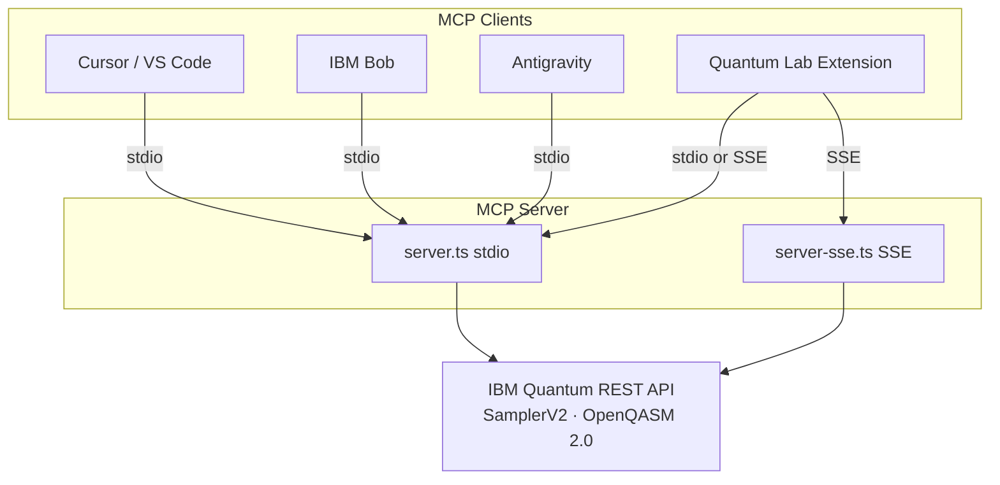
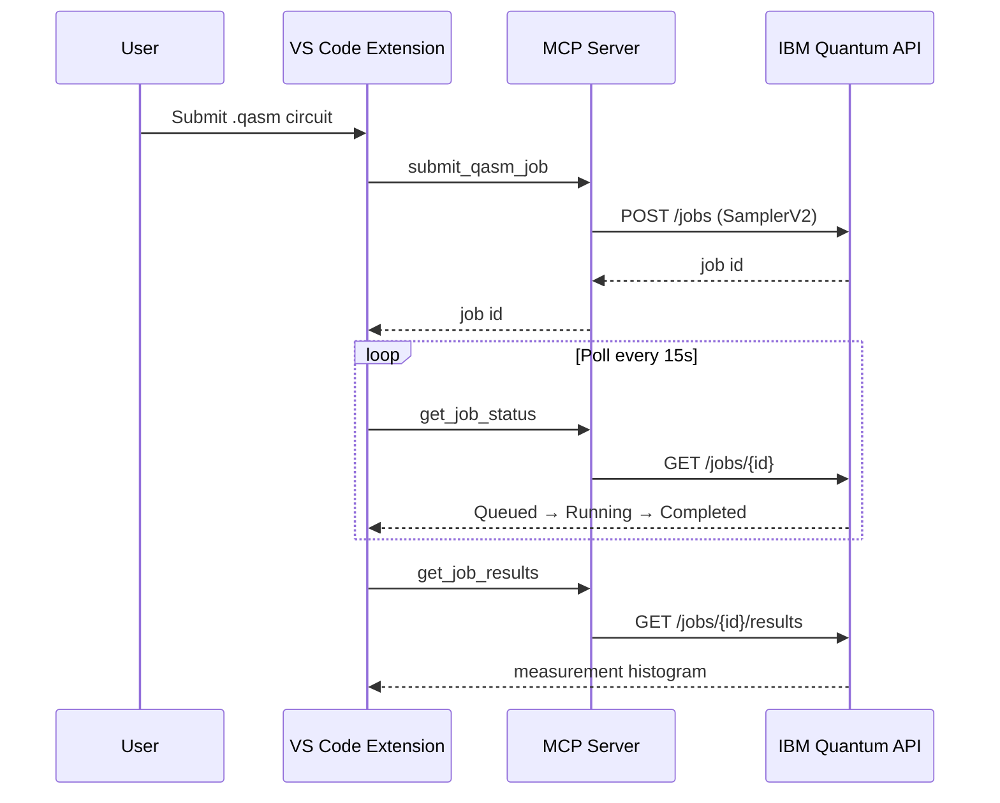

# Quantum OpenQASM Assistant

<!--
SEO: Quantum OpenQASM Assistant | VS Code Extension | MCP Server | IBM Quantum | OpenQASM 2.0 | QASM | Qiskit
quantum computing, quantum computer, qubit, qubits, quantum circuit, quantum circuits, quantum hardware,
quantum lab, quantum programming, quantum physics, quantum experiment, quantum job, quantum backend,
ibm quantum, ibm cloud, ibm fez, ibm marrakesh, sampler v2, bell state, ghz state, cloud quantum,
openqasm, openqasm 2.0, qasm, .qasm, model context protocol, mcp, mcp server, cursor, vscode,
visual studio code, ibm bob, antigravity, copilot, ai assistant, ai agent, llm tools,
typescript, nodejs, histogram, job polling, code engine, sse, stdio, quantum simulator
-->

[](https://marketplace.visualstudio.com/items?itemName=markusvankempen.quantum-openqasm-assistant)
[](https://openqasm.com/)
[](https://modelcontextprotocol.io/)
[](https://quantum.ibm.com/)
[](LICENSE)

<p align="center">
  
</p>

> **Quantum OpenQASM Assistant** is a **VS Code extension** and **Model Context Protocol (MCP) server** for **IBM Quantum** — submit **OpenQASM 2.0** circuits to real **quantum hardware** and simulators from **Cursor**, **VS Code**, **IBM Bob**, and **Google Antigravity**. Includes **Quantum Lab** (interactive circuit editor), live **job polling**, measurement **histograms**, **Bell state** / **GHZ** examples, **SamplerV2** REST integration, and one-click **MCP setup** for AI coding assistants.

**Search terms:** `quantum computing` · `openqasm` · `qasm` · `ibm quantum` · `qiskit` · `quantum circuit` · `quantum hardware` · `mcp server` · `model context protocol` · `cursor mcp` · `vscode quantum` · `ai quantum assistant` · `quantum programming` · `qubit` · `bell state`

**Author:** Markus van Kempen  
**Email:** [markus.van.kempen@gmail.com](mailto:markus.van.kempen@gmail.com) · [mvk@ca.ibm.com](mailto:mvk@ca.ibm.com)  
**Website:** [markusvankempen.github.io](https://markusvankempen.github.io/)  
*No bug too small, no syntax too weird.*

---

## Overview

Quantum OpenQASM Assistant connects AI agents and developers to **IBM Quantum** through a pure TypeScript MCP server and VS Code extension. Submit OpenQASM 2.0 ISA circuits, poll job status, and view measurement histograms — locally via stdio or remotely via SSE on IBM Code Engine.

| Product | Identifier |
|---------|------------|
| **VS Code Extension** | `markusvankempen.quantum-openqasm-assistant` |
| **NPM MCP Server** | `@markusvankempen/quantum-openqasm-mcp` |
| **Public repo** | [quantum-openqasm-assistant](https://github.com/markusvankempen/quantum-openqasm-assistant) |





📖 **[Project structure → docs/PROJECT-STRUCTURE.md](./docs/PROJECT-STRUCTURE.md)** · **[Contributing → CONTRIBUTING.md](./CONTRIBUTING.md)** · **[Code of Conduct → CODE_OF_CONDUCT.md](./CODE_OF_CONDUCT.md)** · **[License → LICENSE](./LICENSE)**

> **Repository policy:** This public GitHub repo publishes overview docs and project metadata only. Extension source, full `docs/`, scripts, and examples live in the **private dev repo** (use `.gitignore.private` when setting it up).

---

## Features

| Feature | Description |
|---------|-------------|
| **Quantum Lab** | Interactive panel with example circuits and histogram results |
| **OpenQASM 2.0** | IBM hardware ISA format (`rz`, `sx`, `cz` native gates) |
| **MCP tools** | `list_backends`, `submit_qasm_job`, `get_job_status`, `get_job_results`, and more |
| **Multi-IDE MCP** | One-click setup for Cursor, VS Code, Bob & Antigravity |
| **Local / remote** | stdio MCP locally or SSE via IBM Code Engine |
| **Diagnostics** | Test IAM auth, list backends, save credentials from the UI |

---

## MCP tools

| Tool | Description |
|------|-------------|
| `list_backends` | Available IBM Quantum backends, status, queue |
| `get_backend` | Details for a specific backend |
| `submit_qasm_job` | Submit OpenQASM 2.0 circuit |
| `get_job_status` | Poll job state |
| `get_job_results` | Measurement counts / histogram data |
| `cancel_job` | Cancel a running job |

---

## Quick start

### Prerequisites

- Node.js 18+ ([mise](https://mise.jdx.dev/) recommended — see `mise.toml`)
- IBM Cloud API key + Quantum Service CRN — [cloud.ibm.com/iam/apikeys](https://cloud.ibm.com/iam/apikeys)

### Build (private dev repo)

```bash
mise run install
mise run build
```

### Configure

```bash
cp .env.example .env
# IBM_API_KEY, IBM_SERVICE_CRN, IBM_QUANTUM_ENDPOINT, IBM_QUANTUM_BACKEND
```

Or use **Quantum → Settings & Diagnostics** in the extension.

### Test

```bash
mise run test-e2e
# or: Press F5 in VS Code → Quantum Lab → Run on Hardware
```

### Install extension

```bash
mise run package
code --install-extension extension/quantum-openqasm-assistant-*.vsix
```

---

## Architecture at a glance

```
quantum-openqasm-assistant/
├── extension/              # VS Code extension + bundled MCP server
│   ├── src/extension.ts    # Extension entry, MCP client
│   ├── src/server.ts       # Local stdio MCP server
│   ├── src/server-sse.ts   # Remote SSE MCP server
│   └── out/                # esbuild output
├── packages/
│   └── quantum-openqasm-mcp/   # Standalone npm MCP package
├── scripts/                # MCP launcher, e2e tests, examples
├── docs/                   # Full documentation (private repo)
├── deployments/            # IBM Code Engine
└── Internal/               # Branding, publishing, status (gitignored)
```

See **[docs/PROJECT-STRUCTURE.md](./docs/PROJECT-STRUCTURE.md)** for the complete file map.

---

## Security

- API keys live in VS Code settings or `~/.quantum-openqasm-mcp/.env` — never in git
- `.env`, `Internal/`, and IDE `mcp.json` files are gitignored
- Report issues via [GitHub Issues](https://github.com/markusvankempen/quantum-openqasm-assistant/issues)

---

## Contributing

Contributions welcome! See **[CONTRIBUTING.md](./CONTRIBUTING.md)** for the two-repo model, mise tasks, and PR process.

Please read our **[CODE_OF_CONDUCT.md](./CODE_OF_CONDUCT.md)**.

---

## License

[MIT License](./LICENSE) — Copyright (c) 2026 Markus van Kempen

---

## Topics & keywords

`quantum-computing` · `quantum-computer` · `openqasm` · `openqasm-2` · `qasm` · `ibm-quantum` · `ibm-cloud` · `qiskit` · `quantum-circuit` · `quantum-hardware` · `quantum-lab` · `quantum-programming` · `quantum-physics` · `qubit` · `bell-state` · `quantum-job` · `quantum-backend` · `mcp` · `model-context-protocol` · `mcp-server` · `vscode-extension` · `cursor` · `ibm-bob` · `antigravity` · `copilot` · `ai-assistant` · `typescript` · `nodejs` · `histogram` · `sampler-v2` · `code-engine` · `cloud-quantum`

---

**Author:** Markus van Kempen  
**Email:** [markus.van.kempen@gmail.com](mailto:markus.van.kempen@gmail.com) · [mvk@ca.ibm.com](mailto:mvk@ca.ibm.com)  
**Website:** [markusvankempen.github.io](https://markusvankempen.github.io/)  
*No bug too small, no syntax too weird.*
