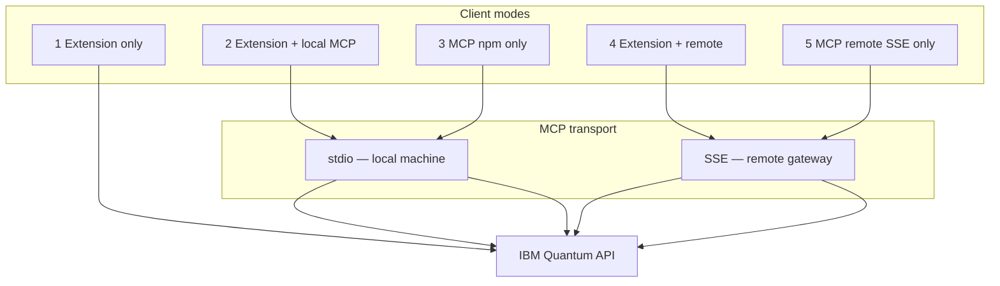

# Deployments — Client modes & infrastructure

How you run **Quantum OpenQASM Assistant** depends on **who installs what** (client modes) and **where the gateway runs** (infrastructure).

📖 **[Deployment scenarios (full)](../docs/deployments/DEPLOYMENT-SCENARIOS.md)** · **[Extension README](../extension/README.md)**

---

## Client modes (what you install)

| Mode | Extension | MCP for AI IDEs | Credentials | Doc |
|------|-----------|-----------------|-------------|-----|
| **1. Extension only** | ✅ Quantum Lab | ❌ | Extension settings | [extension-only](./extension-only/README.md) |
| **2. Extension + local MCP** | ✅ + Setup MCP | ✅ stdio | `~/.quantum-openqasm-mcp/.env` | [extension-mcp-local](./extension-mcp-local/README.md) |
| **3. MCP via npm** | ❌ | ✅ `npx` stdio | `mcp.json` / `.env` | [mcp-npm](./mcp-npm/README.md) |
| **4. Extension + remote MCP** | ✅ `mcpMode: remote` | ✅ SSE (optional) | Server-side on gateway | [extension-remote-mcp](./extension-remote-mcp/README.md) |
| **5. MCP remote SSE** | ❌ | ✅ SSE | Server-side on gateway | [mcp-remote-sse](./mcp-remote-sse/README.md) |



### Quick decision

```text
Need Quantum Lab UI only?              → extension-only
Need Lab + AI on your laptop?          → extension-mcp-local
No extension, only Cursor MCP local?   → mcp-npm
No extension, team remote URL?         → mcp-remote-sse + code-engine
Need Lab + team remote?                → extension-remote-mcp + code-engine
```

Modes **4** and **5** share the same gateway — see infrastructure below.

---

## Infrastructure (where MCP runs)

| Scenario | Folder | Transport | Best for |
|----------|--------|-----------|----------|
| IBM Code Engine | [code-engine/](./code-engine/README.md) | HTTPS `/sse` | Teams, scale-to-zero, production |
| Local dev gateway | [local-bridge/](./local-bridge/README.md) | HTTP `localhost:8080` | Test remote before cloud |
| Docker self-hosted | [docker-sse/](./docker-sse/README.md) | HTTPS `/sse` | On-prem, air-gapped |
| Secured remote | [secured-remote/](./secured-remote/README.md) | SSE + auth | Production access control |
| watsonx Orchestrate | [wxo-orchestrate/](./wxo-orchestrate/README.md) | SSE to agent | Enterprise agentic workflows |
| CI/CD smoke tests | [ci-cd/](./ci-cd/README.md) | stdio ephemeral | Release gates, `--check` |

**Hybrid (local + remote fallback):** switch `quantumAssistant.mcpMode` between `local` and `remote` — see [Deployment scenario 4](../docs/deployments/DEPLOYMENT-SCENARIOS.md#scenario-4-hybrid-local--remote).

---

## Folder map

```
deployments/
├── README.md                 ← this file
├── extension-only/           ← mode 1
├── extension-mcp-local/      ← mode 2
├── mcp-npm/                  ← mode 3
├── extension-remote-mcp/     ← mode 4
├── mcp-remote-sse/           ← mode 5
├── code-engine/              ← IBM Code Engine gateway
├── local-bridge/             ← dev gateway on laptop
├── docker-sse/               ← self-hosted container
├── secured-remote/           ← auth tiers for /sse
├── wxo-orchestrate/          ← Orchestrate agent attachment
└── ci-cd/                    ← pipeline smoke tests
```

---

**Author:** Markus van Kempen · [markusvankempen.github.io](https://markusvankempen.github.io/)
