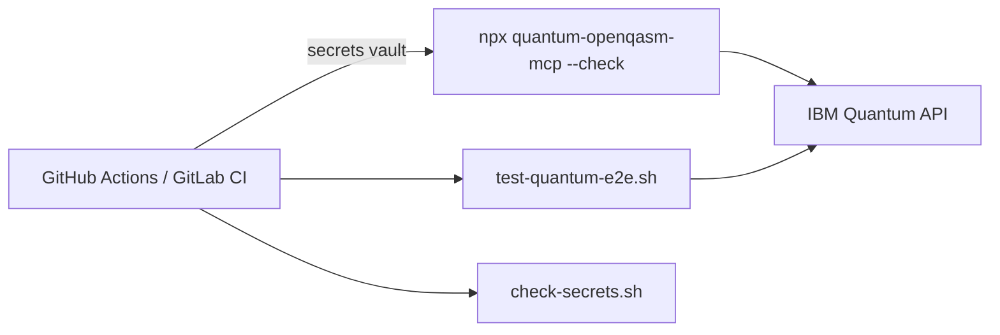

# CI/CD ephemeral MCP smoke tests

Run the Quantum MCP package **only for the duration of a pipeline job** — credential checks, release gates, and regression tests **without** a long-running SSE server.

📖 **[Deployments hub](../README.md)** · **[Mode 3 — MCP via npm](../mcp-npm/README.md)** · **[check-secrets script](../../scripts/check-secrets.sh)**

---

## What you get

| ✅ | ❌ |
|----|-----|
| Catches broken npm releases early | Interactive IDE MCP |
| No gateway to maintain | Uses IBM Quantum quota per run |
| Fast stdio startup | Team-shared remote URL |

---

## Architecture



---

## Prerequisites

Store in CI secrets (never commit):

| Secret | Purpose |
|--------|---------|
| `IBM_API_KEY` | Quantum API access |
| `IBM_SERVICE_CRN` | Quantum instance CRN |

---

## Quick checks

**Verify MCP package and credentials:**

```bash
npx -y @markusvankempen/quantum-openqasm-mcp --check
```

**Pre-publish secret scan:**

```bash
bash scripts/check-secrets.sh
```

**Full e2e** (private dev repo — consumes quota):

```bash
mise run test-e2e
# or: bash scripts/test-quantum-e2e.sh
```

---

## GitHub Actions example

```yaml
jobs:
  quantum-smoke:
    runs-on: ubuntu-latest
    steps:
      - uses: actions/checkout@v4
      - uses: actions/setup-node@v4
        with:
          node-version: "20"

      - name: Verify MCP package
        env:
          IBM_API_KEY: ${{ secrets.IBM_API_KEY }}
          IBM_SERVICE_CRN: ${{ secrets.IBM_SERVICE_CRN }}
        run: npx -y @markusvankempen/quantum-openqasm-mcp --check

      - name: Pre-push secret scan
        run: bash scripts/check-secrets.sh
```

Mask secrets in Actions logs. Never echo `IBM_API_KEY` in output.

---

## Pre-publish checklist

```bash
mise run check-secrets   # no keys in tracked files
mise run build
mise run test-e2e        # optional — uses IBM Quantum quota
```

---

## When to use another mode

| Goal | Use instead |
|------|-------------|
| Interactive AI IDE | [mcp-npm/](../mcp-npm/README.md) |
| Remote gateway health in CI | `curl "${CE_ENDPOINT}/health"` + [code-engine/check-remote-health.sh](../code-engine/check-remote-health.sh) |
| Production team MCP | [code-engine/](../code-engine/README.md) + [mcp-remote-sse/](../mcp-remote-sse/README.md) |

---

## Related docs

- [Deployment scenario 10 (full)](../../docs/deployments/DEPLOYMENT-SCENARIOS.md#scenario-10-cicd-ephemeral-stdio)
- [npm package](https://www.npmjs.com/package/@markusvankempen/quantum-openqasm-mcp)
