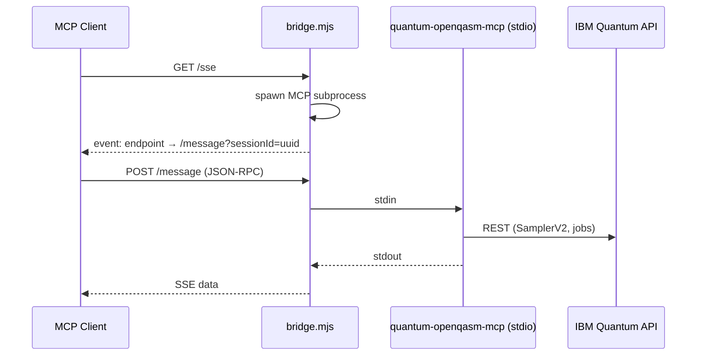

# Quantum OpenQASM MCP on IBM Code Engine — Deployment Guide

Complete guide for the Code Engine gateway: architecture, **`CE_ENDPOINT` resolution**, dashboard/admin/test UI, deploy pipeline, IDE configs, and operations.

**Author:** Markus van Kempen · [markus.van.kempen@gmail.com](mailto:markus.van.kempen@gmail.com)

> **Deployment URLs change.** Code Engine assigns a **project-specific hostname**. Do **not** hardcode URLs in `mcp.json` — always resolve **`CE_ENDPOINT`** after deploy.

---

## Deployment endpoint (`CE_ENDPOINT`)

The public base URL is printed at the end of `deploy-ibmcloud.sh`:

```text
https://quantum-mcp-remote.<project-hash>.ca-tor.codeengine.appdomain.cloud
```

### Resolve the current URL

```bash
export APP_NAME="${APP_NAME:-quantum-mcp-remote}"
ibmcloud ce app get --name "$APP_NAME" --output json \
  | python3 -c "import sys,json; print(json.load(sys.stdin)['status']['url'])"
```

```bash
export CE_ENDPOINT="$(ibmcloud ce app get --name quantum-mcp-remote --output json \
  | python3 -c "import sys,json; print(json.load(sys.stdin)['status']['url'])")"
```

| Resource | Path |
|----------|------|
| Dashboard | `/` |
| Connection test | `/test` |
| Admin | `/admin` |
| MCP SSE | `/sse` |
| Health | `/health` |
| Stats | `/stats` |
| Diagnostics API | `/test/api/run` |

---

## Default IBM Cloud settings

| Setting | Default |
|---------|---------|
| CE region | `ca-tor` |
| CE project | `markus-app-v2-toronto` |
| Resource group | `Default` |
| App name | `quantum-mcp-remote` |
| ICR image | `us.icr.io/mvk-code-engine/quantum-mcp-remote:latest` |
| CPU / memory | `0.5` vCPU / `1G` |
| Scale | min `0`, max `5` |
| Container port | `8080` |

Override via environment variables before running `./deploy.sh`.

---

## Architecture



The container runs **`bridge.mjs`**, not the MCP server HTTP directly:

1. Spawns **stdio MCP** (`@markusvankempen/quantum-openqasm-mcp`) per SSE session
2. Serves **dashboard** at `GET /`
3. Tracks **tool stats** at `GET /stats`
4. **Probes** 10 tools at startup via `tools/list`
5. **Admin UI** at `/admin` for runtime credential updates
6. **Test UI** at `/test` — IAM token, MCP probe, `check_credentials`, `list_backends`

---

## Prerequisites

1. [IBM Cloud account](https://cloud.ibm.com/)
2. [IBM Cloud CLI](https://cloud.ibm.com/docs/cli) + Code Engine plugin
3. Docker or Podman (`linux/amd64` build)
4. **IBM Quantum credentials:**
   - `IBM_API_KEY` — from [quantum.ibm.com](https://quantum.ibm.com) → Account → API keys
   - `IBM_SERVICE_CRN` — service instance CRN

---

## Deploy pipeline (9 steps)

`deploy-ibmcloud.sh` performs:

1. IBM Cloud login (`IBMCLOUD_API_KEY`)
2. ICR login
3. Build image from `Dockerfile` (installs published npm package)
4. Push to `us.icr.io/mvk-code-engine/quantum-mcp-remote:latest`
5. Target CE project
6. Create ICR pull secret
7. Create `IBM_API_KEY` secret + `BRIDGE_ADMIN_SECRET`
8. Create/update CE app with env vars
9. Wait for Ready, print URLs

### Full command

```bash
cd deployments/code-engine

IBMCLOUD_API_KEY=your_ibm_cloud_api_key \
IBM_API_KEY=your_quantum_api_key \
IBM_SERVICE_CRN=crn:v1:bluemix:public:quantum-computing:... \
IBM_QUANTUM_ENDPOINT=https://us-east.quantum-computing.cloud.ibm.com \
IBM_QUANTUM_BACKEND=ibm_fez \
QUANTUM_MCP_NPM_VERSION=1.7.4 \
./deploy.sh
```

Save the printed **`BRIDGE_ADMIN_SECRET`** for the admin panel.

---

## Environment variables (Code Engine app)

| Variable | Required | Source |
|----------|----------|--------|
| `IBM_API_KEY` | Yes | CE secret `quantum-api-key` |
| `IBM_SERVICE_CRN` | Yes | Deploy env |
| `IBM_QUANTUM_ENDPOINT` | No | Deploy env (default us-east) |
| `IBM_QUANTUM_BACKEND` | No | Deploy env (default `ibm_fez`) |
| `BRIDGE_ADMIN_SECRET` | Recommended | CE secret (auto-generated) |
| `CE_REGION`, `CE_PROJECT_ID`, `CE_APP` | Auto | Set by deploy script |
| `BRIDGE_DEPLOY_TIME` | Auto | Deploy timestamp |

---

## Connection test

### Web UI

Open `https://<CE_ENDPOINT>/test` and click **Run all tests**.

### CLI

```bash
curl -sS -X POST "${CE_ENDPOINT}/test/api/run" | jq .
```

Expected steps (all `"ok": true`):

1. IBM Quantum credentials present
2. IBM IAM token
3. MCP `tools/list` probe (10 tools)
4. MCP `check_credentials`
5. MCP `list_backends`

---

## Admin panel

1. Open `https://<CE_ENDPOINT>/admin`
2. Enter `BRIDGE_ADMIN_SECRET` from deploy output
3. **Test credentials** before **Save**

Runtime updates apply to new MCP sessions; existing sessions are closed on save. For persistence across restarts, update Code Engine secrets and redeploy.

---

## IDE configuration

### VS Code

`.vscode/mcp.json` or user MCP config:

```json
{
  "servers": {
    "quantum-openqasm-mcp-remote": {
      "type": "sse",
      "url": "https://<CE_ENDPOINT>/sse"
    }
  }
}
```

### Cursor

```json
{
  "mcpServers": {
    "quantum-openqasm-mcp-remote": {
      "command": "npx",
      "args": ["-y", "mcp-remote", "https://<CE_ENDPOINT>/sse"]
    }
  }
}
```

### Quantum VS Code extension

| Setting | Value |
|---------|-------|
| `quantumAssistant.mcpMode` | `remote` |
| `quantumAssistant.remoteMcpUrl` | `https://<CE_ENDPOINT>/sse` |

Templates: `mcp-configs/` (see [REMOTE-MCP-SETUP.md](../../docs/ide/REMOTE-MCP-SETUP.md)).

```bash
cd deployments/code-engine
./generate-mcp-configs.sh   # refresh mcp-configs/deployed/*.json
```

| IDE | Template | Local generated (gitignored) |
|-----|----------|------------------------------|
| VS Code | `mcp-configs/vscode-remote.json` | `mcp-configs/deployed/vscode-mcp.json` |
| Cursor (npx) | `mcp-configs/cursor-remote-npx.json` | `mcp-configs/deployed/cursor-mcp.json` |
| Cursor (proxy) | `mcp-configs/cursor-remote-mcp-proxy.json` | `mcp-configs/deployed/cursor-mcp-proxy.json` |

Workspace: copy `.vscode/mcp.json.example` → `.vscode/mcp.json`, then run `generate-mcp-configs.sh` or replace `<CE_ENDPOINT>`.

> **Do not hardcode** Code Engine hostnames in committed files. URLs are project-specific.

---

## Operations

```bash
# Logs
ibmcloud ce app logs --name quantum-mcp-remote --follow

# Status
ibmcloud ce app get --name quantum-mcp-remote

# Health
curl -sS "${CE_ENDPOINT}/health" | jq .

# Tool stats
curl -sS "${CE_ENDPOINT}/stats" | jq .

# Redeploy after npm package update
QUANTUM_MCP_NPM_VERSION=1.7.4 ./deploy.sh
```

---

## Troubleshooting

| Symptom | Fix |
|---------|-----|
| `/sse` returns 503 | Set `IBM_API_KEY` + `IBM_SERVICE_CRN` on the app |
| 0 tools on dashboard | Check CE logs; verify IAM token via `/test` |
| Admin panel disabled | Set `BRIDGE_ADMIN_SECRET` and redeploy |
| Cold start delay | Normal with `min-scale 0`; first SSE session may take ~10s |
| Wrong quantum region | Set `IBM_QUANTUM_ENDPOINT` to your instance region |

---

## Local Docker (pre-deploy test)

```bash
cd deployments/code-engine
docker build -f Dockerfile -t quantum-mcp-local .
docker run --rm -p 8080:8080 \
  -e IBM_API_KEY=... \
  -e IBM_SERVICE_CRN=crn:v1:... \
  -e BRIDGE_ADMIN_SECRET=local-dev-secret \
  quantum-mcp-local
```

Dashboard: http://localhost:8080/

---

## Related docs

- [README.md](./README.md) — quick reference
- [../../docs/deployments/DEPLOYMENT-SCENARIOS.md](../../docs/deployments/DEPLOYMENT-SCENARIOS.md) — all deployment modes
- [../../docs/ide/LOCAL-MCP-SETUP.md](../../docs/ide/LOCAL-MCP-SETUP.md) — local stdio MCP

---

*No bug too small, no syntax too weird.*
