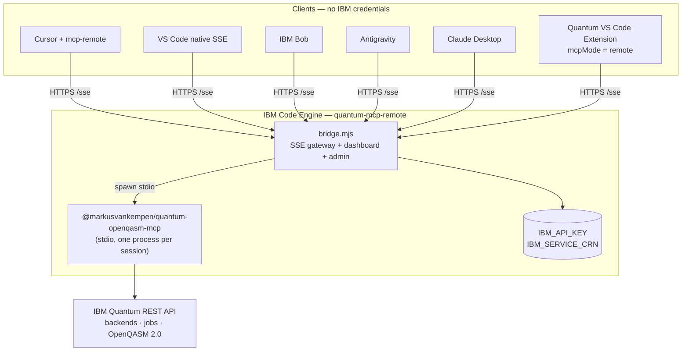
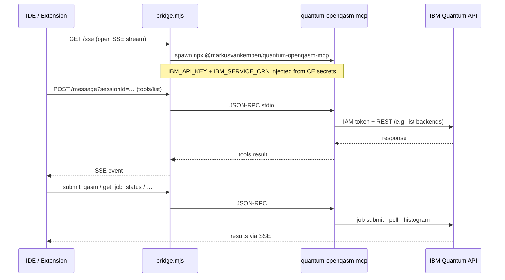
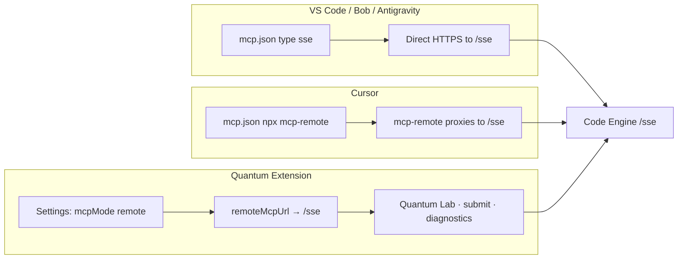
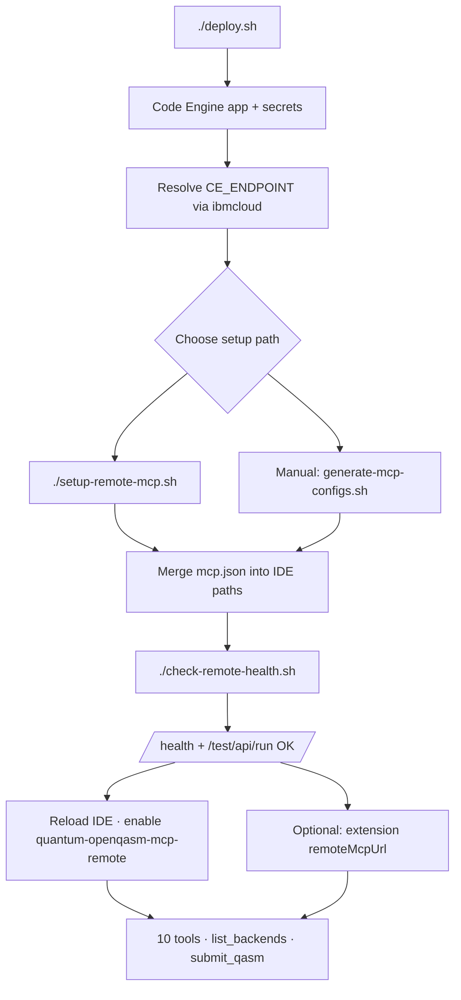
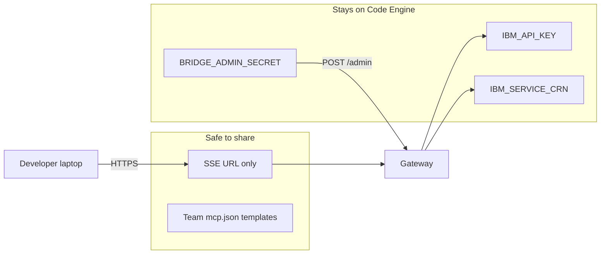

# Quantum OpenQASM MCP — IBM Code Engine

Deploy the Quantum OpenQASM MCP server to [IBM Code Engine](https://www.ibm.com/products/code-engine) with **SSE transport**, a **web dashboard**, **connection test UI**, and **admin panel** (pattern from [code-engine-mcp-server](https://github.com/markusvankempen/code-engine-mcp-server) and Zendesk MCP).

**Live deployment:** resolve your URL after deploy — see [Deployment endpoint](./DEPLOYMENT-GUIDE.md#deployment-endpoint-ce_endpoint). **Do not hardcode** the hostname; it is project-specific.

📖 **[Client modes hub](../README.md)** · **[MCP remote SSE (mode 5)](../mcp-remote-sse/README.md)** · **[Extension + remote (mode 4)](../extension-remote-mcp/README.md)** · **[Local bridge](../local-bridge/README.md)** · **[DEPLOYMENT-GUIDE.md](./DEPLOYMENT-GUIDE.md)**

> **`bridge.mjs` is not in the public GitHub repo.** It is required for the Docker image (SSE gateway + dashboard). Keep it in your private dev checkout or obtain it from the author before running `docker build` / `./deploy.sh`.

**Author:** Markus van Kempen  
**Email:** [markus.van.kempen@gmail.com](mailto:markus.van.kempen@gmail.com) · [mvk@ca.ibm.com](mailto:mvk@ca.ibm.com)  
**Website:** [markusvankempen.github.io](https://markusvankempen.github.io/)

---

## Architecture — how remote MCP works

Remote mode runs the **full MCP server on IBM Code Engine**. Your IDE or extension only needs the **SSE URL** — no `IBM_API_KEY` on the client. The gateway (`bridge.mjs`) holds credentials, spawns `@markusvankempen/quantum-openqasm-mcp` per session, and talks to IBM Quantum on your behalf.

### Remote vs local at a glance

| | **Remote (Code Engine)** | **Local (stdio)** |
|---|--------------------------|-------------------|
| **Where credentials live** | Code Engine secrets | `~/.quantum-openqasm-mcp/.env` or IDE `mcp.json` |
| **What the client needs** | `https://<CE_ENDPOINT>/sse` | `npx` / `node` + env vars |
| **MCP tools** | 10 (full npm package) | 10 |
| **Dashboard / test UI** | `CE_ENDPOINT/` and `/test` | Extension Diagnostics |
| **Team sharing** | One URL for everyone | Per-machine setup |



### Inside the Code Engine container

Each MCP client opens an **SSE session**. The bridge creates a **dedicated stdio child** running the published npm MCP package. JSON-RPC flows: client ↔ bridge ↔ MCP process ↔ IBM Quantum.



**Gateway routes** (same host, different jobs):

| Path | Role |
|------|------|
| `/sse` + `/message` | MCP transport for IDEs |
| `/` | Dashboard — copy configs, session stats |
| `/test` | Browser UI — run full connection suite |
| `/admin` | Rotate IBM credentials without redeploy |
| `/health` | Liveness for scripts and load balancers |

### How each client connects

All paths end at **`https://<CE_ENDPOINT>/sse`**. The difference is how the IDE reaches SSE.



| Client | Config | Notes |
|--------|--------|-------|
| **VS Code** | `"type": "sse", "url": "…/sse"` | Native MCP — no extra proxy |
| **Cursor** | `npx mcp-remote https://…/sse` | Or `uvx mcp-proxy` if SSE times out (`--proxy`) |
| **Bob / Antigravity** | Same SSE URL in `mcp.json` | Templates in `mcp-configs/` |
| **Claude Desktop** | SSE URL in desktop config | See `claude-desktop-remote.json` |
| **Extension** | `quantumAssistant.mcpMode` = `remote` | Uses `remoteMcpUrl` for Lab + job flows — **no local stdio spawn** |

The extension can run **independently** of Cursor/VS Code MCP: install only the [VS Code extension](https://marketplace.visualstudio.com/items?itemName=markusvankempen.quantum-openqasm-assistant), set remote mode, and use Quantum Lab without configuring `mcp.json`. AI assistants in the same IDE use `mcp.json`; both share the same remote server.

### Setup flow — deploy to working IDE



**One command after deploy:**

```bash
./setup-remote-mcp.sh --ide cursor,vscode --workspace
```

This resolves the live URL (never hardcoded in git), writes IDE configs, backs up existing `mcp.json`, and verifies the gateway.

### Credential boundary



Clients never receive IBM API keys. Rotate credentials via `/admin` or redeploy — IDE configs unchanged.

### Securing `/sse` (no custom domain required for HTTPS)

Code Engine already provides **TLS** on `https://<app>.<hash>.<region>.codeengine.appdomain.cloud` — you do **not** need your own domain for encryption.

| Need | Code Engine option | Custom domain? |
|------|-------------------|----------------|
| HTTPS | Default CE URL | No |
| Hide IBM keys from clients | CE secrets (deploy script) | No |
| Rotate IBM creds | `/admin` + `BRIDGE_ADMIN_SECRET` | No |
| Block public internet | `--visibility project` or `private` | No — but **breaks laptop IDEs** unless VPE/VPN |
| Auth on `/sse` | App/proxy layer (not built into CE) | No — Tier 2 in Scenario 8 |
| WAF / IP allowlist / branded URL | Custom domain + Cloud Internet Services | Yes |

📖 **[Scenario 8 — Secured remote (tiers 0–3)](../../docs/deployments/DEPLOYMENT-SCENARIOS.md#scenario-8-secured-remote-auth-in-front-of-sse)** · [IBM Code Engine security](https://cloud.ibm.com/docs/codeengine?topic=codeengine-secure)

📖 **More detail:** [Remote MCP setup guide](../../docs/ide/REMOTE-MCP-SETUP.md) · [Deployment scenarios](../../docs/deployments/DEPLOYMENT-SCENARIOS.md) · [Extension README](../../extension/README.md)

---

## Quick deploy

```bash
cd deployments/code-engine

IBMCLOUD_API_KEY=your_ibm_cloud_api_key \
IBM_API_KEY=your_quantum_api_key \
IBM_SERVICE_CRN=crn:v1:bluemix:public:quantum-computing:... \
./deploy.sh
```

Optional:

```bash
IBM_QUANTUM_ENDPOINT=https://us-east.quantum-computing.cloud.ibm.com
IBM_QUANTUM_BACKEND=ibm_fez
QUANTUM_MCP_NPM_VERSION=1.7.2
CE_PROJECT=your-ce-project
APP_NAME=quantum-mcp-remote
```

After deploy, open the **dashboard** at `CE_ENDPOINT/` and run **connection tests** at `/test`.

---

## Endpoints

| Path | Description |
|------|-------------|
| `/` | Dashboard UI — stats, tools, connect snippets |
| `/sse` | Open MCP SSE stream |
| `/message?sessionId=` | POST JSON-RPC to session |
| `/health` | Liveness JSON |
| `/stats` | Tool usage JSON |
| `/test` | Connection test UI |
| `/test/api/run` | Diagnostic suite (JSON) |
| `/admin` | Update IBM Quantum credentials at runtime |

---

## Credential model

IBM Quantum credentials (`IBM_API_KEY`, `IBM_SERVICE_CRN`) are stored as Code Engine secrets/env. **Clients connect to `/sse` without passing API keys.** The bridge spawns `@markusvankempen/quantum-openqasm-mcp` (stdio) per session with full **10 tools**.

---

## After deploy — enable remote MCP in your IDE

See **[Architecture — how remote MCP works](#architecture--how-remote-mcp-works)** for diagrams (container, IDE paths, extension remote mode).

**One command** (resolve URL, write `mcp.json`, health check):

```bash
cd deployments/code-engine
./setup-remote-mcp.sh
```

📖 **[IDE setup procedure](./IDE-SETUP.md)** · **[Remote MCP guide (detailed)](../../docs/ide/REMOTE-MCP-SETUP.md)**

```bash
# Examples
./setup-remote-mcp.sh --ide cursor,vscode --workspace
./setup-remote-mcp.sh --check-only
./setup-remote-mcp.sh --dry-run --ide all
```

### Generate configs only (no IDE install)

```bash
./generate-mcp-configs.sh
# writes mcp-configs/deployed/vscode-mcp.json, cursor-mcp.json, …
```

### Templates (`mcp-configs/`)

| File | Copy to |
|------|---------|
| `vscode-remote.json` | `~/Library/Application Support/Code/User/mcp.json` or `.vscode/mcp.json` |
| `cursor-remote-npx.json` | `~/.cursor/mcp.json` |
| `cursor-remote-mcp-proxy.json` | `~/.cursor/mcp.json` (if SSE times out) |
| `bob-remote.json` | `~/.bob/mcp.json` |
| `antigravity-remote.json` | `~/.gemini/antigravity/mcp.json` |
| `claude-desktop-remote.json` | Claude Desktop config |

Generated files land in `mcp-configs/deployed/` (gitignored). See `mcp-configs/deployed/README.md`.

**Workspace template:** copy `.vscode/mcp.json.example` → `.vscode/mcp.json`, then run `generate-mcp-configs.sh` or replace `<CE_ENDPOINT>`.

### Quick verify

```bash
cd deployments/code-engine
./check-remote-health.sh
```

Or resolve manually (from **repo root**):

```bash
export CE_ENDPOINT="$(ibmcloud ce app get --name quantum-mcp-remote --output json \
  | python3 -c "import sys,json; print(json.load(sys.stdin)['status']['url'])")"
curl -sS "${CE_ENDPOINT}/health" | jq .
```

If you are already in `deployments/code-engine`, use `mcp-configs/deployed/CE_ENDPOINT.txt` — not `deployments/code-engine/...`.

**Extension remote mode:** Diagnostics → MCP mode **remote** → paste `https://<CE_ENDPOINT>/sse` → **Test Remote Gateway** → Save.

| Setting | Value |
|---------|-------|
| `quantumAssistant.mcpMode` | `remote` |
| `quantumAssistant.remoteMcpUrl` | `https://<CE_ENDPOINT>/sse` |

📖 **[Extension remote MCP guide](../../docs/ide/EXTENSION-REMOTE-MCP.md)** · Command: `Quantum: Setup Remote MCP (Code Engine SSE)`

---

## Local Docker / Podman test (Scenario 6)

Run the production gateway on your laptop before cloud deploy — see **[local-bridge/README.md](../local-bridge/README.md)**.

```bash
cd deployments/code-engine
docker build -f Dockerfile -t quantum-mcp-local .

docker run --rm -p 8080:8080 \
  -e IBM_API_KEY=... \
  -e IBM_SERVICE_CRN=crn:v1:... \
  -e BRIDGE_ADMIN_SECRET=test-secret \
  quantum-mcp-local
```

Open http://localhost:8080/ for the dashboard.

---

## Files

| File | Purpose |
|------|---------|
| `bridge.mjs` | SSE bridge + dashboard + admin + test UI |
| `Dockerfile` | Published npm package + bridge |
| `deploy-ibmcloud.sh` | 9-step IBM Cloud deploy |
| `deploy.sh` | Wrapper |
| `mcp-configs/` | IDE templates (`<CE_ENDPOINT>` placeholder only) |
| `setup-remote-mcp.sh` | **All-in-one** IDE setup + connection check |
| `generate-mcp-configs.sh` | Write gitignored `deployed/*.json` from live CE URL |
| `IDE-SETUP.md` | Step-by-step IDE procedure |
| `.vscode/mcp.json.example` | Workspace template — copy to `mcp.json` locally |
| `mcp-client-*.json` | Legacy aliases → see `mcp-configs/` |

---

*No bug too small, no syntax too weird.*
