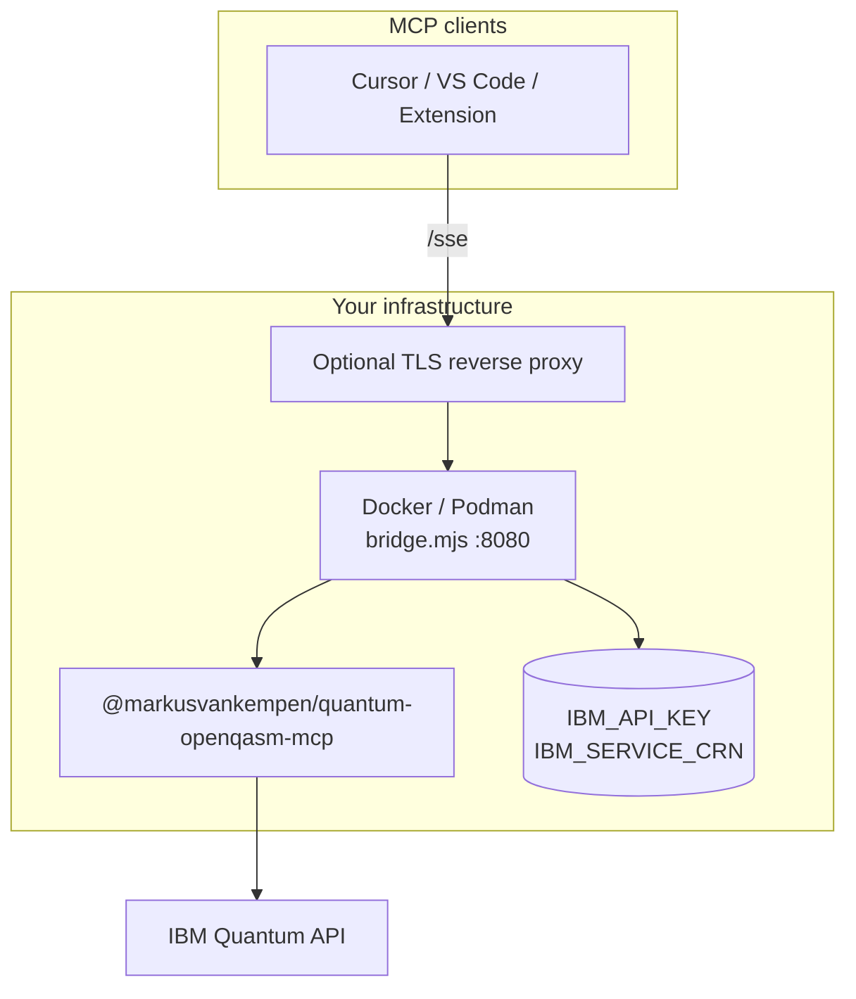

# Docker self-hosted SSE gateway

Run the **Quantum MCP gateway** (`bridge.mjs` + npm package) in a **container on your own infrastructure** — on-premises, air-gapped, or any host where IBM Code Engine is not an option.

Clients connect the same way as Code Engine: HTTPS (or HTTP on trusted networks) to `/sse`.

📖 **[Deployments hub](../README.md)** · **[Code Engine Dockerfile](../code-engine/Dockerfile)** · **[Mode 5 — MCP remote SSE](../mcp-remote-sse/README.md)**

---

## What you get

| ✅ | ❌ |
|----|-----|
| Full control over hosting | IBM-managed scale-to-zero |
| Predictable infra cost | You manage updates, TLS, scaling |
| On-premises / air-gapped | Built-in IBM Cloud IAM |
| Dashboard + `/test` + `/sse` | — |

---

## Architecture



Use the **Code Engine image** — not the deprecated `deployments/Dockerfile` at repo root (legacy `server-sse.js`).

---

## Quick setup

```bash
cd deployments/code-engine
docker build -f Dockerfile -t quantum-mcp-remote .

docker run -d \
  --name quantum-mcp-remote \
  -p 8080:8080 \
  -e IBM_API_KEY=your_quantum_api_key \
  -e IBM_SERVICE_CRN=crn:v1:bluemix:public:quantum-computing:... \
  -e IBM_QUANTUM_ENDPOINT=https://us-east.quantum-computing.cloud.ibm.com \
  -e BRIDGE_ADMIN_SECRET=your_admin_secret \
  --restart unless-stopped \
  quantum-mcp-remote
```

**Health check:**

```bash
curl -sS http://localhost:8080/health
curl -sS http://localhost:8080/sse -I
```

---

## Docker Compose example

```yaml
services:
  quantum-mcp-remote:
    build:
      context: ./deployments/code-engine
      dockerfile: Dockerfile
    ports:
      - "8080:8080"
    env_file:
      - .env   # IBM_API_KEY, IBM_SERVICE_CRN — never commit
    restart: unless-stopped
    healthcheck:
      test: ["CMD", "node", "-e", "fetch('http://127.0.0.1:8080/health').then(r=>r.json().then(j=>process.exit(j.status==='ok'?0:1))).catch(()=>process.exit(1))"]
      interval: 30s
      timeout: 5s
      retries: 3
```

---

## Production notes

| Topic | Guidance |
|-------|----------|
| **TLS** | Terminate HTTPS at nginx, Traefik, or cloud load balancer in front of `:8080` |
| **Secrets** | `env_file` or orchestrator secrets — never bake keys into the image |
| **Auth** | See [secured-remote/](../secured-remote/README.md) for API key / proxy patterns |
| **Clients** | Point [mcp-remote-sse](../mcp-remote-sse/README.md) or extension remote URL to `https://your-host/sse` |

Pin a package version at build time:

```bash
docker build -f Dockerfile \
  --build-arg QUANTUM_MCP_NPM_VERSION=1.2.3 \
  -t quantum-mcp-remote:1.2.3 .
```

---

## When to use another mode

| Goal | Use instead |
|------|-------------|
| IBM Cloud, scale-to-zero | [code-engine/](../code-engine/README.md) |
| Dev on laptop only | [local-bridge/](../local-bridge/README.md) |
| No server — local stdio | [mcp-npm/](../mcp-npm/README.md) |

---

## Related docs

- [Deployment scenario 3 (full)](../../docs/deployments/DEPLOYMENT-SCENARIOS.md#scenario-3-docker-self-hosted-sse)
- [Secured remote](../secured-remote/README.md)
