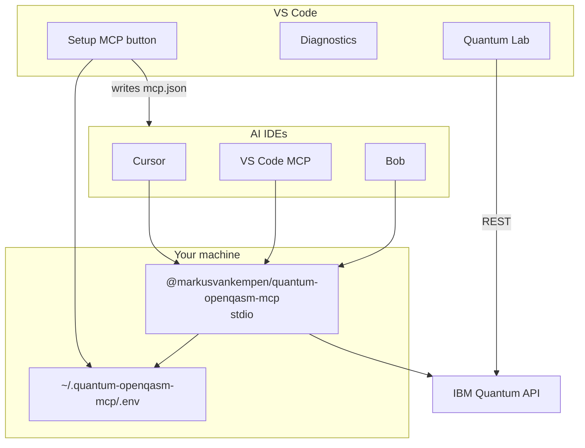

# Mode 2 — Extension + local MCP client

**Quantum Lab** in VS Code **plus** MCP for AI IDEs — MCP runs on your machine via **stdio** (`@markusvankempen/quantum-openqasm-mcp`).

📖 **[Deployments hub](../README.md)** · **[Local MCP setup](../../docs/ide/LOCAL-MCP-SETUP.md)** · **[Extension README](../../extension/README.md)**

---

## What you get

| Component | Role |
|-----------|------|
| **VS Code extension** | Quantum Lab, submit jobs, diagnostics, **Setup MCP** button |
| **MCP server (local)** | 10 tools for Cursor / VS Code / Bob / Antigravity |
| **Credentials** | `~/.quantum-openqasm-mcp/.env` (written by extension or manual) |

---

## Architecture



**Extension `mcpMode`:** keep **`local`** (default). The extension may spawn the bundled MCP for in-editor features; AI IDEs use the same npm package via `mcp.json`.

---

## Quick setup (recommended)

1. Install **[Quantum OpenQASM Assistant](https://marketplace.visualstudio.com/items?itemName=markusvankempen.quantum-openqasm-assistant)**
2. **Quantum → Open Diagnostics Panel**
3. Enter **IBM API Key**, **Service CRN**, **Endpoint** → **Save Configuration**
4. Click **Setup MCP for Cursor / VS Code / Bob / Antigravity**
5. Reload IDEs when prompted
6. In Cursor: verify MCP shows **quantum-openqasm-mcp** with 10 tools

---

## Manual MCP (without extension UI)

If you only want the npm package in an IDE:

```json
{
  "mcpServers": {
    "quantum-openqasm-mcp": {
      "command": "npx",
      "args": ["-y", "@markusvankempen/quantum-openqasm-mcp"],
      "env": {
        "IBM_API_KEY": "your-key",
        "IBM_SERVICE_CRN": "crn:v1:bluemix:public:quantum-computing:..."
      }
    }
  }
}
```

See **[MCP via npm only](../mcp-npm/README.md)** if you do not need the extension at all.

---

## Extension settings

| Setting | Value |
|---------|-------|
| `quantumAssistant.mcpMode` | `local` |
| `quantumAssistant.ibmApiKey` | Your IBM Cloud API key |
| `quantumAssistant.ibmServiceCrn` | Quantum instance CRN |

---

## Verify

```bash
# After Setup MCP — test launcher
node scripts/run-mcp-server.mjs --version 2>/dev/null || npx -y @markusvankempen/quantum-openqasm-mcp --help
```

In Cursor chat: *"List available IBM Quantum backends using the quantum MCP"*

---

## Related docs

- [Local MCP setup (full)](../../docs/ide/LOCAL-MCP-SETUP.md)
- [Deployment scenario 1 / 5](../../docs/deployments/DEPLOYMENT-SCENARIOS.md)
- [npm package](https://www.npmjs.com/package/@markusvankempen/quantum-openqasm-mcp)
