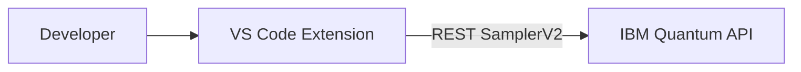

# Mode 1 — Extension only (no MCP)

Use the **Quantum OpenQASM Assistant** VS Code extension for **Quantum Lab**, **job submission**, and **histograms** — without configuring MCP for Cursor, VS Code AI, Bob, or Antigravity.

📖 **[Deployments hub](../README.md)** · **[Extension README](../../extension/README.md)**

---

## What you get

| ✅ Included | ❌ Not included |
|-------------|-----------------|
| Quantum Lab panel | MCP tools in Cursor / Copilot chat |
| Submit `.qasm` from editor | `npx @markusvankempen/quantum-openqasm-mcp` |
| Job polling + histograms | One-click **Setup MCP** (optional later) |
| Diagnostics (auth, backends) | Remote Code Engine gateway |

---

## Architecture



The extension talks to IBM Quantum **directly** via REST. No MCP child process, no `mcp.json`.

---

## Setup

### 1. Install extension

Marketplace: [Quantum OpenQASM Assistant](https://marketplace.visualstudio.com/items?itemName=markusvankempen.quantum-openqasm-assistant)

Or:

```bash
code --install-extension quantum-openqasm-assistant-*.vsix
```

### 2. Configure credentials

**Quantum → Open Diagnostics Panel** (or Settings → `quantumAssistant`):

| Setting | Required |
|---------|----------|
| `ibmApiKey` | Yes |
| `ibmServiceCrn` | Yes |
| `ibmEndpoint` | Optional (default US-East) |
| `defaultBackend` | Optional (`ibm_fez`, etc.) |

Click **Save Configuration** and **Test Connection**.

### 3. Run a circuit

1. Activity Bar → **⚛ Quantum** → **Open Quantum Lab**
2. Pick Bell State (or open a `.qasm` file)
3. **▶ Run on Hardware**

---

## When to add MCP later

| Goal | Switch to |
|------|-----------|
| AI assistant submits QASM in chat | [Extension + local MCP](../extension-mcp-local/README.md) |
| AI only, no extension UI | [MCP via npm](../mcp-npm/README.md) |
| Team shared URL, no local keys | [Extension + remote MCP](../extension-remote-mcp/README.md) |

---

## Related docs

- [Extension commands & settings](../../extension/README.md)
- [OpenQASM Primer](../../docs/OPENQASM-PRIMER.md)
- [Tips & Tricks](../../docs/TIPS-AND-TRICKS.md)
