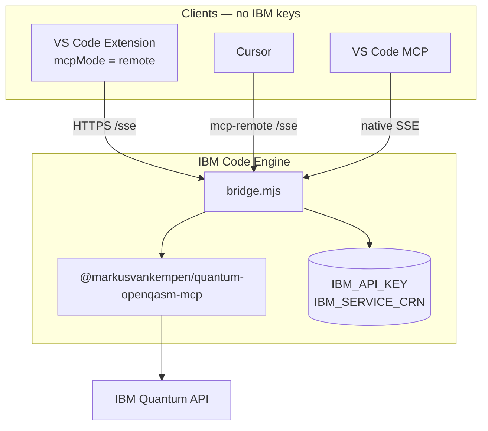

# Mode 4 — Extension + remote MCP (Code Engine SSE)

**Quantum Lab** connects to a **remote MCP gateway** on IBM Code Engine. IBM credentials stay **on the server** — your laptop only needs the **SSE URL**.

AI IDEs can use the **same URL** (no local `IBM_API_KEY`). IDE-only remote (no extension)? Use **[mode 5 — MCP remote SSE](../mcp-remote-sse/README.md)**.

📖 **[Deployments hub](../README.md)** · **[Extension remote MCP](../../docs/ide/EXTENSION-REMOTE-MCP.md)** · **[Code Engine deploy](../code-engine/README.md)** · **[Remote MCP setup](../../docs/ide/REMOTE-MCP-SETUP.md)**

---

## What you get

| Component | Role |
|-----------|------|
| **VS Code extension** | Quantum Lab over SSE (`mcpMode: remote`) |
| **Code Engine gateway** | `bridge.mjs` + npm MCP + dashboard |
| **AI IDEs (optional)** | Same `/sse` URL via `setup-remote-mcp.sh` |
| **Credentials** | Code Engine secrets only |

---

## Architecture



---

## Part A — Deploy gateway (once per team)

```bash
cd deployments/code-engine

IBMCLOUD_API_KEY=your_ibm_cloud_api_key \
IBM_API_KEY=your_quantum_api_key \
IBM_SERVICE_CRN=crn:v1:bluemix:public:quantum-computing:... \
./deploy.sh
```

Resolve URL (do not hardcode):

```bash
export CE_ENDPOINT=$(ibmcloud ce app get --name quantum-mcp-remote --output json \
  | python3 -c "import sys,json; print(json.load(sys.stdin)['status']['url'])")
curl -sS "${CE_ENDPOINT}/health"
```

📖 **[Code Engine README](../code-engine/README.md)** · **[DEPLOYMENT-GUIDE.md](../code-engine/DEPLOYMENT-GUIDE.md)**

---

## Part B — Extension remote mode

1. Install **Quantum OpenQASM Assistant** extension
2. **Quantum → Open Diagnostics Panel**
3. Set **MCP Mode** → **remote**
4. **Remote MCP URL** → `https://<CE_ENDPOINT>/sse` (must end with `/sse`)
5. **Test Remote Gateway** → expect health OK + tools listed
6. **Save Configuration**
7. Use **Quantum Lab** — jobs flow through Code Engine

| Setting | Value |
|---------|-------|
| `quantumAssistant.mcpMode` | `remote` |
| `quantumAssistant.remoteMcpUrl` | `https://…codeengine.appdomain.cloud/sse` |
| `ibmApiKey` | Optional for Lab in remote mode (gateway holds secrets) |

Command: **`Quantum: Setup Remote MCP`** — registers remote URL for Cursor / VS Code / Bob / Antigravity.

---

## Part C — AI IDEs on same gateway (optional)

```bash
cd deployments/code-engine
./setup-remote-mcp.sh
# Or: ./setup-remote-mcp.sh --ide cursor,vscode --workspace
```

Templates: [`mcp-configs/`](../code-engine/mcp-configs/README.md)

---

## Remote vs local

| | Remote (this mode) | Local MCP |
|---|-------------------|-----------|
| Credentials on laptop | No | Yes |
| Needs Code Engine | Yes | No |
| Team sharing | One URL | Per machine |
| Dashboard / test UI | `CE_ENDPOINT/` `/test` | Extension diagnostics |

---

## Verify

```bash
./deployments/code-engine/check-remote-health.sh
# Or
curl -sS "${CE_ENDPOINT}/health" && curl -sS "${CE_ENDPOINT}/sse" -I
```

Extension: Diagnostics → **Test Remote Gateway**

---

## Related docs

- [Extension remote MCP (full)](../../docs/ide/EXTENSION-REMOTE-MCP.md)
- [Remote MCP setup for IDEs](../../docs/ide/REMOTE-MCP-SETUP.md)
- [Deployment scenario 2 — Code Engine](../../docs/deployments/DEPLOYMENT-SCENARIOS.md)
