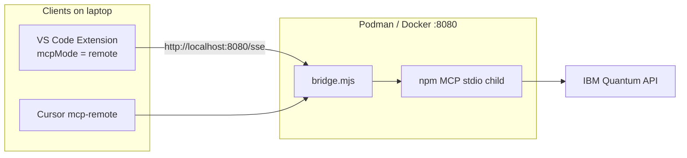

# Local bridge — Podman/Docker dev gateway

Run the **same Code Engine gateway image** on your laptop to exercise **remote MCP** — dashboard, `/test`, `/sse`, extension `mcpMode: remote` — **without** deploying to IBM Cloud.

📖 **[Deployments hub](../README.md)** · **[Code Engine](../code-engine/README.md)** · **[Mode 5 — MCP remote SSE](../mcp-remote-sse/README.md)** · **[Mode 4 — Extension + remote](../extension-remote-mcp/README.md)**

---

## What you get

| ✅ | ❌ |
|----|-----|
| Full gateway UI at `http://localhost:8080/` | HTTPS (use Code Engine for prod) |
| Test `setup-remote-mcp.sh` before cloud | Multi-user / team sharing |
| Extension **Test Remote Gateway** | Public internet access |
| Same behavior as production CE | — |

---

## Architecture



---

## Prerequisites

- Docker or Podman
- IBM Quantum API key + service CRN
- `bridge.mjs` in your dev checkout (not in public GitHub — same as Code Engine deploy)

---

## Quick setup

```bash
cd deployments/code-engine
docker build -f Dockerfile -t quantum-mcp-local .

docker run --rm -p 8080:8080 \
  -e IBM_API_KEY=your_quantum_api_key \
  -e IBM_SERVICE_CRN=crn:v1:bluemix:public:quantum-computing:... \
  -e BRIDGE_ADMIN_SECRET=test-secret \
  quantum-mcp-local
```

Podman: replace `docker` with `podman`.

**Verify:**

```bash
curl -sS http://localhost:8080/health | jq .
open http://localhost:8080/
```

---

## Client configuration

| Client | Setting | Value |
|--------|---------|-------|
| Extension | `quantumAssistant.mcpMode` | `remote` |
| Extension | `quantumAssistant.remoteMcpUrl` | `http://localhost:8080/sse` |
| Cursor | `mcp-remote` URL | `http://localhost:8080/sse` |
| VS Code | SSE `url` | `http://localhost:8080/sse` |

Point [setup-remote-mcp.sh](../code-engine/setup-remote-mcp.sh) at localhost by setting `CE_ENDPOINT=http://localhost:8080` before running, or edit `mcp.json` manually.

---

## When to use another mode

| Goal | Use instead |
|------|-------------|
| Production team URL | [code-engine/](../code-engine/README.md) |
| No gateway, local stdio | [mcp-npm/](../mcp-npm/README.md) or [extension-mcp-local/](../extension-mcp-local/README.md) |
| Self-hosted HTTPS on your infra | [docker-sse/](../docker-sse/README.md) |

---

## Related docs

- [Code Engine — local Docker test](../code-engine/README.md#local-docker--podman-test-scenario-6)
- [Deployment scenario 6 (full)](../../docs/deployments/DEPLOYMENT-SCENARIOS.md#scenario-6-local-podmandocker-bridge-dev-gateway)
