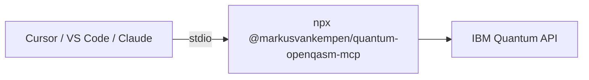

# Mode 3 — MCP client via npm (no extension)

Run **`@markusvankempen/quantum-openqasm-mcp`** with **`npx`** in Cursor, VS Code, Bob, Antigravity, or Claude Desktop — **without** installing the Quantum VS Code extension.

📖 **[Deployments hub](../README.md)** · **[Local MCP setup](../../docs/ide/LOCAL-MCP-SETUP.md)** · **[npm package](https://www.npmjs.com/package/@markusvankempen/quantum-openqasm-mcp)**

---

## What you get

| ✅ | ❌ |
|----|-----|
| 10 MCP tools (backends, submit QASM, jobs, histograms) | Quantum Lab UI |
| Works in any MCP-capable IDE | Extension diagnostics panel |
| Fastest path for workshops / trials | Remote SSE (use [mode 5](../mcp-remote-sse/README.md)) |

---

## Architecture



---

## Prerequisites

- Node.js 18+
- IBM Cloud API key + Quantum service CRN

---

## Cursor

`~/.cursor/mcp.json`:

```json
{
  "mcpServers": {
    "quantum-openqasm-mcp": {
      "command": "npx",
      "args": ["-y", "@markusvankempen/quantum-openqasm-mcp"],
      "env": {
        "IBM_API_KEY": "your-ibm-api-key",
        "IBM_SERVICE_CRN": "crn:v1:bluemix:public:quantum-computing:..."
      }
    }
  }
}
```

[One-click install (Cursor Directory)](https://cursor.directory/mcp/quantum-openqasm-mcp) — still requires env vars.

---

## VS Code

User or workspace `mcp.json`:

```json
{
  "servers": {
    "quantum-openqasm-mcp": {
      "command": "npx",
      "args": ["-y", "@markusvankempen/quantum-openqasm-mcp"],
      "env": {
        "IBM_API_KEY": "your-ibm-api-key",
        "IBM_SERVICE_CRN": "crn:v1:bluemix:public:quantum-computing:..."
      }
    }
  }
}
```

---

## Env file alternative

```bash
mkdir -p ~/.quantum-openqasm-mcp
cat > ~/.quantum-openqasm-mcp/.env << 'EOF'
IBM_API_KEY=your-key
IBM_SERVICE_CRN=crn:v1:...
IBM_QUANTUM_ENDPOINT=https://us-east.quantum-computing.cloud.ibm.com
EOF
```

Use the repo launcher (if cloned):

```json
{
  "command": "node",
  "args": ["/absolute/path/to/quantum-openqasm-assistant/scripts/run-mcp-server.mjs"]
}
```

---

## Smoke test

```bash
npx -y @markusvankempen/quantum-openqasm-mcp
# Expect: MCP server listening on stdio (no HTTP port)
```

In IDE: ask *"Use quantum MCP to check credentials and list backends"*

---

## When to use something else

| Need | Mode |
|------|------|
| Quantum Lab + histogram UI | [Extension only](../extension-only/README.md) |
| One-click MCP + Lab together | [Extension + local MCP](../extension-mcp-local/README.md) |
| No API keys on client machines | [Extension + remote MCP](../extension-remote-mcp/README.md) |

---

## Related docs

- [Local MCP setup (full)](../../docs/ide/LOCAL-MCP-SETUP.md)
- [Deployment scenario 5 — npm-only](../../docs/deployments/DEPLOYMENT-SCENARIOS.md)
- [MCP Registry](https://registry.modelcontextprotocol.io/?q=quantum-openqasm-mcp)
