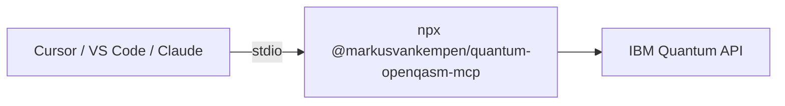

# Mode 3 — MCP client via npm (no extension)

Run **`@markusvankempen/quantum-openqasm-mcp`** with **`npx`** in Cursor, VS Code, Bob, Antigravity, or Claude Desktop — **without** installing the Quantum VS Code extension.

📖 **[Deployments hub](../README.md)** · **[npm package](https://www.npmjs.com/package/@markusvankempen/quantum-openqasm-mcp)** · **[MCP Registry](https://registry.modelcontextprotocol.io/servers/io.github.markusvankempen/quantum-openqasm-mcp)** · **[Local MCP setup (full)](../../docs/ide/LOCAL-MCP-SETUP.md)** · **[Qiskit workflow](../../docs/QISKIT-INTEGRATION.md)**

**Package:** `@markusvankempen/quantum-openqasm-mcp` · **CLI:** `quantum-openqasm-mcp` · **Transport:** stdio · **Node:** 18+

---

## What you get

| ✅ | ❌ |
|----|-----|
| 10 MCP tools (backends, submit QASM, jobs, histograms) | Quantum Lab UI |
| Works in any MCP-capable IDE | Extension diagnostics panel |
| Fastest path for workshops / trials | Remote SSE (use [mode 5](../mcp-remote-sse/README.md)) |

---

## Architecture



---

## Quick start

```bash
# 1. Verify Node.js
node --version   # need 18+

# 2. Check IBM credentials
npx -y @markusvankempen/quantum-openqasm-mcp --check

# 3. Interactive wizard (writes mcp.json + optional .env)
npx -y @markusvankempen/quantum-openqasm-mcp --setup
```

Reload your IDE, enable **quantum-openqasm-mcp** in MCP settings, then ask: *"Use quantum MCP to list backends."*

---

## Install the npm package

### Option A — `npx` (recommended for MCP clients)

No global install — MCP hosts spawn the server on demand:

```bash
npx -y @markusvankempen/quantum-openqasm-mcp
```

Use this in every `mcp.json` as:

```json
"command": "npx",
"args": ["-y", "@markusvankempen/quantum-openqasm-mcp"]
```

### Option B — Global CLI

```bash
npm install -g @markusvankempen/quantum-openqasm-mcp
quantum-openqasm-mcp --check
```

Then in `mcp.json`:

```json
"command": "quantum-openqasm-mcp",
"args": []
```

### Option C — Interactive setup wizard

```bash
npx -y @markusvankempen/quantum-openqasm-mcp --setup
```

| Choice | What it does |
|--------|----------------|
| **(a)** | VS Code `mcp.json` with `${input:...}` prompts (secure — no secrets in file) |
| **(b)** | `mcp.json` with env vars + writes `~/.quantum-openqasm-mcp/.env` |
| **(c)** | `.env` only (for Cursor / manual `mcp.json`) |

---

## IBM Quantum credentials

The MCP server reads credentials from **environment variables** or a **`.env` file**.

### Required variables

| Variable | Where to get it |
|----------|-----------------|
| `IBM_API_KEY` | [IBM Cloud IAM API keys](https://cloud.ibm.com/iam/apikeys) |
| `IBM_SERVICE_CRN` | [IBM Quantum instance](https://quantum.ibm.com/) → instance CRN |

### Optional variables

| Variable | Default / example |
|----------|-------------------|
| `IBM_QUANTUM_ENDPOINT` | `https://us-east.quantum-computing.cloud.ibm.com` |
| `IBM_QUANTUM_BACKEND` | e.g. `ibm_fez`, `ibm_marrakesh`, `ibm_kingston` |

### `.env` file (recommended for Cursor)

```bash
mkdir -p ~/.quantum-openqasm-mcp
cat > ~/.quantum-openqasm-mcp/.env << 'EOF'
IBM_API_KEY=your_ibm_cloud_api_key
IBM_SERVICE_CRN=crn:v1:bluemix:public:quantum-computing:us-east:a/...
IBM_QUANTUM_ENDPOINT=https://us-east.quantum-computing.cloud.ibm.com
IBM_QUANTUM_BACKEND=ibm_fez
EOF
chmod 600 ~/.quantum-openqasm-mcp/.env
```

The package also loads `.env` from the **current working directory** when the MCP process starts.

**Never commit** API keys — run `bash scripts/check-secrets.sh` before publishing repos.

---

## Configure your MCP client

### Config file locations

| IDE | Global config path |
|-----|-------------------|
| **Cursor** | `~/.cursor/mcp.json` |
| **VS Code** | macOS: `~/Library/Application Support/Code/User/mcp.json` · Linux: `~/.config/Code/User/mcp.json` · Windows: `%APPDATA%\Code\User\mcp.json` |
| **Claude Desktop** | macOS: `~/Library/Application Support/Claude/claude_desktop_config.json` |
| **IBM Bob** | `~/.bob/mcp.json` or `~/.bob/mcp_settings.json` |
| **Antigravity** | `~/.gemini/antigravity/mcp_config.json` |

Project-level: `.cursor/mcp.json`, `.vscode/mcp.json`, etc.

| IDE | JSON root key | Stdio shape |
|-----|---------------|-------------|
| Cursor, Claude, Bob, Antigravity | `mcpServers` | `{ "command", "args", "env"? }` |
| VS Code (native MCP) | `servers` | `{ "type": "stdio", "command", "args", "env"? }` |

---

### Cursor

`~/.cursor/mcp.json`:

```json
{
  "mcpServers": {
    "quantum-openqasm-mcp": {
      "command": "npx",
      "args": ["-y", "@markusvankempen/quantum-openqasm-mcp"],
      "env": {
        "IBM_API_KEY": "your-ibm-api-key",
        "IBM_SERVICE_CRN": "crn:v1:bluemix:public:quantum-computing:..."
      }
    }
  }
}
```

Or omit `env` if you use `~/.quantum-openqasm-mcp/.env`.

[Cursor Directory listing](https://cursor.directory/mcp/quantum-openqasm-mcp) — still requires credentials.

**After editing:** restart Cursor or **MCP: List Servers** → enable **quantum-openqasm-mcp** (10 tools).

---

### VS Code (native MCP)

**Recommended** — secure `${input:...}` prompts (no secrets in `mcp.json`):

```json
{
  "servers": {
    "quantum-openqasm-mcp": {
      "type": "stdio",
      "command": "npx",
      "args": ["-y", "@markusvankempen/quantum-openqasm-mcp"],
      "env": {
        "IBM_API_KEY": "${input:ibmApiKey}",
        "IBM_SERVICE_CRN": "${input:ibmServiceCrn}",
        "IBM_QUANTUM_ENDPOINT": "https://us-east.quantum-computing.cloud.ibm.com",
        "IBM_QUANTUM_BACKEND": "ibm_fez"
      }
    }
  },
  "inputs": [
    {
      "id": "ibmApiKey",
      "type": "promptString",
      "description": "IBM Cloud API Key (quantum.ibm.com → Account → API keys)",
      "password": true
    },
    {
      "id": "ibmServiceCrn",
      "type": "promptString",
      "description": "IBM Quantum Instance CRN (crn:v1:bluemix:public:quantum-computing:...)"
    }
  ]
}
```

**After editing:** Command Palette → **MCP: List Servers** → enable **quantum-openqasm-mcp**.

Plain env vars (same shape as Cursor) also work if you prefer inline keys.

---

### Claude Desktop

Same `mcpServers` block as Cursor in `claude_desktop_config.json`:

```json
{
  "mcpServers": {
    "quantum-openqasm-mcp": {
      "command": "npx",
      "args": ["-y", "@markusvankempen/quantum-openqasm-mcp"],
      "env": {
        "IBM_API_KEY": "your-ibm-api-key",
        "IBM_SERVICE_CRN": "crn:v1:bluemix:public:quantum-computing:..."
      }
    }
  }
}
```

Restart Claude Desktop after saving.

---

### IBM Bob & Antigravity

Use the same `mcpServers` / `npx` block as Cursor. Merge into existing JSON — do not replace other servers.

Alternatively, install the [Quantum OpenQASM Assistant](https://marketplace.visualstudio.com/items?itemName=markusvankempen.quantum-openqasm-assistant) extension and run **Quantum → Setup MCP** (writes all IDE configs + `.env`).

---

## Verify installation

### 1. Credential check (CLI)

```bash
npx -y @markusvankempen/quantum-openqasm-mcp --check
```

Masks secrets, tests IBM IAM, exits **0** when ready.

### 2. Server startup

```bash
npx -y @markusvankempen/quantum-openqasm-mcp
```

Expect: MCP server on **stdio** (no HTTP port). Press Ctrl+C to stop.

The server **fails fast** if `IBM_API_KEY` or `IBM_SERVICE_CRN` are missing — stderr shows setup guidance.

### 3. In your IDE

- MCP panel shows **quantum-openqasm-mcp** with **10 tools**
- Chat: *"Call check_credentials, then list_backends on the quantum MCP"*

---

## MCP tools (10)

| Tool | Description |
|------|-------------|
| `check_credentials` | Masked env status + IBM IAM connectivity test |
| `list_backends` | IBM Quantum backends — qubits, status, queue |
| `get_backend` | Details for one backend |
| `get_backend_configuration` | Native gates and coupling map |
| `list_jobs` | Recent jobs for your account |
| `submit_qasm_job` | Submit OpenQASM 2.0 via SamplerV2 |
| `get_job_status` | Poll job status |
| `get_job_results` | Measurement histogram + JSON counts |
| `get_job_result` | Combined status + results |
| `cancel_job` | Cancel a queued or running job |

### Example prompts

- *"Use quantum-openqasm-mcp to list backends with the shortest queue."*
- *"Submit this Bell-state OpenQASM circuit on ibm_fez with 4096 shots."*
- *"Poll get_job_status until done, then show the histogram."*

Minimal OpenQASM 2.0 circuit:

```qasm
OPENQASM 2.0;
include "qelib1.inc";
qreg q[2];
creg c[2];
h q[0];
cx q[0], q[1];
measure q -> c;
```

From Qiskit: see **[Qiskit integration guide](../../docs/QISKIT-INTEGRATION.md)**.

---

## Troubleshooting

| Symptom | Fix |
|---------|-----|
| MCP server not listed | Reload IDE; check JSON syntax; merge don't replace other servers |
| Startup error about credentials | Run `--check`; verify `.env` path or `mcp.json` `env` block |
| `npx` slow on first run | Normal — npm downloads package once; use global install to cache |
| Tools timeout on hardware | Check queue with `list_backends`; try a simulator backend |
| VS Code prompts not appearing | Ensure `inputs` array matches `${input:...}` ids in `env` |

---

## When to use something else

| Need | Mode |
|------|------|
| Quantum Lab + histogram UI | [Extension only](../extension-only/README.md) |
| One-click MCP + Lab together | [Extension + local MCP](../extension-mcp-local/README.md) |
| No API keys on client machines | [MCP remote SSE](../mcp-remote-sse/README.md) or [Extension + remote](../extension-remote-mcp/README.md) |

---

## Related docs

- [Local MCP setup (full)](../../docs/ide/LOCAL-MCP-SETUP.md)
- [Deployment scenario 5 — npm-only](../../docs/deployments/DEPLOYMENT-SCENARIOS.md)
- [npm package on npmjs.com](https://www.npmjs.com/package/@markusvankempen/quantum-openqasm-mcp)
