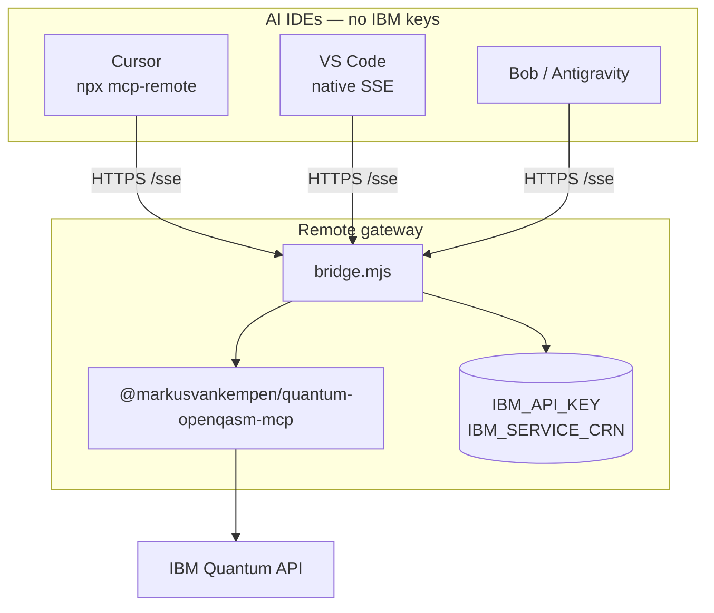

# Mode 5 — MCP remote SSE (no extension)

Connect **Cursor**, **VS Code**, **Bob**, **Antigravity**, or **Claude Desktop** to a **remote MCP gateway** over HTTPS `/sse` — **without** installing the Quantum VS Code extension.

IBM credentials stay **on the server** (Code Engine or self-hosted Docker). Your laptop only needs the **SSE URL** in `mcp.json`.

📖 **[Deployments hub](../README.md)** · **[Remote MCP setup](../../docs/ide/REMOTE-MCP-SETUP.md)** · **[Code Engine deploy](../code-engine/README.md)** · **[IDE setup procedure](../code-engine/IDE-SETUP.md)**

---

## What you get

| ✅ | ❌ |
|----|-----|
| 10 MCP tools via remote gateway | Quantum Lab UI |
| No `IBM_API_KEY` in `mcp.json` | Extension diagnostics panel |
| Team-shared URL | Local stdio (use [mode 3](../mcp-npm/README.md)) |
| Same gateway as [mode 4](../extension-remote-mcp/README.md) | — |

---

## Architecture



---

## Prerequisites

| Requirement | Check |
|-------------|-------|
| Gateway deployed | [Code Engine](../code-engine/README.md) or [local bridge](../local-bridge/README.md) for dev |
| `CE_ENDPOINT` resolved | `curl -sS "${CE_ENDPOINT}/health"` → `ok` |
| Cursor: `npx` or `uvx` | For `mcp-remote` / `mcp-proxy` |

---

## Quick setup (recommended)

```bash
cd deployments/code-engine
./setup-remote-mcp.sh
```

Interactive menu: pick IDE(s), optional workspace `.vscode/mcp.json`, health check.

```bash
# Non-interactive examples
./setup-remote-mcp.sh --ide cursor,vscode --workspace
./setup-remote-mcp.sh --ide cursor --proxy    # SSE timeout workaround
./setup-remote-mcp.sh --check-only            # verify only, no file changes
```

📖 **[IDE-SETUP.md](../code-engine/IDE-SETUP.md)** · **[mcp-configs templates](../code-engine/mcp-configs/README.md)**

---

## Manual `mcp.json` examples

Replace `<CE_ENDPOINT>` with your live URL (must end with `/sse` for the connection target).

**VS Code** (native SSE):

```json
{
  "servers": {
    "quantum-openqasm-mcp-remote": {
      "type": "sse",
      "url": "https://<CE_ENDPOINT>/sse"
    }
  }
}
```

**Cursor** (`npx mcp-remote`):

```json
{
  "mcpServers": {
    "quantum-openqasm-mcp-remote": {
      "command": "npx",
      "args": ["-y", "mcp-remote", "https://<CE_ENDPOINT>/sse"]
    }
  }
}
```

If Cursor times out after ~30s, use the proxy template: `mcp-configs/cursor-remote-mcp-proxy.json` (`uvx mcp-proxy`).

---

## Verify

```bash
cd deployments/code-engine
./check-remote-health.sh
```

In IDE chat: *"Use quantum-openqasm-mcp-remote to list IBM Quantum backends."*

---

## Mode 5 vs mode 4

| | **Mode 5** (this doc) | [Mode 4 — Extension + remote](../extension-remote-mcp/README.md) |
|---|----------------------|------------------------------------------------------------------|
| VS Code extension | ❌ | ✅ Quantum Lab + `mcpMode: remote` |
| AI IDE `mcp.json` | ✅ | ✅ (optional, same URL) |
| Gateway deploy | Same `code-engine/` | Same `code-engine/` |

Need **both** Lab UI and AI MCP? Use **mode 4**. AI assistants only? Use **mode 5**.

---

## Related docs

- [Remote MCP setup (full)](../../docs/ide/REMOTE-MCP-SETUP.md)
- [Deployment scenario 2 — Code Engine](../../docs/deployments/DEPLOYMENT-SCENARIOS.md#scenario-2-ibm-code-engine-remote-sse)
- [Secured remote gateway](../secured-remote/README.md) — when you need auth on `/sse`
