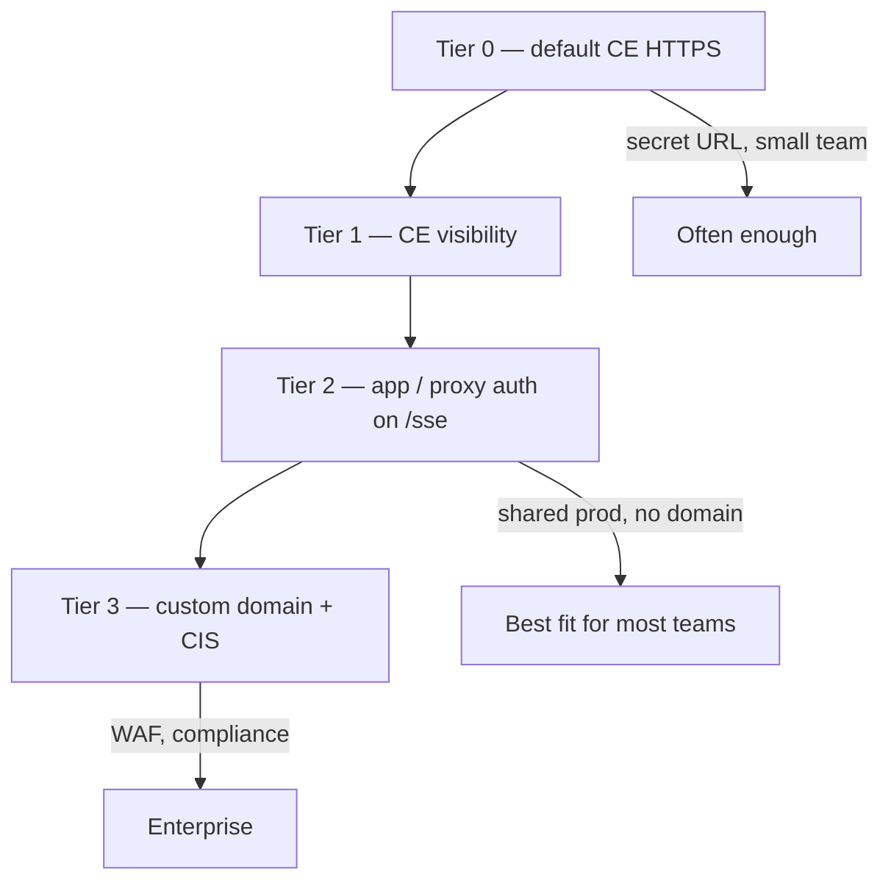

# Secured remote gateway

Add **access control** in front of the Quantum MCP `/sse` endpoint while keeping **IBM Quantum credentials on the server**.

Builds on [Code Engine](../code-engine/README.md) or [Docker SSE](../docker-sse/README.md) — IBM Code Engine provides HTTPS by default; this doc covers **who may open an MCP session**.

📖 **[Deployments hub](../README.md)** · **[Deployment scenario 8 (full)](../../docs/deployments/DEPLOYMENT-SCENARIOS.md#scenario-8-secured-remote-auth-in-front-of-sse)**

---

## Security tiers



| Tier | Custom domain? | Remote IDE from laptop? | Summary |
|------|----------------|-------------------------|---------|
| **0 — Default** | No | ✅ | HTTPS CE URL; IBM keys in CE secrets; treat URL like a password |
| **1a — Project-only** | No | ❌ | `--visibility=project` — same CE project only |
| **1b — Private** | No | ⚠️ VPN/VPE | `--visibility=private` — IBM private network |
| **2 — App / proxy auth** | No | ✅ | API key or JWT on `/sse` |
| **3 — Custom domain + CIS** | Yes | ✅ | Branded URL, WAF, hide `*.codeengine.appdomain.cloud` |

---

## Tier 0 — What you already have

| Control | Status |
|---------|--------|
| TLS / HTTPS | ✅ `*.codeengine.appdomain.cloud` |
| IBM keys on server | ✅ Code Engine secrets |
| Admin rotation | ✅ `/admin` + `BRIDGE_ADMIN_SECRET` |
| Client auth on `/sse` | ❌ Anyone with URL can connect |

**Good for:** trusted internal teams. Do not commit the SSE URL to git — run `bash scripts/check-secrets.sh`.

---

## Tier 1 — Code Engine visibility

```bash
# Project-only: not reachable from public internet
ibmcloud ce app update --name quantum-mcp-remote --visibility project

# Private: IBM Cloud private network + VPE
ibmcloud ce app update --name quantum-mcp-remote --visibility private
```

**Catch:** Cursor, VS Code, and the extension run on **developer laptops** on the public internet. `project` or `private` visibility **blocks them** unless you add VPN/VPE or an in-project proxy.

**Good for:** server-to-server only (e.g. [watsonx Orchestrate](../wxo-orchestrate/README.md) inside IBM Cloud).

📖 [Code Engine — securing applications](https://cloud.ibm.com/docs/codeengine?topic=codeengine-secure)

---

## Tier 2 — Auth without a custom domain

Keep the default CE HTTPS URL; authenticate clients before MCP traffic reaches `bridge.mjs`.

| Approach | IDE-friendly? |
|----------|---------------|
| **Gateway API key** (`X-Api-Key` on `/sse`) | ⚠️ Needs `mcp-remote` header support or thin wrapper |
| **Sidecar proxy on CE** | ✅ Team proxy URL |
| **Team policy** (vault-distributed URL only) | Weak alone — fine as extra layer |

**Today:** `BRIDGE_ADMIN_SECRET` protects **`/admin` only**, not `/sse`. Tier 2 requires bridge extension or an auth proxy in the same CE project.

Example nginx pattern (same idea on CE sidecar):

```nginx
location /sse {
    if ($http_x_api_key != "team-shared-gateway-key") { return 401; }
    proxy_pass http://127.0.0.1:8080;
    proxy_http_version 1.1;
    proxy_set_header Connection '';
    proxy_buffering off;
    proxy_read_timeout 3600s;
}
```

SSE needs long `proxy_read_timeout` and `proxy_buffering off`.

---

## Tier 3 — Custom domain + CIS

1. Obtain FQDN + TLS cert (or CIS origin cert)
2. `ibmcloud ce domainmapping create` — map domain → app
3. **Cloud Internet Services** — WAF, IP allowlist, DDoS
4. Disable public system domain mapping in console
5. Clients use `https://quantum-mcp.yourcompany.com/sse`

📖 [Layer 7 protection with CIS](https://cloud.ibm.com/docs/codeengine?topic=codeengine-secure)

---

## Recommended path

| Situation | Start with |
|-----------|------------|
| Just deployed, internal team | **Tier 0** |
| Lock down `/sse` soon | **Tier 2** |
| Laptops on public internet | Avoid **Tier 1** alone — use Tier 0/2/3 |
| WxO agent in IBM Cloud | **Tier 1b** + VPE may work |
| Compliance / WAF | **Tier 3** |

---

## Other controls (any tier)

| Control | Purpose |
|---------|---------|
| **IAM** | Who can deploy, view logs, change CE secrets |
| **Separate CE projects** | Dev / staging / prod isolation |
| **`scripts/check-secrets.sh`** | No URLs or keys in git |

---

## Related docs

- [Code Engine — credential boundary](../code-engine/README.md#credential-boundary)
- [Mode 5 — MCP remote SSE](../mcp-remote-sse/README.md) — client config after securing gateway
