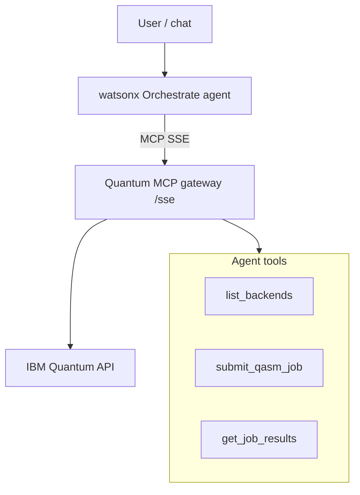

# watsonx Orchestrate agent attachment

Attach the **Quantum MCP gateway** (`/sse`) to a **watsonx Orchestrate** agent as a remote tool source — natural-language quantum jobs inside enterprise agentic workflows.

Same pattern as other Code Engine MCP gateways (e.g. [Zendesk MCP](https://github.com/markusvankempen/zendesk_mcp)).

📖 **[Deployments hub](../README.md)** · **[Code Engine deploy](../code-engine/README.md)** · **[Secured remote](../secured-remote/README.md)**

---

## What you get

| ✅ | ❌ |
|----|-----|
| Agent calls `list_backends`, `submit_qasm_job`, etc. | Quantum Lab UI (use extension separately) |
| IBM keys stay on gateway | Zero-latency quantum (queue time applies) |
| One gateway for IDEs + agents | Dedicated Orchestrate licensing |

---

## Architecture



---

## Prerequisites

1. **Gateway deployed** — [Code Engine](../code-engine/README.md) (prod) or [local bridge](../local-bridge/README.md) (dev)
2. **SSE URL resolved** — never hardcode; use `generate-mcp-configs.sh` or `ibmcloud ce app get`
3. **watsonx Orchestrate** environment with MCP / remote tool support

---

## Setup outline

### 1. Deploy gateway

```bash
cd deployments/code-engine
IBMCLOUD_API_KEY=... IBM_API_KEY=... IBM_SERVICE_CRN=... ./deploy.sh
```

```bash
export CE_ENDPOINT=$(ibmcloud ce app get --name quantum-mcp-remote --output json \
  | python3 -c "import sys,json; print(json.load(sys.stdin)['status']['url'])")
curl -sS "${CE_ENDPOINT}/health"
```

### 2. Register in Orchestrate

Add a **remote MCP connection** pointing at:

```text
https://<CE_ENDPOINT>/sse
```

If Orchestrate requires a local stdio bridge, use `mcp-remote` as a proxy to the SSE URL (same as Cursor).

### 3. Assign tools to the agent

Enable relevant tools, for example:

- `list_backends`
- `submit_qasm_job`
- `get_job_status`
- `get_job_results`
- `check_credentials`

### 4. Test

Ask the agent: *"List available IBM Quantum backends"* or *"Submit a Bell-state circuit on the least busy simulator."*

---

## Credentials

| Secret | Where |
|--------|-------|
| `IBM_API_KEY`, `IBM_SERVICE_CRN` | Code Engine secrets (gateway) |
| SSE URL | Orchestrate connection config only |

The Orchestrate runtime does **not** need IBM Quantum keys on the agent host — same model as [mode 5](../mcp-remote-sse/README.md).

---

## Security

| Concern | Guidance |
|---------|----------|
| Public `/sse` URL | Use [secured-remote](../secured-remote/README.md) Tier 1b/2 if agents run inside IBM Cloud |
| Shared quota | IDE users and agents share the same gateway job quota |
| URL in git | Never commit — `bash scripts/check-secrets.sh` |

---

## When to use another mode

| Goal | Use instead |
|------|-------------|
| Developer IDE only | [mcp-remote-sse/](../mcp-remote-sse/README.md) |
| Lab UI + agent | [extension-remote-mcp/](../extension-remote-mcp/README.md) + this doc |
| Local WxO dev test | [local-bridge/](../local-bridge/README.md) |

---

## Related docs

- [Remote MCP setup](../../docs/ide/REMOTE-MCP-SETUP.md)
- [Deployment scenario 9 (full)](../../docs/deployments/DEPLOYMENT-SCENARIOS.md#scenario-9-watsonx-orchestrate-agent-attachment)
- [Code Engine architecture](../code-engine/README.md#architecture--how-remote-mcp-works)
