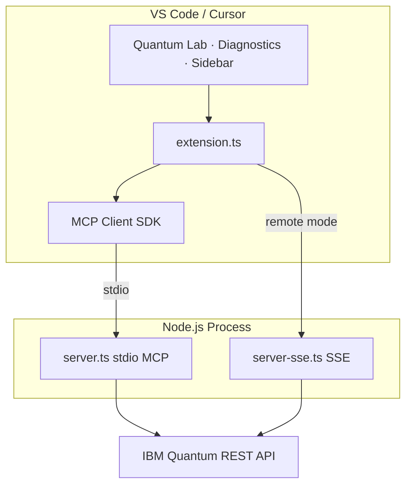

# Architecture Documentation

<!--
SEO: Quantum OpenQASM architecture | MCP server | VS Code extension | IBM Quantum API
system design, stdio mcp, sse code engine, sampler v2, typescript quantum extension
-->

> Technical architecture for the **Quantum OpenQASM Assistant** — **VS Code extension**, **MCP server** (`server.ts` / `server-sse.ts`), and **IBM Quantum REST API** integration via **SamplerV2** and **OpenQASM 2.0 ISA**.

📖 **[Docs index](./README.md)** · **[Main README](../README.md)** · **[Project structure](./PROJECT-STRUCTURE.md)** · **[Local MCP setup](./ide/LOCAL-MCP-SETUP.md)** · **[Deployment](./deployments/DEPLOYMENT-SCENARIOS.md)**

Built on three core principles:

1. **Pure TypeScript** — no Python required for the extension or MCP server
2. **MCP Protocol** — standard interface for AI tool integration
3. **REST APIs** — direct IBM Quantum SamplerV2 communication



## System Overview

## Component Architecture

### High-Level System Design

```
┌─────────────────────────────────────────────────────────────────────┐
│                         VS Code Environment                          │
│                                                                      │
│  ┌────────────────────────────────────────────────────────────┐    │
│  │                    Extension Host Process                   │    │
│  │                                                             │    │
│  │  ┌──────────────────────────────────────────────────────┐  │    │
│  │  │         Quantum Assistant Extension                   │  │    │
│  │  │         (extension.ts)                                │  │    │
│  │  │                                                       │  │    │
│  │  │  ┌─────────────────┐    ┌────────────────────────┐  │  │    │
│  │  │  │  Command        │    │  Configuration         │  │  │    │
│  │  │  │  Registration   │    │  Management            │  │  │    │
│  │  │  │                 │    │  - IBM Token           │  │  │    │
│  │  │  │  • submitCircuit│    │  - Provider Settings   │  │  │    │
│  │  │  └─────────────────┘    └────────────────────────┘  │  │    │
│  │  │                                                       │  │    │
│  │  │  ┌──────────────────────────────────────────────┐   │  │    │
│  │  │  │         MCP Client                            │   │  │    │
│  │  │  │  (@modelcontextprotocol/sdk)                 │   │  │    │
│  │  │  │                                               │   │  │    │
│  │  │  │  • Connection Management                      │   │  │    │
│  │  │  │  • Tool Discovery (listTools)                 │   │  │    │
│  │  │  │  • Tool Execution (callTool)                  │   │  │    │
│  │  │  └───────────────────┬──────────────────────────┘   │  │    │
│  │  └──────────────────────┼──────────────────────────────┘  │    │
│  └─────────────────────────┼─────────────────────────────────┘    │
│                            │                                       │
│                            │ stdio (stdin/stdout)                  │
│                            │                                       │
│  ┌─────────────────────────▼─────────────────────────────────┐    │
│  │              Child Process (Node.js)                       │    │
│  │                                                            │    │
│  │  ┌──────────────────────────────────────────────────────┐ │    │
│  │  │         MCP Server (server.ts)                        │ │    │
│  │  │                                                       │ │    │
│  │  │  ┌────────────────────────────────────────────────┐  │ │    │
│  │  │  │  Tool Registry                                  │  │ │    │
│  │  │  │                                                 │  │ │    │
│  │  │  │  • submit_qasm_job                             │  │ │    │
│  │  │  │    - Input: qasm_string, provider, backend     │  │ │    │
│  │  │  │    - Output: job_id, status                    │  │ │    │
│  │  │  └────────────────────────────────────────────────┘  │ │    │
│  │  │                                                       │ │    │
│  │  │  ┌────────────────────────────────────────────────┐  │ │    │
│  │  │  │  Provider Routing Layer                         │  │ │    │
│  │  │  │                                                 │  │ │    │
│  │  │  │  ┌──────────────┐      ┌──────────────┐       │  │ │    │
│  │  │  │  │ submitToIBM  │      │ submitToOQ   │       │  │ │    │
│  │  │  │  │              │      │  (planned)   │       │  │ │    │
│  │  │  │  └──────────────┘      └──────────────┘       │  │ │    │
│  │  │  └────────────────────────────────────────────────┘  │ │    │
│  │  └──────────────────────────────────────────────────────┘ │    │
│  └────────────────────────────────────────────────────────────┘    │
└──────────────────────────────┬───────────────────────────────────────┘
                               │
                               │ HTTPS REST API
                               │
┌──────────────────────────────▼───────────────────────────────────────┐
│                    Quantum Cloud Infrastructure                       │
│                                                                       │
│  ┌─────────────────────────────────────────────────────────────┐    │
│  │              IBM Quantum Platform                            │    │
│  │                                                              │    │
│  │  API Endpoint: https://quantum.cloud.ibm.com/api/v1/jobs   │    │
│  │                                                              │    │
│  │  ┌──────────────┐  ┌──────────────┐  ┌──────────────┐     │    │
│  │  │   Simulators │  │  Real QPUs   │  │ Job Queue    │     │    │
│  │  │              │  │              │  │              │     │    │
│  │  │ • qasm_sim   │  │ • Brisbane   │  │ • Scheduler  │     │    │
│  │  │ • statevec   │  │ • Kyoto      │  │ • Monitor    │     │    │
│  │  └──────────────┘  └──────────────┘  └──────────────┘     │    │
│  └─────────────────────────────────────────────────────────────┘    │
└───────────────────────────────────────────────────────────────────────┘
```

## Data Flow Sequences

### 1. Extension Activation

```
User Opens VS Code
        │
        ▼
Extension Activates (activate function)
        │
        ├─▶ Read Configuration
        │   └─▶ Get IBM Token from settings
        │
        ├─▶ Spawn MCP Server Process
        │   ├─▶ command: 'node'
        │   ├─▶ args: ['out/server.js']
        │   └─▶ env: { IBM_QUANTUM_TOKEN: '...' }
        │
        ├─▶ Create MCP Client
        │   └─▶ StdioClientTransport
        │
        ├─▶ Connect Client to Server
        │   └─▶ await client.connect(transport)
        │
        └─▶ Register Commands
            └─▶ 'quantum.submitCircuit'
```

### 2. Circuit Submission Flow

```
User Action: Command Palette → "Submit Circuit"
        │
        ▼
Extension Handler (quantum.submitCircuit)
        │
        ├─▶ Validate MCP Client
        │   └─▶ Error if not initialized
        │
        ├─▶ Get Active Editor
        │   └─▶ Error if no file open
        │
        ├─▶ Read OpenQASM Code
        │   └─▶ editor.document.getText()
        │
        ├─▶ Call MCP Tool
        │   │
        │   └─▶ mcpClient.callTool({
        │         name: 'submit_qasm_job',
        │         arguments: {
        │           qasm_string: "...",
        │           provider: "ibm_quantum",
        │           backend_name: "ibmq_qasm_simulator"
        │         }
        │       })
        │
        ▼
MCP Server Receives Request
        │
        ├─▶ Validate Tool Name
        │   └─▶ Check: 'submit_qasm_job'
        │
        ├─▶ Extract Arguments
        │   ├─▶ qasm_string
        │   ├─▶ provider
        │   └─▶ backend_name
        │
        ├─▶ Route to Provider
        │   │
        │   └─▶ if (provider === 'ibm_quantum')
        │       │
        │       └─▶ submitToIBM(qasm, backend)
        │           │
        │           ├─▶ Get Token from env
        │           │   └─▶ process.env.IBM_QUANTUM_TOKEN
        │           │
        │           ├─▶ Format REST Request
        │           │   └─▶ {
        │           │         program_id: "sampler",
        │           │         backend: backend,
        │           │         params: { pubs: [[qasm]] }
        │           │       }
        │           │
        │           ├─▶ POST to IBM API
        │           │   └─▶ axios.post(
        │           │         'https://quantum.cloud.ibm.com/api/v1/jobs',
        │           │         payload,
        │           │         { headers: { Authorization, ... } }
        │           │       )
        │           │
        │           └─▶ Extract Job ID
        │               └─▶ response.data.id
        │
        └─▶ Return Result
            └─▶ {
                  content: [{
                    type: "text",
                    text: "Job ID: xyz123"
                  }],
                  isError: false
                }
        │
        ▼
Extension Receives Response
        │
        ├─▶ Parse Content
        │   └─▶ result.content[0].text
        │
        └─▶ Display to User
            └─▶ vscode.window.showInformationMessage()
```

### 3. Error Handling Flow

```
Error Occurs (Any Stage)
        │
        ├─▶ Network Error
        │   └─▶ axios catches → error.response?.data
        │
        ├─▶ Authentication Error
        │   └─▶ IBM API returns 401
        │
        ├─▶ Invalid QASM
        │   └─▶ IBM API returns 400
        │
        └─▶ Server Error
            └─▶ IBM API returns 500
        │
        ▼
MCP Server Error Handler
        │
        ├─▶ Extract Error Message
        │   └─▶ error.response?.data?.error?.message || error.message
        │
        └─▶ Return Error Response
            └─▶ {
                  content: [{ type: "text", text: "Error: ..." }],
                  isError: true
                }
        │
        ▼
Extension Error Handler
        │
        └─▶ Display Error
            └─▶ vscode.window.showErrorMessage()
```

## Technology Stack

### Core Dependencies

```
┌─────────────────────────────────────────────────────────┐
│                   Technology Stack                       │
├─────────────────────────────────────────────────────────┤
│                                                         │
│  Runtime Environment                                    │
│  ├─ Node.js (v18+)                                     │
│  └─ TypeScript (v5.3.3)                                │
│                                                         │
│  VS Code Extension API                                  │
│  └─ @types/vscode (^1.85.0)                           │
│                                                         │
│  MCP Protocol                                           │
│  └─ @modelcontextprotocol/sdk (^1.0.1)                │
│     ├─ Server SDK (stdio transport)                    │
│     └─ Client SDK (stdio transport)                    │
│                                                         │
│  HTTP Client                                            │
│  └─ axios (^1.6.8)                                     │
│     └─ REST API communication                          │
│                                                         │
│  Build Tools                                            │
│  ├─ TypeScript Compiler (tsc)                         │
│  └─ VS Code Extension Manager (vsce)                   │
│                                                         │
└─────────────────────────────────────────────────────────┘
```

## Security Architecture

### Token Management

```
┌─────────────────────────────────────────────────────────┐
│              Security & Token Flow                       │
├─────────────────────────────────────────────────────────┤
│                                                         │
│  1. User Configuration                                  │
│     └─▶ VS Code Settings (User Level)                  │
│         └─▶ quantumAssistant.ibmToken: "..."          │
│                                                         │
│  2. Extension Reads Token                               │
│     └─▶ vscode.workspace.getConfiguration()            │
│         └─▶ Stored in memory (not persisted)           │
│                                                         │
│  3. Pass to MCP Server                                  │
│     └─▶ Environment Variable                           │
│         └─▶ IBM_QUANTUM_TOKEN: token                   │
│             (Only visible to child process)             │
│                                                         │
│  4. Server Uses Token                                   │
│     └─▶ Authorization Header                           │
│         └─▶ Bearer ${token}                            │
│             (HTTPS encrypted in transit)                │
│                                                         │
│  Security Notes:                                        │
│  • Token never written to disk by extension            │
│  • Token not logged or displayed                       │
│  • HTTPS ensures encrypted transmission                │
│  • VS Code settings can be encrypted                   │
│                                                         │
└─────────────────────────────────────────────────────────┘
```

## Extension Points for Future Development

### 1. Additional MCP Tools

```typescript
// Future tools to implement:

{
  name: "get_backends",
  description: "List available quantum backends",
  inputSchema: {
    type: "object",
    properties: {
      provider: { type: "string" }
    }
  }
}

{
  name: "get_job_status",
  description: "Check status of submitted job",
  inputSchema: {
    type: "object",
    properties: {
      job_id: { type: "string" },
      provider: { type: "string" }
    }
  }
}

{
  name: "get_job_results",
  description: "Retrieve results from completed job",
  inputSchema: {
    type: "object",
    properties: {
      job_id: { type: "string" },
      provider: { type: "string" }
    }
  }
}
```

### 2. Provider Expansion

```
Current:
  └─ IBM Quantum (implemented)

Planned:
  ├─ Open Quantum
  ├─ AWS Braket (via SDK)
  └─ Local Simulators
```

### 3. LLM Integration

```
┌─────────────────────────────────────────────────────────┐
│           Future: AI-Assisted Circuit Generation         │
├─────────────────────────────────────────────────────────┤
│                                                         │
│  User Prompt: "Create a 3-qubit GHZ state"            │
│       │                                                 │
│       ▼                                                 │
│  LLM (Claude/GPT)                                      │
│       │                                                 │
│       ├─▶ Generates OpenQASM 3                         │
│       │                                                 │
│       └─▶ Calls MCP Tool                               │
│           └─▶ submit_qasm_job                          │
│                                                         │
└─────────────────────────────────────────────────────────┘
```

## Performance Considerations

### Optimization Strategies

1. **Lazy Loading**: MCP server only spawned when needed
2. **Connection Pooling**: Single server instance per session
3. **Async Operations**: Non-blocking REST API calls
4. **Error Recovery**: Automatic reconnection on server failure

### Resource Usage

```
Memory Footprint:
├─ Extension: ~10-20 MB
├─ MCP Server: ~30-50 MB
└─ Total: ~40-70 MB

Startup Time:
├─ Extension Activation: <100ms
├─ MCP Server Spawn: ~200-500ms
└─ First Tool Call: ~1-2s (network dependent)
```

## Testing Strategy

### Unit Tests (Planned)

```
src/
├─ extension.test.ts
│  ├─ Command registration
│  ├─ Configuration reading
│  └─ MCP client initialization
│
└─ server.test.ts
   ├─ Tool registration
   ├─ Provider routing
   └─ Error handling
```

### Integration Tests (Planned)

```
tests/
├─ e2e/
│  ├─ circuit-submission.test.ts
│  ├─ error-scenarios.test.ts
│  └─ provider-switching.test.ts
```

## Deployment Architecture

```
Development:
  └─ F5 in VS Code → Extension Development Host

Production:
  ├─ Package: cd extension && npm run package → .vsix file
  └─ Publish: see Internal/PUBLISHING.md (private repo)
      └─ Users install via Extensions view or VSIX
```

---

## Topics & keywords

`architecture` · `mcp-server` · `vscode-extension` · `typescript` · `ibm-quantum-api` · `sampler-v2` · `stdio` · `sse` · `openqasm`

---

**Author:** Markus van Kempen  
**Email:** [markus.van.kempen@gmail.com](mailto:markus.van.kempen@gmail.com) · [mvk@ca.ibm.com](mailto:mvk@ca.ibm.com)  
**Website:** [markusvankempen.github.io](https://markusvankempen.github.io/)  
*No bug too small, no syntax too weird.*

