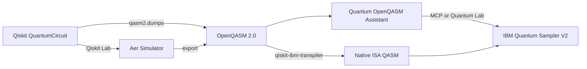

# Qiskit → OpenQASM → IBM Quantum

<!--
SEO: Qiskit OpenQASM export | IBM Quantum Sampler V2 | quantum circuit workflow
qiskit qasm2 dumps, openqasm 2.0 ibm hardware, mcp quantum assistant, qiskit lab,
qiskit-ibm-transpiler, ai transpilation, quantum lab panel
-->

> **Quantum OpenQASM Assistant** does not depend on the Qiskit Python package at runtime. It **complements Qiskit** by taking **OpenQASM 2.0** circuits — exported from Qiskit — and submitting them to **IBM Quantum** via the **Sampler V2** REST API. Starting with **v1.9.2**, a dedicated **Qiskit Lab** panel and **AI-powered transpilation** workflows via `qiskit-ibm-transpiler` bring end-to-end Qiskit development into AI IDEs.

📖 **[Docs index](./README.md)** · **[OpenQASM primer](./OPENQASM-PRIMER.md)** · **[Local MCP](./ide/LOCAL-MCP-SETUP.md)** · **[IBM Quantum — OpenQASM 2 interop](https://docs.quantum.ibm.com/guides/interoperate-qiskit-qasm2)**

**Search terms:** `qiskit openqasm export` · `qasm2 dumps` · `sampler v2` · `ibm quantum workflow` · `qiskit lab` · `qiskit-ibm-transpiler`

---

## Workflow



| Step | Tool | Output |
|------|------|--------|
| 1. Design circuit | Qiskit SDK or **Qiskit Lab** | `QuantumCircuit` |
| 2. Simulate locally | **Qiskit Lab** (Aer) | Histogram preview |
| 3. Export | `qiskit.qasm2.dumps()` | `.qasm` string or file |
| 4. Transpile for hardware | **qiskit-ibm-transpiler** (AI-powered) or Qiskit SDK | ISA-native `.qasm` |
| 5. Submit & monitor | Extension, MCP, or AI IDE | Job ID, histogram |

---

## Example: Bell state from Qiskit

**Requirements:** `qiskit` (+ `qiskit-ibm-runtime` to transpile for IBM hardware). Install via [Qiskit Developer Pack](./ide/QISKIT-DEVELOPER-PACK.md) setup script.

| Script | Purpose |
|--------|---------|
| [`examples/qiskit-bell-export.py`](../examples/qiskit-bell-export.py) | Simple export (logical gates — **not** hardware-ready alone) |
| [`examples/qiskit-bell-transpile-export.py`](../examples/qiskit-bell-transpile-export.py) | **Transpile for IBM backend → OpenQASM 2.0** (use before submit) |

```python
from qiskit import QuantumCircuit, qasm2

qc = QuantumCircuit(2, 2)
qc.h(0)
qc.cx(0, 1)
qc.measure([0, 1], [0, 1])

print(qasm2.dumps(qc))
qasm2.dump(qc, "bell-from-qiskit.qasm")
```

Typical exported OpenQASM 2.0 (Bell state, **logical gates — transpile before IBM hardware**):

```qasm
OPENQASM 2.0;
include "qelib1.inc";
qreg q[2];
creg c[2];
h q[0];
cx q[0], q[1];
measure q[0] -> c[0];
measure q[1] -> c[1];
```

Run the exporters:

```bash
# Developer Pack — offers to install qiskit + qiskit-ibm-runtime
./deployments/qiskit-developer-pack/setup-qiskit-developer-pack.sh --install-python-deps --yes

# Hardware-ready export (uses IBM_SERVICE_CRN + IBM_API_KEY from ~/.quantum-openqasm-mcp/.env)
~/.quantum-openqasm-mcp/qiskit-venv/bin/python examples/qiskit-bell-transpile-export.py
```

### Transpile before submit

IBM QPUs require **native gates**. Submitting raw `h` / `cx` QASM fails with:

```text
The instruction h on qubits (0,) is not supported by the target system.
Transpile your circuits for the target before submitting a primitive query.
```

After transpile + submit to **ibm_marrakesh** (job example `d8uk065posuc738qa6kg`, 4096 shots):

| State | Count | ~% |
|-------|------:|---:|
| `\|11⟩` | 1943 | 47% |
| `\|00⟩` | 1867 | 46% |
| `\|10⟩` | 203 | 5% |
| `\|01⟩` | 83 | 2% |

Full agent workflow: [Qiskit Developer Pack — worked example](./ide/QISKIT-DEVELOPER-PACK.md#worked-example-bell-state-on-ibm-hardware)

---

## Qiskit Lab (v1.9.2+)

The **Qiskit Lab** panel provides a dedicated Qiskit development environment inside VS Code / Cursor:

- **12 ready-to-run templates** — Bell state, GHZ, Grover, teleportation, variational ansatz, Deutsch-Jozsa, QAOA, and more
- **Local Aer simulation** — run Qiskit Python circuits instantly without IBM credentials
- **One-click export** — `qasm2.dumps()` produces OpenQASM 2.0 for hardware submission
- **AI workflows** — ask the agent to transpile, optimize, or submit the exported circuit

Open via: **Quantum → Qiskit Lab** in the sidebar.

### AI-powered transpilation

The extension integrates with **[`qiskit-ibm-transpiler`](https://github.com/Qiskit/qiskit-ibm-transpiler)** for cloud-based AI transpilation:

```
Agent prompt: "Transpile this circuit for ibm_fez using the AI transpiler and submit with 4096 shots"
```

The `quantum-assistant` MCP + `qiskit-ibm-transpiler` MCP together provide:
1. **AI routing** — intelligent pass selection for target hardware
2. **Hardware-aware optimization** — native ISA gates for the selected backend
3. **Seamless submit** — transpiled QASM flows directly to `submit_qasm_job`

Setup: [Qiskit Developer Pack](./ide/QISKIT-DEVELOPER-PACK.md) installs both MCP servers together.

---

## Run on IBM hardware

### Option A — Qiskit Lab → Quantum Lab

1. Open **Qiskit Lab** → select a template or write your own circuit
2. **Simulate** locally with Aer to verify results
3. **Export** to OpenQASM 2.0 → opens in **Quantum Lab** for hardware submission
4. Configure IBM API key + service CRN → submit job → view histogram

### Option B — MCP (Cursor / VS Code AI)

1. **Quantum → Setup MCP** (or see [Local MCP setup](./ide/LOCAL-MCP-SETUP.md))
2. In chat: *"Submit bell-from-qiskit.qasm to the least busy simulator with 4096 shots"*

### Option C — Qiskit Developer Pack (recommended for Qiskit workflows)

Install [Qiskit MCP Servers](https://github.com/Qiskit/mcp-servers) **and** OpenQASM execution together:

```bash
./deployments/qiskit-developer-pack/setup-qiskit-developer-pack.sh --ide cursor
```

Then ask the agent to search docs, build a circuit in Qiskit, export OpenQASM 2.0, transpile with the AI transpiler, and submit via `quantum-openqasm-mcp`. See [Qiskit Developer Pack](./ide/QISKIT-DEVELOPER-PACK.md).

### Option D — Remote team gateway

Deploy [Code Engine](../deployments/code-engine/README.md) and use [remote MCP](../deployments/mcp-remote-sse/README.md) — IBM credentials stay on the server.

---

## V2 primitives alignment

| Qiskit | Quantum OpenQASM Assistant |
|--------|----------------------------|
| `Sampler` V2 primitive | IBM Quantum REST `program_id: sampler` |
| OpenQASM 2.0 payload | `submit_qasm_job` MCP tool / Quantum Lab |
| Backend selection | `list_backends` / Lab backend picker |
| `qiskit-ibm-transpiler` | AI transpilation via MCP / Qiskit Lab workflow |
| Aer local sim | **Qiskit Lab** Aer panel (Python bridge) |

Circuits must be **OpenQASM 2.0** with `include "qelib1.inc"` and **native gates for the target backend**. Transpile using one of:
- **`qiskit-ibm-transpiler`** MCP (AI-powered, cloud) — recommended with Qiskit Developer Pack
- **Qiskit SDK** locally before `qasm2.dumps()` — see [`qiskit-bell-transpile-export.py`](../examples/qiskit-bell-transpile-export.py)
- **Qiskit Lab** panel → agent prompt: *"transpile for ibm_fez"*

Qiskit features that cannot export to OpenQASM 2 (e.g. some dynamic circuits) raise `QASM2ExportError` — fix the circuit in Qiskit before submitting here.

---

## Related IBM Quantum docs

- [OpenQASM 2 and the Qiskit SDK](https://docs.quantum.ibm.com/guides/interoperate-qiskit-qasm2)
- [Qiskit Runtime REST API](https://quantum.cloud.ibm.com/docs/en/api/qiskit-runtime-rest)
- [OpenQASM specification](https://openqasm.com/)

---

**Author:** Markus van Kempen · [markusvankempen.github.io](https://markusvankempen.github.io/)
