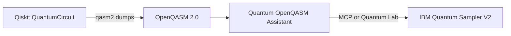

# Qiskit → OpenQASM → IBM Quantum

<!--
SEO: Qiskit OpenQASM export | IBM Quantum Sampler V2 | quantum circuit workflow
qiskit qasm2 dumps, openqasm 2.0 ibm hardware, mcp quantum assistant
-->

> **Quantum OpenQASM Assistant** does not depend on the Qiskit Python package at runtime. It **complements Qiskit** by taking **OpenQASM 2.0** circuits — exported from Qiskit — and submitting them to **IBM Quantum** via the **Sampler V2** REST API.

📖 **[Docs index](./README.md)** · **[OpenQASM primer](./OPENQASM-PRIMER.md)** · **[Local MCP](./ide/LOCAL-MCP-SETUP.md)** · **[IBM Quantum — OpenQASM 2 interop](https://docs.quantum.ibm.com/guides/interoperate-qiskit-qasm2)**

**Search terms:** `qiskit openqasm export` · `qasm2 dumps` · `sampler v2` · `ibm quantum workflow`

---

## Workflow



| Step | Tool | Output |
|------|------|--------|
| 1. Design circuit | Qiskit SDK | `QuantumCircuit` |
| 2. Export | `qiskit.qasm2.dumps()` | `.qasm` string or file |
| 3. Submit & monitor | Extension, MCP, or AI IDE | Job ID, histogram |

---

## Example: Bell state from Qiskit

**Requirements:** `pip install qiskit` — for **export only**; not a runtime dependency of this project.

Script: [`examples/qiskit-bell-export.py`](../examples/qiskit-bell-export.py)

```python
from qiskit import QuantumCircuit, qasm2

qc = QuantumCircuit(2, 2)
qc.h(0)
qc.cx(0, 1)
qc.measure([0, 1], [0, 1])

print(qasm2.dumps(qc))
qasm2.dump(qc, "bell-from-qiskit.qasm")
```

Typical exported OpenQASM 2.0 (Bell state):

```qasm
OPENQASM 2.0;
include "qelib1.inc";
qreg q[2];
creg c[2];
h q[0];
cx q[0], q[1];
measure q[0] -> c[0];
measure q[1] -> c[1];
```

Run the exporter:

```bash
pip install qiskit
python examples/qiskit-bell-export.py
```

---

## Run on IBM hardware

### Option A — VS Code Quantum Lab

1. Install [Quantum OpenQASM Assistant](https://marketplace.visualstudio.com/items?itemName=markusvankempen.quantum-openqasm-assistant)
2. Open `bell-from-qiskit.qasm` in Quantum Lab
3. Configure IBM API key + service CRN → submit job → view histogram

### Option B — MCP (Cursor / VS Code AI)

1. **Quantum → Setup MCP** (or see [Local MCP setup](./ide/LOCAL-MCP-SETUP.md))
2. In chat: *"Submit bell-from-qiskit.qasm to the least busy simulator with 4096 shots"*

### Option C — Remote team gateway

Deploy [Code Engine](../deployments/code-engine/README.md) and use [remote MCP](../deployments/mcp-remote-sse/README.md) — IBM credentials stay on the server.

---

## V2 primitives alignment

| Qiskit | Quantum OpenQASM Assistant |
|--------|----------------------------|
| `Sampler` V2 primitive | IBM Quantum REST `program_id: sampler` |
| OpenQASM 2.0 payload | `submit_qasm_job` MCP tool / Quantum Lab |
| Backend selection | `list_backends` / Lab backend picker |

Circuits must be **OpenQASM 2.0** with `include "qelib1.inc"`. Qiskit features that cannot export to OpenQASM 2 (e.g. some dynamic circuits) raise `QASM2ExportError` — fix the circuit in Qiskit before submitting here.

---

## Related IBM Quantum docs

- [OpenQASM 2 and the Qiskit SDK](https://docs.quantum.ibm.com/guides/interoperate-qiskit-qasm2)
- [Qiskit Runtime REST API](https://quantum.cloud.ibm.com/docs/en/api/qiskit-runtime-rest)
- [OpenQASM specification](https://openqasm.com/)

---

**Author:** Markus van Kempen · [markusvankempen.github.io](https://markusvankempen.github.io/)
