# Deployment Scenarios — Quantum OpenQASM MCP

<!--
SEO: Quantum MCP deployment | IBM Code Engine | SSE | stdio | Docker | hybrid
quantum server deployment, remote mcp, local mcp, code engine quantum, openqasm production
-->

> Complete guide for deploying the **Quantum OpenQASM MCP server** — from **zero-deploy npx** through **IBM Code Engine**, **local Docker/Podman**, **secured SSE**, **watsonx Orchestrate agents**, and **CI smoke tests**. Use with the **VS Code extension** or MCP clients in **Cursor**, **VS Code**, **Bob**, and **Antigravity**.

📖 **[Main README](../../README.md)** · **[Local MCP setup](../ide/LOCAL-MCP-SETUP.md)** · **[Remote MCP setup](../ide/REMOTE-MCP-SETUP.md)** · **[Extension remote mode](../ide/EXTENSION-REMOTE-MCP.md)** · **[Code Engine deploy](../../deployments/code-engine/README.md)** · **[Extension README](../../extension/README.md)**

---

## Deployment options overview

| Scenario | Transport | Hosting | Best for |
|----------|-----------|---------|----------|
| **1. Local stdio** | stdio | Developer machine | Development, personal use, AI IDE MCP |
| **2. Code Engine** | SSE | IBM Code Engine | Team sharing, production, scale-to-zero |
| **3. Docker** | SSE | Self-hosted container | On-premises, air-gapped, full control |
| **4. Hybrid** | stdio + SSE | Mixed | Fallback when remote is unavailable |
| **5. npm-only** | stdio | None (consumer only) | Workshops, trials, quickest MCP path |
| **6. Local bridge** | SSE | Podman/Docker on laptop | Test remote mode before cloud deploy |
| **8. Secured remote** | SSE + auth | CE / Docker + proxy | Production with access control |
| **9. watsonx Orchestrate** | SSE | Shared gateway | Agentic workflows, enterprise AI |
| **10. CI/CD ephemeral** | stdio | Pipeline runner | Release gates, smoke tests |

> **Not covered here:** Kubernetes / OpenShift (IKS / ROKS) — add when an enterprise deployment is requested.

### Choosing a scenario

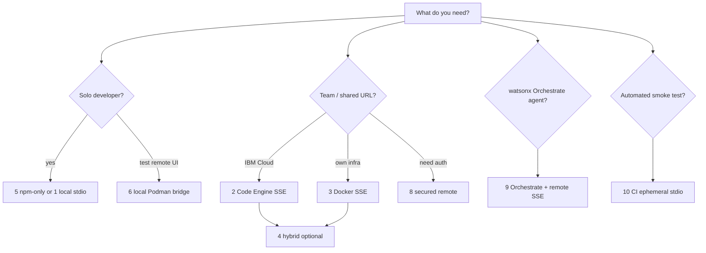

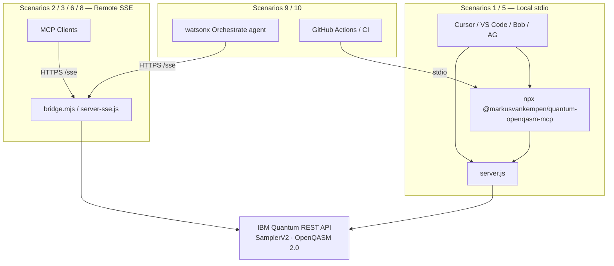

---

## Scenario 1: Local development (stdio)

### Architecture

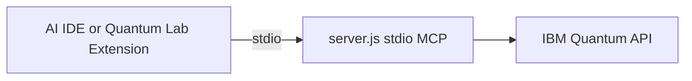

### Setup

**Recommended:** use the extension's **Setup MCP** button — see [Local MCP setup](../ide/LOCAL-MCP-SETUP.md).

**Manual build:**

```bash
cd extension
npm install
node esbuild.js
```

**Cursor** (`~/.cursor/mcp.json`):

```json
{
  "mcpServers": {
    "quantum-openqasm-mcp": {
      "command": "node",
      "args": ["/absolute/path/to/quantum-openqasm-assistant/scripts/run-mcp-server.mjs"]
    }
  }
}
```

**VS Code** (user `mcp.json`):

```json
{
  "servers": {
    "quantum-openqasm-mcp": {
      "type": "stdio",
      "command": "node",
      "args": ["/absolute/path/to/quantum-openqasm-assistant/scripts/run-mcp-server.mjs"]
    }
  }
}
```

Credentials load from `~/.quantum-openqasm-mcp/.env` via the launcher script.

### Extension local mode

In VS Code settings:

| Setting | Value |
|---------|-------|
| `quantumAssistant.mcpMode` | `local` |
| `quantumAssistant.ibmApiKey` | Your IBM Cloud API key |
| `quantumAssistant.ibmServiceCrn` | Service CRN |

The extension spawns `extension/out/server.js` directly with env vars.

### Pros & cons

| ✅ Advantages | ❌ Disadvantages |
|--------------|-----------------|
| Simple setup | Single user per machine |
| Lowest latency | Restarts with IDE |
| Easy debugging | Not shared across team |
| Works offline for local ops | |

**Best for:** development, learning OpenQASM, personal quantum experiments.

---

## Scenario 2: IBM Code Engine (remote SSE)

### Architecture

Production deploy uses **`bridge.mjs`** (Zendesk MCP pattern): a dashboard + SSE gateway that spawns the published npm package `@markusvankempen/quantum-openqasm-mcp` (stdio) per client session — **all 10 tools**, server-side credentials.

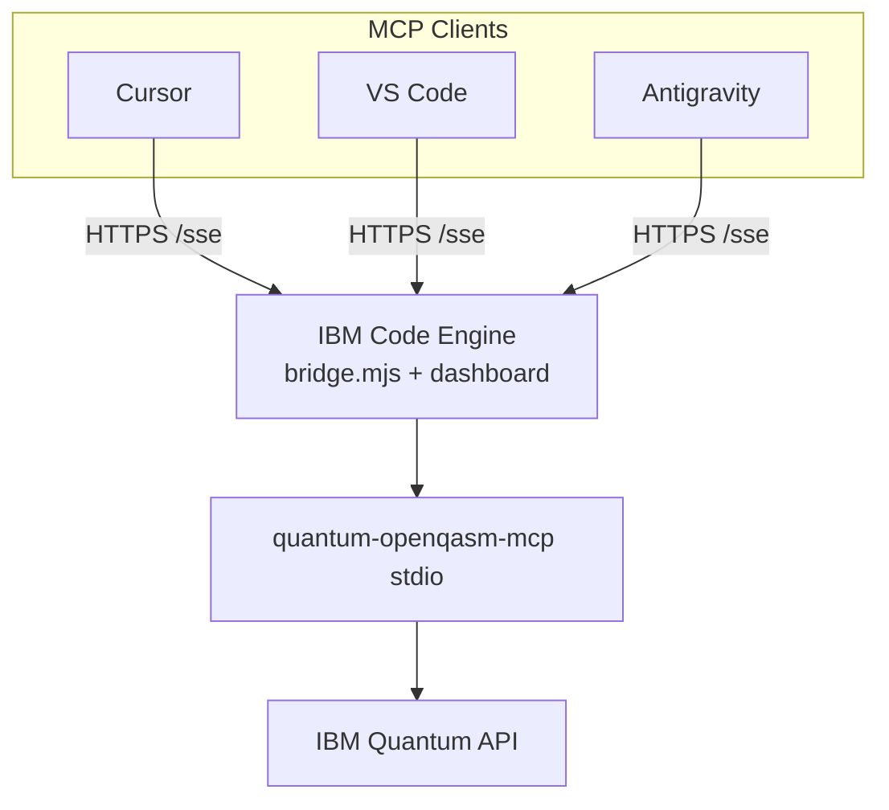

**Operational UI** (after deploy — resolve `CE_ENDPOINT`, do not hardcode URLs):

| Path | Purpose |
|------|---------|
| `/` | Dashboard — stats, tools, connect snippets |
| `/test` | Connection test (IAM, MCP probe, `list_backends`) |
| `/admin` | Update IBM credentials at runtime |
| `/sse` | MCP SSE endpoint |
| `/health` | Liveness probe |

Full guide (private dev repo): `deployments/code-engine/DEPLOYMENT-GUIDE.md`

### Prerequisites

1. **IBM Cloud account** — [cloud.ibm.com](https://cloud.ibm.com)
2. **Credentials** — `IBMCLOUD_API_KEY` (deploy), `IBM_API_KEY` + `IBM_SERVICE_CRN` (Quantum)
3. **IBM Cloud CLI** + Code Engine plugin + Docker/Podman:

```bash
ibmcloud plugin install code-engine
```

### Deploy

**Automated (recommended):**

```bash
cd deployments/code-engine

IBMCLOUD_API_KEY=your_ibm_cloud_api_key \
IBM_API_KEY=your_quantum_api_key \
IBM_SERVICE_CRN=crn:v1:bluemix:public:quantum-computing:... \
./deploy.sh
```

Optional: `IBM_QUANTUM_ENDPOINT`, `IBM_QUANTUM_BACKEND`, `QUANTUM_MCP_NPM_VERSION=1.7.2`

The script outputs:

- **Dashboard:** `<CE_ENDPOINT>/`
- **SSE:** `<CE_ENDPOINT>/sse`
- **Test UI:** `<CE_ENDPOINT>/test`
- **Admin:** `<CE_ENDPOINT>/admin` (save `BRIDGE_ADMIN_SECRET` from deploy output)

No local extension build required — the Docker image installs the published npm MCP package.

```bash
# Resolve URL after deploy
export CE_ENDPOINT=$(ibmcloud ce app get --name quantum-mcp-remote --output json \
  | python3 -c "import sys,json; print(json.load(sys.stdin)['status']['url'])")
curl -sS "${CE_ENDPOINT}/health"
```

### Configure clients for remote SSE

📖 **[Remote MCP setup (full guide)](../ide/REMOTE-MCP-SETUP.md)** — `mcp.json` for VS Code, Cursor, Bob, Antigravity, Claude Desktop, extension remote mode, and end-to-end test checklist.

**Templates:** `deployments/code-engine/mcp-configs/` (`<CE_ENDPOINT>` placeholder)  
**Local generated configs:** run `deployments/code-engine/generate-mcp-configs.sh` (gitignored output)  
**Workspace:** `.vscode/mcp.json.example` → `.vscode/mcp.json`

**VS Code** (`"servers"` + native SSE):

```json
{
  "servers": {
    "quantum-openqasm-mcp-remote": {
      "type": "sse",
      "url": "https://<CE_ENDPOINT>/sse"
    }
  }
}
```

**Cursor** (`~/.cursor/mcp.json`):

```json
{
  "mcpServers": {
    "quantum-openqasm-mcp-remote": {
      "command": "npx",
      "args": ["-y", "mcp-remote", "https://<CE_ENDPOINT>/sse"]
    }
  }
}
```

**Extension remote mode:** `quantumAssistant.mcpMode` = `remote`, `remoteMcpUrl` = `https://<CE_ENDPOINT>/sse`.

### Monitoring

```bash
ibmcloud ce app logs --name quantum-mcp-remote --follow
ibmcloud ce app get --name quantum-mcp-remote
curl -sS "${CE_ENDPOINT}/stats" | jq .
```

Open the **dashboard** at `${CE_ENDPOINT}/` for live session count, tool usage, and copy-paste MCP config snippets.

### Pros & cons

| ✅ Advantages | ❌ Disadvantages |
|--------------|-----------------|
| Serverless, scale-to-zero | Requires IBM Cloud account |
| Share across team | Network latency |
| Auto-scaling | Cold start when scaled to zero |
| Built-in monitoring | Usage-based cost |

**Best for:** team collaboration, production, multi-user environments.

---

## Scenario 3: Docker (self-hosted SSE)

### Architecture

Run `server-sse.js` in a container on your own infrastructure, exposing port 3000 with `/sse` and `/health` endpoints.

### Deploy

```bash
cd extension
npm install && node esbuild.js

docker build -f ../deployments/Dockerfile -t quantum-openqasm-mcp:latest ..
docker run -d \
  --name quantum-openqasm-mcp \
  -p 3000:3000 \
  -e IBM_API_KEY="your_key" \
  -e IBM_SERVICE_CRN="your_crn" \
  -e IBM_QUANTUM_ENDPOINT="https://us-east.quantum-computing.cloud.ibm.com" \
  quantum-openqasm-mcp:latest
```

**Health check:**

```bash
curl http://localhost:3000/health
```

**Client config** — point `remoteMcpUrl` or SSE proxy to `http://localhost:3000/sse`.

### Docker Compose example

```yaml
services:
  quantum-openqasm-mcp:
    build:
      context: ..
      dockerfile: deployments/Dockerfile
    ports:
      - "3000:3000"
    env_file:
      - .env
    restart: unless-stopped
    healthcheck:
      test: ["CMD", "curl", "-f", "http://localhost:3000/health"]
      interval: 30s
      timeout: 3s
      retries: 3
```

### Pros & cons

| ✅ Advantages | ❌ Disadvantages |
|--------------|-----------------|
| Full control | Manual scaling |
| Predictable cost | You manage infrastructure |
| On-premises / air-gapped | Single-node unless orchestrated |

**Best for:** on-premises, air-gapped, cost-sensitive deployments.

---

## Scenario 4: Hybrid (local + remote)

Use **remote SSE** as primary and **local stdio** as fallback when the remote endpoint is unreachable.

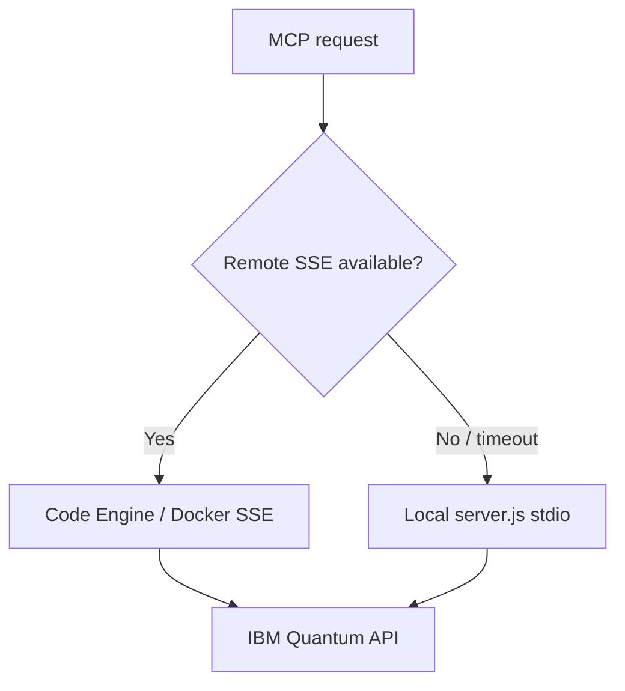

**Extension approach:** switch `quantumAssistant.mcpMode` between `remote` and `local` in settings, or use Diagnostics to test connectivity before submitting jobs.

**Best for:** unreliable networks, dev-with-production-fallback patterns.

---

## Scenario 5: npm-only consumer (zero deploy)

No server to host — run the published MCP package directly from npm. This is the **fastest path** for individuals and workshops.

### Architecture

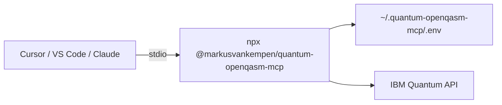

### Setup

**Extension one-click:** Quantum → **Setup Local MCP** (writes `.env` + IDE configs).

**Manual Cursor** (`~/.cursor/mcp.json`):

```json
{
  "mcpServers": {
    "quantum-openqasm-mcp": {
      "command": "npx",
      "args": ["-y", "@markusvankempen/quantum-openqasm-mcp"]
    }
  }
}
```

Credentials: `~/.quantum-openqasm-mcp/.env` (created by extension setup or `cp .env.example .env`).

```bash
npx @markusvankempen/quantum-openqasm-mcp --check   # verify credentials
```

📖 **[Local MCP setup](../ide/LOCAL-MCP-SETUP.md)**

### Pros & cons

| ✅ Advantages | ❌ Disadvantages |
|--------------|-----------------|
| No cloud account for MCP hosting | Credentials on each machine |
| Works in minutes | Not shared across a team |
| Same 10 MCP tools as npm package | Process tied to IDE session |

**Best for:** learning OpenQASM, personal experiments, conference demos, trying MCP before any cloud deploy.

---

## Scenario 6: Local Podman/Docker bridge (dev gateway)

Run the **same Code Engine image** on your laptop to exercise remote mode — dashboard, `/test`, `/sse`, extension `mcpMode = remote` — **without** deploying to IBM Cloud.

### Architecture

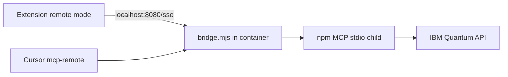

### Setup

Requires `bridge.mjs` in your private dev checkout (not in public GitHub).

```bash
cd deployments/code-engine
podman build -f Dockerfile -t quantum-mcp-local .   # or: docker build …

podman run --rm -p 8080:8080 \
  -e IBM_API_KEY=your_quantum_api_key \
  -e IBM_SERVICE_CRN=crn:v1:... \
  -e BRIDGE_ADMIN_SECRET=test-secret \
  quantum-mcp-local
```

**Verify:**

```bash
curl -sS http://localhost:8080/health | jq .
open http://localhost:8080/
```

**Extension / IDE clients:**

| Setting / config | Value |
|------------------|-------|
| `quantumAssistant.mcpMode` | `remote` |
| `quantumAssistant.remoteMcpUrl` | `http://localhost:8080/sse` |
| Cursor `mcp-remote` | `http://localhost:8080/sse` |

📖 **[Code Engine README — Local Docker test](../../deployments/code-engine/README.md#local-docker-test)**

### Pros & cons

| ✅ Advantages | ❌ Disadvantages |
|--------------|-----------------|
| Full gateway UI locally | Still need `bridge.mjs` + build |
| Test remote configs before CE | Single machine only |
| Same behavior as production CE | HTTP only (use CE for HTTPS prod) |

**Best for:** validating `setup-remote-mcp.sh`, extension Diagnostics **Test Remote Gateway**, and dashboard workflows pre-deploy.

---

## Scenario 8: Secured remote (auth in front of SSE)

Scenario 2 and 3 expose `/sse` over HTTPS with **IBM credentials on the server** — convenient, but some teams need **access control** before traffic reaches the gateway.

### Do you need a custom domain?

**No — not for TLS.** IBM Code Engine already gives every app a **HTTPS** URL:

```text
https://quantum-mcp-remote.<project-hash>.<region>.codeengine.appdomain.cloud
```

That URL is TLS-terminated by IBM. A custom domain is **optional** and mainly helps when you want:

- A branded URL (`quantum-mcp.yourcompany.com`)
- **Cloud Internet Services (CIS)** in front — WAF, DDoS, IP allowlists, bot management
- To **disable** the public `*.codeengine.appdomain.cloud` URL so only your domain works

📖 [Code Engine — securing applications](https://cloud.ibm.com/docs/codeengine?topic=codeengine-secure) · [Domain mappings](https://cloud.ibm.com/docs/codeengine?topic=codeengine-domain-mappings) · [Endpoint visibility](https://cloud.ibm.com/docs/codeengine?topic=codeengine-application-workloads)

**What Code Engine does *not* provide:** application-level auth on `/sse` (no built-in API key or OAuth on your routes). IBM’s docs state that **you** must add auth in your app or in front of it if the endpoint is public.

### Security tiers (practical → enterprise)

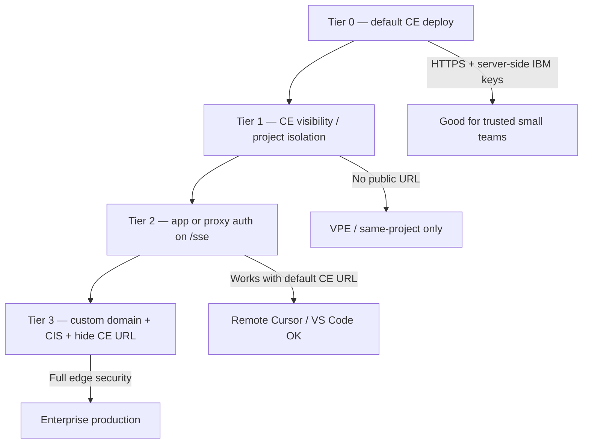

| Tier | Custom domain? | What you get | Remote IDE from laptop? |
|------|----------------|--------------|-------------------------|
| **0 — Default** | No | HTTPS CE URL; IBM keys in CE secrets; `BRIDGE_ADMIN_SECRET` for `/admin` only | ✅ Yes |
| **1a — Project-only** | No | `--visibility=project` — no public internet URL; only other CE apps in same project | ❌ No (unless another CE proxy in-project) |
| **1b — Private endpoint** | No | `--visibility=private` — IBM Cloud private network + [VPE](https://cloud.ibm.com/docs/vpc?topic=vpc-about-vpe) | ⚠️ Only from corp network / VPE |
| **1c — Project isolation** | No | Separate CE projects per team/env; IAM on who can deploy | ✅ If URL still public |
| **2 — App / proxy auth** | No | API key or JWT on `/sse` (bridge or nginx sidecar) | ✅ Yes, with shared team key |
| **3 — Custom domain + CIS** | **Yes** | Map FQDN → CE app; CIS WAF/IP rules; turn off public CE system domain | ✅ Via your domain |

### Tier 0 — What you already have (no extra setup)

| Control | Status |
|---------|--------|
| TLS / HTTPS | ✅ Automatic on `*.codeengine.appdomain.cloud` |
| IBM Quantum credentials on server | ✅ CE secrets — not in client `mcp.json` |
| Admin credential rotation | ✅ `/admin` + `BRIDGE_ADMIN_SECRET` |
| Client auth on `/sse` | ❌ Anyone with the URL can open an MCP session |
| URL secrecy | ⚠️ Long hostname — treat URL like a password; don’t commit to git |

**Good enough for:** internal teams that trust members with the SSE URL.

### Tier 1 — Code Engine visibility (no custom domain)

Use IBM Cloud console **Domain mappings** tab or CLI:

```bash
# Project-only: not reachable from public internet
ibmcloud ce app update --name quantum-mcp-remote --visibility project

# Private: IBM Cloud private network + VPE (not public internet)
ibmcloud ce app update --name quantum-mcp-remote --visibility private
```

| Visibility | Public `*.codeengine.appdomain.cloud` | Who can reach the app |
|------------|--------------------------------------|------------------------|
| **public** (default) | Yes | Internet + project + private network |
| **project** | No external mapping | Other workloads **in the same CE project** only |
| **private** | Private URL only | IBM Cloud private network, VPE, same project |

**Catch for Quantum MCP:** Cursor, VS Code, and the extension run on **developer laptops** on the public internet. `visibility=project` or `private` **blocks them** unless you add:

- A **VPE** + corporate VPN so laptops route through IBM private network, or
- A **second CE component** in the same project (e.g. authenticated proxy) that laptops can’t reach directly — usually you still need Tier 2 or 3 for IDE users.

**Good for:** server-to-server only (e.g. watsonx Orchestrate agent running inside IBM Cloud), not typical IDE remote MCP.

### Tier 2 — Auth without a custom domain (best fit for most teams)

Keep the default CE HTTPS URL; add **client authentication** before MCP traffic hits the bridge.

| Approach | Where | IDE-friendly? |
|----------|-------|---------------|
| **Gateway API key** | `bridge.mjs` checks `X-Api-Key` on `/sse` and `/message` | ⚠️ Needs header support in `mcp-remote` or thin wrapper |
| **Sidecar proxy on CE** | Second CE app or nginx container in same project | ✅ Proxy URL for team |
| **IBM App ID** | OIDC in app code | Medium complexity |
| **Team policy** | Distribute SSE URL only via vault; rotate on redeploy | Weak alone, fine as layer |

**Example — nginx API key in front of local bridge (same pattern on CE):**

```nginx
location /sse {
    if ($http_x_api_key != "team-shared-gateway-key") { return 401; }
    proxy_pass http://127.0.0.1:8080;
    proxy_http_version 1.1;
    proxy_set_header Connection '';
    proxy_buffering off;
    proxy_read_timeout 3600s;
}
```

SSE needs long `proxy_read_timeout` and `proxy_buffering off`.

**Today:** `BRIDGE_ADMIN_SECRET` protects **`/admin` only**, not `/sse`. Tier 2 would extend the bridge (future enhancement) or deploy a small auth proxy in the same CE project.

**Good for:** production shared gateway **without** buying/mapping a domain.

### Tier 3 — Custom domain + CIS (full enterprise)

IBM’s recommended hardening path when the default CE URL is too exposed:

1. Obtain FQDN + CA-signed TLS cert (or CIS origin cert)
2. `ibmcloud ce domainmapping create` — map domain → app
3. Put **Cloud Internet Services** in front — WAF, IP allowlist, DDoS
4. **Disable** public system domain mapping (console: *No external system domain mapping*)
5. Clients use `https://quantum-mcp.yourcompany.com/sse` only

📖 [Layer 7 protection with CIS](https://cloud.ibm.com/docs/codeengine?topic=codeengine-secure) · [Automated cert renewal sample](https://github.com/IBM/CodeEngine/tree/main/app-n-event-notification)

**Good for:** regulated industries, hiding the CE hostname, edge IP filtering.

### Other IBM Cloud controls (any tier)

| Control | Applies to |
|---------|------------|
| **IAM** | Who can deploy, view logs, change CE secrets |
| **Context-Based Restrictions (CBR)** | Which networks can call IBM Cloud APIs / console |
| **Separate CE projects** | Dev / staging / prod isolation |
| **`scripts/check-secrets.sh`** | Ensure URLs and keys never land in git |

### Recommended path

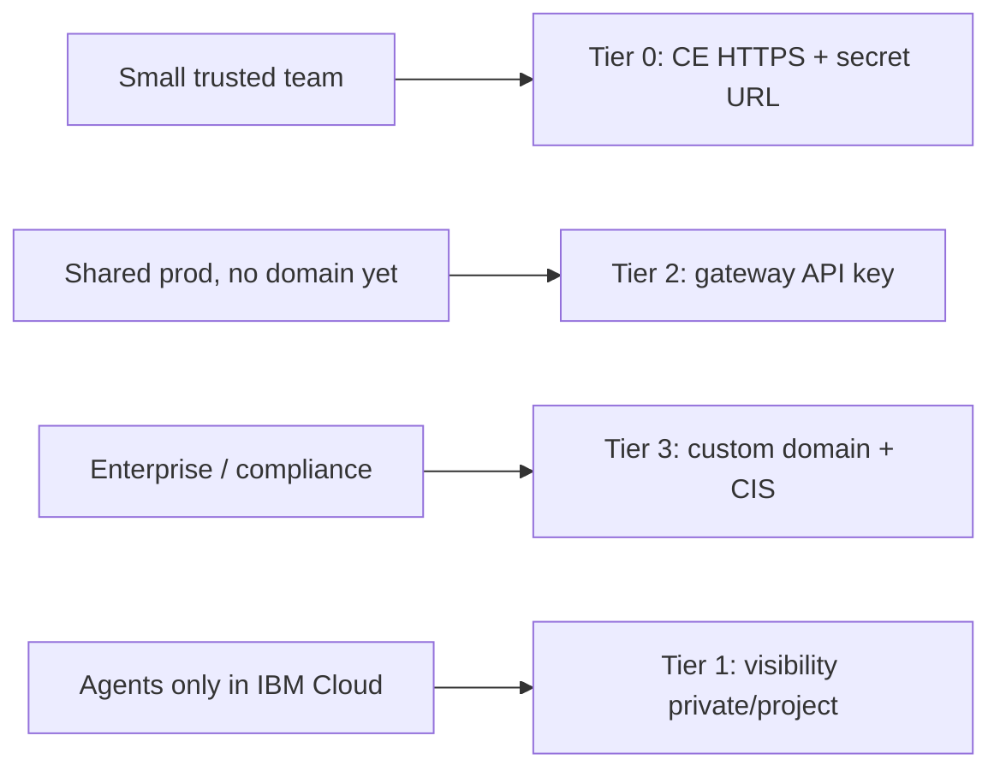

| Situation | Start with |
|-----------|------------|
| Just deployed, internal team | **Tier 0** — you’re already on HTTPS; don’t commit the URL |
| Need to lock down `/sse` soon | **Tier 2** — app-level API key (bridge or proxy) |
| Laptops on public internet | Avoid **Tier 1** alone — use Tier 0/2/3 |
| WxO agent in same IBM account | **Tier 1b** private + VPE may work |
| Compliance / WAF / hide CE URL | **Tier 3** |

### Pros & cons

| ✅ Advantages | ❌ Disadvantages |
|--------------|-----------------|
| Tier 0–2 work **without** owning a domain | CE has no built-in `/sse` OAuth |
| IBM keys stay server-side at every tier | `visibility=private` breaks laptop IDEs |
| CIS + custom domain is optional, not mandatory | Tier 2 needs bridge or proxy work for MCP headers |
| Layered security (IAM + URL + auth) | SSE through proxies needs timeout tuning |

**Best for:** shared production gateways. Pair with **Scenario 2** (Code Engine) or **Scenario 3** (Docker).

📖 **[Code Engine README — credential boundary](../../deployments/code-engine/README.md#credential-boundary)**

---

## Scenario 9: watsonx Orchestrate agent attachment

Deploy the MCP gateway **once** (Scenario 2 or 6), then attach the SSE endpoint to a **watsonx Orchestrate** agent as a remote tool source — same pattern as [Zendesk MCP](https://github.com/markusvankempen/zendesk_mcp) on Code Engine.

### Architecture

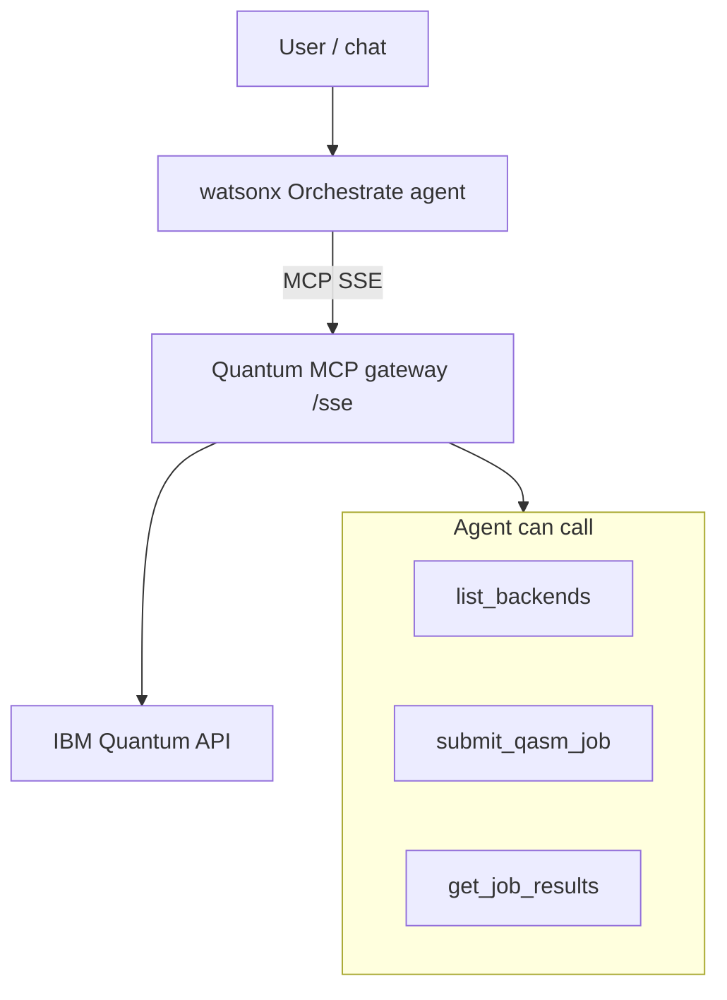

### Setup outline

1. **Deploy gateway** — Scenario 2 (`./deploy.sh`) or Scenario 6 (local bridge for dev).
2. **Resolve SSE URL** — `https://<CE_ENDPOINT>/sse` (never hardcode; use `generate-mcp-configs.sh`).
3. **Register in Orchestrate** — add remote MCP connection pointing at `/sse` (stdio bridge via `mcp-remote` if Orchestrate requires a local proxy).
4. **Assign tools** to the agent: `list_backends`, `submit_qasm_job`, `check_credentials`, etc.
5. **Test** — ask the agent to list backends or submit a small Bell-state circuit.

**Credentials:** stay on the gateway (Code Engine secrets). The Orchestrate runtime only needs the **SSE URL** — same security model as IDE remote MCP.

📖 **[Remote MCP setup](../ide/REMOTE-MCP-SETUP.md)** · **[Code Engine architecture](../../deployments/code-engine/README.md#architecture--how-remote-mcp-works)**

### Pros & cons

| ✅ Advantages | ❌ Disadvantages |
|--------------|-----------------|
| Natural language quantum jobs in WxO flows | Requires Orchestrate environment |
| Reuses existing CE deployment | Agent tool latency + quantum queue time |
| One gateway for IDEs and agents | Job quota shared across all consumers |

**Best for:** enterprise agentic automation, lab assistants, workflows that combine quantum steps with other Orchestrate tools.

---

## Scenario 10: CI/CD ephemeral stdio

Run MCP **only for the duration of a pipeline job** — no long-running SSE server. Ideal for release smoke tests and credential regression checks.

### Architecture

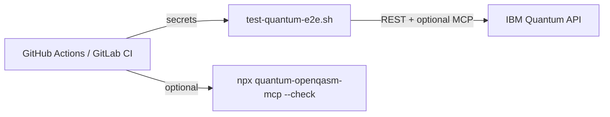

### Setup

**Project smoke test** (private dev repo):

```bash
# Requires .env or CI secrets: IBM_API_KEY, IBM_SERVICE_CRN
mise run test-e2e
# or: bash scripts/test-quantum-e2e.sh
```

**GitHub Actions example** (secrets in repo settings — never commit values):

```yaml
jobs:
  quantum-smoke:
    runs-on: ubuntu-latest
    steps:
      - uses: actions/checkout@v4
      - uses: actions/setup-node@v4
        with:
          node-version: "20"
      - name: Verify MCP package
        env:
          IBM_API_KEY: ${{ secrets.IBM_API_KEY }}
          IBM_SERVICE_CRN: ${{ secrets.IBM_SERVICE_CRN }}
        run: npx -y @markusvankempen/quantum-openqasm-mcp --check
      - name: Pre-push secret scan
        run: bash scripts/check-secrets.sh
```

**Pre-publish checklist:**

```bash
mise run check-secrets   # no keys in tracked files
mise run build
mise run test-e2e        # optional — uses IBM Quantum quota
```

### Pros & cons

| ✅ Advantages | ❌ Disadvantages |
|--------------|-----------------|
| Catches broken releases early | Consumes IBM Quantum quota per run |
| No server to maintain | Needs secrets in CI vault |
| Fast stdio startup | Not for interactive IDE use |

**Best for:** npm publish gates, extension VSIX validation, nightly regression against IBM Quantum.

---

## Comparison matrix

| Feature | 1 Local | 2 CE SSE | 3 Docker | 4 Hybrid | 5 npm | 6 Local bridge | 8 Secured | 9 WxO | 10 CI |
|---------|---------|----------|----------|----------|-------|----------------|-----------|-------|-------|
| Setup complexity | Easy | Complex | Medium | Complex | Easiest | Medium | High | Medium | Easy |
| Hosting cost | Free | Pay-per-use | Infra | Mixed | Free | Free | +proxy | Shared GW | CI minutes |
| Multi-user | No | Yes | Yes | Yes | No | No (dev) | Yes | Yes | N/A |
| Client credentials | Yes | No | No | Mixed | Yes | No | No | No | CI secrets |
| Dashboard / test UI | Extension | Yes | Partial | Yes | No | Yes | Yes | Yes | No |
| Best latency | Lowest | Medium | Low–med | Variable | Low | Lowest remote | Medium | Medium | Batch |

---

## Security

| Environment | Credential storage |
|-------------|-------------------|
| **Local dev / npm (5)** | `~/.quantum-openqasm-mcp/.env` or VS Code settings |
| **Code Engine (2, 8, 9)** | IBM CE secrets (`ibmcloud ce secret create`) |
| **Docker / local bridge (3, 6)** | `env_file` or `-e` flags — never bake keys into images |
| **CI (10)** | GitHub/GitLab secrets vault only |
| **Secured remote (8)** | IBM keys on gateway; client auth at proxy layer |

**Rules:**

- HTTPS only for remote SSE in production (except Scenario 6 localhost dev)
- Never commit `.env` or API keys to git — run `bash scripts/check-secrets.sh` before publish
- Rotate IBM Cloud API keys periodically; use `/admin` or redeploy for gateway rotation
- Restrict Code Engine ingress or add Scenario 8 proxy when exposing publicly
- Never log `IBM_API_KEY` in CI output — mask secrets in Actions logs

---

## Troubleshooting

### Local stdio

```bash
cd extension && node esbuild.js    # rebuild server.js
node --version                     # requires 18+
cat ~/.quantum-openqasm-mcp/.env   # verify credentials exist
```

### Code Engine

```bash
ibmcloud ce application logs --name quantum-mcp-server
ibmcloud ce application get --name quantum-mcp-server
curl https://your-app/sse          # should connect (SSE stream)
curl https://your-app/health       # should return 200
```

### Docker / local bridge (6)

```bash
docker logs quantum-openqasm-mcp
podman logs -f quantum-mcp-local
curl -sS http://localhost:8080/health | jq .
```

### Secured remote (8)

```bash
# 401 from proxy = auth layer working; 503 from gateway = check CE credentials
curl -sS -o /dev/null -w "%{http_code}" -H "X-Api-Key: wrong" https://your-proxy/sse
curl -sS "${CE_ENDPOINT}/health" | jq .
```

### CI (10)

```bash
mise run check-secrets
mise run test-e2e    # needs IBM_API_KEY + IBM_SERVICE_CRN in .env or env
```

---

## Cost notes (IBM Code Engine)

**Free tier (typical):** 100,000 vCPU-seconds and 200,000 GB-seconds per month — sufficient for moderate quantum job orchestration (MCP overhead is lightweight; IBM Quantum runtime is billed separately).

**Self-hosted Docker:** fixed server cost ($5–50/month depending on provider), no per-request MCP charges.

---

## Next steps

| Goal | Start here |
|------|------------|
| Try MCP in 5 minutes | **Scenario 5** — [Local MCP setup](../ide/LOCAL-MCP-SETUP.md) |
| Quantum Lab + extension | [Extension README](../../extension/README.md) |
| Test remote UI locally | **Scenario 6** — [Code Engine local Docker](../../deployments/code-engine/README.md#local-docker-test) |
| Team production gateway | **Scenario 2** — `deployments/code-engine/deploy.sh` |
| Extension without local keys | [Extension remote MCP](../ide/EXTENSION-REMOTE-MCP.md) |
| Orchestrate agent | **Scenario 9** + [Remote MCP setup](../ide/REMOTE-MCP-SETUP.md) |
| Release smoke test | **Scenario 10** — `mise run check-secrets && mise run test-e2e` |
| Monitor quantum jobs | [IBM Quantum Jobs](https://quantum.ibm.com/jobs) |

---

## Additional resources

- [IBM Code Engine docs](https://cloud.ibm.com/docs/codeengine)
- [MCP specification](https://modelcontextprotocol.io/)
- [IBM Quantum docs](https://quantum.ibm.com/docs)
- [OpenQASM specification](https://openqasm.com/)

---

## Topics & keywords

`deployment` · `code-engine` · `sse` · `stdio` · `docker` · `podman` · `hybrid` · `npm` · `npx` · `secured-mcp` · `watsonx-orchestrate` · `ci-cd` · `github-actions` · `ibm-cloud` · `quantum-mcp` · `remote-mcp` · `production` · `self-hosted`

---

**Author:** Markus van Kempen  
**Email:** [markus.van.kempen@gmail.com](mailto:markus.van.kempen@gmail.com) · [mvk@ca.ibm.com](mailto:mvk@ca.ibm.com)  
**Website:** [markusvankempen.github.io](https://markusvankempen.github.io/)  
*No bug too small, no syntax too weird.*
