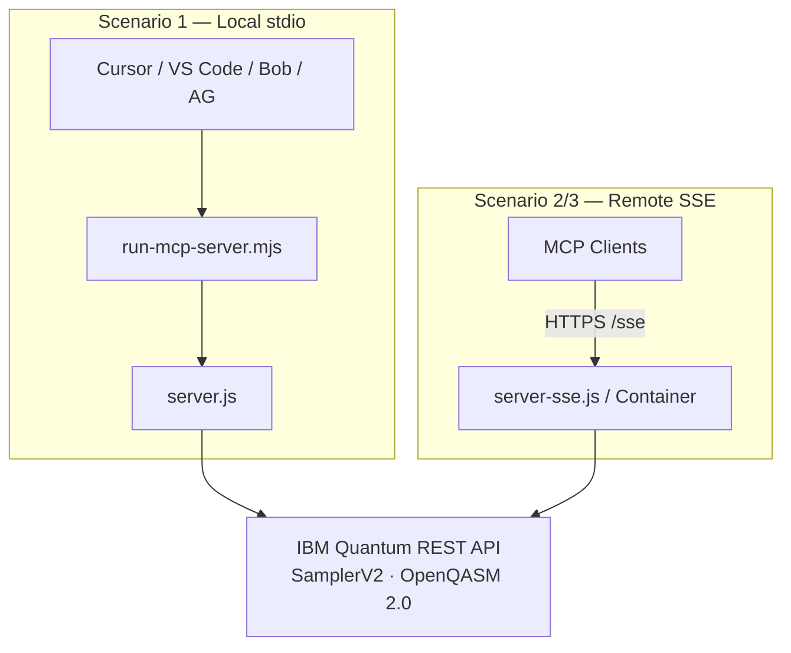
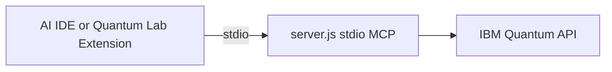
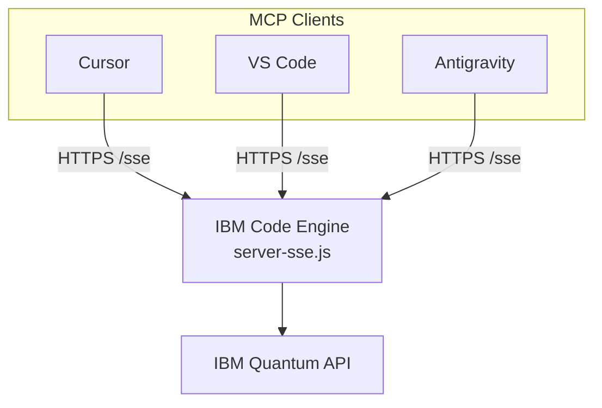
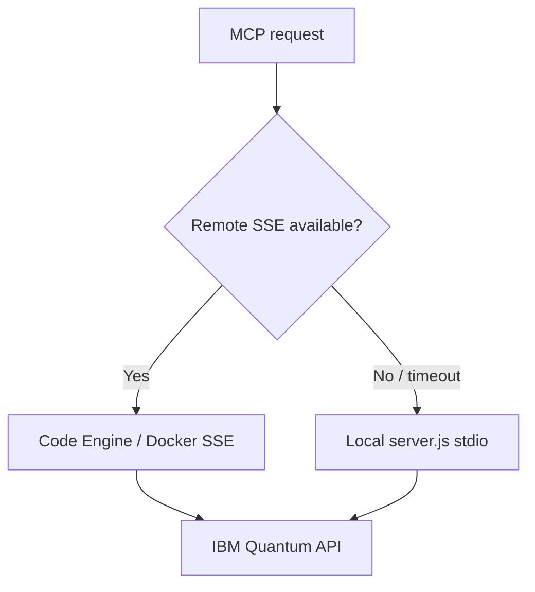

# Deployment Scenarios — Quantum OpenQASM MCP

<!--
SEO: Quantum MCP deployment | IBM Code Engine | SSE | stdio | Docker | hybrid
quantum server deployment, remote mcp, local mcp, code engine quantum, openqasm production
-->

> Complete guide for deploying the **Quantum OpenQASM MCP server** in **local stdio**, **IBM Code Engine SSE**, **Docker**, and **hybrid** configurations. Use with the **VS Code extension** or standalone MCP clients in **Cursor**, **VS Code**, **Bob**, and **Antigravity**.

📖 **[Main README](../../README.md)** · **[Local MCP setup](../ide/LOCAL-MCP-SETUP.md)** · **[Extension README](../../extension/README.md)** · **[Project structure](../PROJECT-STRUCTURE.md)**

---

## Deployment options overview

| Scenario | Transport | Hosting | Best for |
|----------|-----------|---------|----------|
| **1. Local stdio** | stdio | Developer machine | Development, personal use, AI IDE MCP |
| **2. Code Engine** | SSE | IBM Code Engine | Team sharing, production, scale-to-zero |
| **3. Docker** | SSE | Self-hosted container | On-premises, air-gapped, full control |
| **4. Hybrid** | stdio + SSE | Mixed | Fallback when remote is unavailable |



---

## Scenario 1: Local development (stdio)

### Architecture



### Setup

**Recommended:** use the extension's **Setup MCP** button — see [Local MCP setup](../ide/LOCAL-MCP-SETUP.md).

**Manual build:**

```bash
cd extension
npm install
node esbuild.js
```

**Cursor** (`~/.cursor/mcp.json`):

```json
{
  "mcpServers": {
    "quantum-openqasm-mcp": {
      "command": "node",
      "args": ["/absolute/path/to/quantum-openqasm-assistant/scripts/run-mcp-server.mjs"]
    }
  }
}
```

**VS Code** (user `mcp.json`):

```json
{
  "servers": {
    "quantum-openqasm-mcp": {
      "type": "stdio",
      "command": "node",
      "args": ["/absolute/path/to/quantum-openqasm-assistant/scripts/run-mcp-server.mjs"]
    }
  }
}
```

Credentials load from `~/.quantum-openqasm-mcp/.env` via the launcher script.

### Extension local mode

In VS Code settings:

| Setting | Value |
|---------|-------|
| `quantumAssistant.mcpMode` | `local` |
| `quantumAssistant.ibmApiKey` | Your IBM Cloud API key |
| `quantumAssistant.ibmServiceCrn` | Service CRN |

The extension spawns `extension/out/server.js` directly with env vars.

### Pros & cons

| ✅ Advantages | ❌ Disadvantages |
|--------------|-----------------|
| Simple setup | Single user per machine |
| Lowest latency | Restarts with IDE |
| Easy debugging | Not shared across team |
| Works offline for local ops | |

**Best for:** development, learning OpenQASM, personal quantum experiments.

---

## Scenario 2: IBM Code Engine (remote SSE)

### Architecture



### Prerequisites

1. **IBM Cloud account** — [cloud.ibm.com](https://cloud.ibm.com)
2. **API keys** — IBM Cloud IAM + IBM Quantum credentials
3. **IBM Cloud CLI** + Code Engine plugin:

```bash
ibmcloud plugin install code-engine
```

### Deploy

**Automated (recommended):**

```bash
cd deployments/code-engine
IBM_CLOUD_API_KEY=... IBM_API_KEY=... IBM_SERVICE_CRN=... ./deploy.sh
```

The script outputs:

- Application URL
- SSE endpoint: `<app-url>/sse`
- Health endpoint: `<app-url>/health`

**Build MCP server first:**

```bash
cd extension && npm install && node esbuild.js
```

### Configure clients for remote SSE

**Extension remote mode:**

| Setting | Value |
|---------|-------|
| `quantumAssistant.mcpMode` | `remote` |
| `quantumAssistant.remoteMcpUrl` | `https://your-app.region.codeengine.appdomain.cloud/sse` |

**Cursor** (`~/.cursor/mcp.json`):

```json
{
  "mcpServers": {
    "quantum-openqasm-mcp-remote": {
      "command": "npx",
      "args": ["-y", "mcp-remote", "https://your-app.region.codeengine.appdomain.cloud/sse"]
    }
  }
}
```

Or use an SSE-capable MCP proxy compatible with your IDE.

### Monitoring

```bash
ibmcloud ce application logs --name quantum-mcp-server --follow
ibmcloud ce application get --name quantum-mcp-server
```

### Pros & cons

| ✅ Advantages | ❌ Disadvantages |
|--------------|-----------------|
| Serverless, scale-to-zero | Requires IBM Cloud account |
| Share across team | Network latency |
| Auto-scaling | Cold start when scaled to zero |
| Built-in monitoring | Usage-based cost |

**Best for:** team collaboration, production, multi-user environments.

---

## Scenario 3: Docker (self-hosted SSE)

### Architecture

Run `server-sse.js` in a container on your own infrastructure, exposing port 3000 with `/sse` and `/health` endpoints.

### Deploy

```bash
cd extension
npm install && node esbuild.js

docker build -f ../deployments/Dockerfile -t quantum-openqasm-mcp:latest ..
docker run -d \
  --name quantum-openqasm-mcp \
  -p 3000:3000 \
  -e IBM_API_KEY="your_key" \
  -e IBM_SERVICE_CRN="your_crn" \
  -e IBM_QUANTUM_ENDPOINT="https://us-east.quantum-computing.cloud.ibm.com" \
  quantum-openqasm-mcp:latest
```

**Health check:**

```bash
curl http://localhost:3000/health
```

**Client config** — point `remoteMcpUrl` or SSE proxy to `http://localhost:3000/sse`.

### Docker Compose example

```yaml
services:
  quantum-openqasm-mcp:
    build:
      context: ..
      dockerfile: deployments/Dockerfile
    ports:
      - "3000:3000"
    env_file:
      - .env
    restart: unless-stopped
    healthcheck:
      test: ["CMD", "curl", "-f", "http://localhost:3000/health"]
      interval: 30s
      timeout: 3s
      retries: 3
```

### Pros & cons

| ✅ Advantages | ❌ Disadvantages |
|--------------|-----------------|
| Full control | Manual scaling |
| Predictable cost | You manage infrastructure |
| On-premises / air-gapped | Single-node unless orchestrated |

**Best for:** on-premises, air-gapped, cost-sensitive deployments.

---

## Scenario 4: Hybrid (local + remote)

Use **remote SSE** as primary and **local stdio** as fallback when the remote endpoint is unreachable.



**Extension approach:** switch `quantumAssistant.mcpMode` between `remote` and `local` in settings, or use Diagnostics to test connectivity before submitting jobs.

**Best for:** unreliable networks, dev-with-production-fallback patterns.

---

## Comparison matrix

| Feature | Local stdio | Code Engine SSE | Docker SSE | Hybrid |
|---------|-------------|-----------------|------------|--------|
| Setup complexity | Easy | Complex | Medium | Complex |
| Cost | Free | Pay-per-use | Infrastructure | Mixed |
| Multi-user | No | Yes | Yes | Yes |
| Latency | Lowest | Medium | Low–medium | Variable |
| Offline | Partial | No | Yes (local net) | Partial |
| Maintenance | None | Minimal | Medium | Medium |

---

## Security

| Environment | Credential storage |
|-------------|-------------------|
| **Local dev** | `~/.quantum-openqasm-mcp/.env` or VS Code settings |
| **Code Engine** | IBM CE secrets (`ibmcloud ce secret create`) |
| **Docker** | `env_file` or Docker secrets — never bake keys into images |

**Rules:**

- HTTPS only for remote SSE in production
- Never commit `.env` or API keys to git
- Rotate IBM Cloud API keys periodically
- Restrict Code Engine ingress if exposing publicly

---

## Troubleshooting

### Local stdio

```bash
cd extension && node esbuild.js    # rebuild server.js
node --version                     # requires 18+
cat ~/.quantum-openqasm-mcp/.env   # verify credentials exist
```

### Code Engine

```bash
ibmcloud ce application logs --name quantum-mcp-server
ibmcloud ce application get --name quantum-mcp-server
curl https://your-app/sse          # should connect (SSE stream)
curl https://your-app/health       # should return 200
```

### Docker

```bash
docker logs quantum-openqasm-mcp
docker exec quantum-openqasm-mcp env | grep IBM_
```

---

## Cost notes (IBM Code Engine)

**Free tier (typical):** 100,000 vCPU-seconds and 200,000 GB-seconds per month — sufficient for moderate quantum job orchestration (MCP overhead is lightweight; IBM Quantum runtime is billed separately).

**Self-hosted Docker:** fixed server cost ($5–50/month depending on provider), no per-request MCP charges.

---

## Next steps

1. **Start local** — [Local MCP setup](../ide/LOCAL-MCP-SETUP.md)
2. **Install extension** — [Extension README](../../extension/README.md)
3. **Deploy remote** — `deployments/code-engine/deploy.sh` (private dev repo)
4. **Monitor jobs** — [IBM Quantum Jobs dashboard](https://quantum.ibm.com/jobs)

---

## Additional resources

- [IBM Code Engine docs](https://cloud.ibm.com/docs/codeengine)
- [MCP specification](https://modelcontextprotocol.io/)
- [IBM Quantum docs](https://quantum.ibm.com/docs)
- [OpenQASM specification](https://openqasm.com/)

---

## Topics & keywords

`deployment` · `code-engine` · `sse` · `stdio` · `docker` · `hybrid` · `ibm-cloud` · `quantum-mcp` · `remote-mcp` · `production` · `self-hosted`

---

**Author:** Markus van Kempen  
**Email:** [markus.van.kempen@gmail.com](mailto:markus.van.kempen@gmail.com) · [mvk@ca.ibm.com](mailto:mvk@ca.ibm.com)  
**Website:** [markusvankempen.github.io](https://markusvankempen.github.io/)  
*No bug too small, no syntax too weird.*
