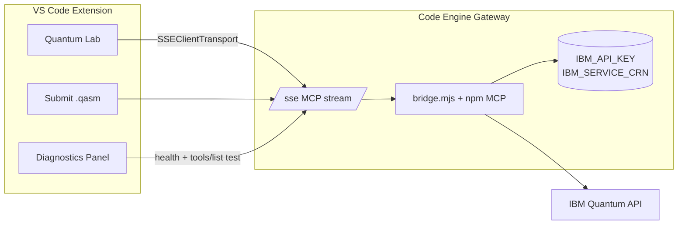

# Extension Remote MCP — Quantum Lab on Code Engine

<!--
SEO: VS Code extension remote MCP | Code Engine SSE | quantumAssistant.mcpMode
extension remote quantum, quantum lab code engine, no local credentials
-->

> Use the **Quantum OpenQASM Assistant** VS Code extension with a **remote MCP gateway** on IBM Code Engine. Quantum Lab, job submission, and polling connect via **SSE** — **no IBM API keys on your machine**.

📖 **[Remote MCP setup](./REMOTE-MCP-SETUP.md)** · **[Code Engine deploy](../../deployments/code-engine/README.md)** · **[Extension README](../../extension/README.md)**

---

## When to use remote mode

| Use remote | Use local |
|------------|-----------|
| Team shares one Code Engine deployment | Solo development on your laptop |
| Credentials managed server-side | You keep keys in `~/.quantum-openqasm-mcp/.env` |
| Scale-to-zero gateway with dashboard | No IBM Cloud / Code Engine account |
| Extension + AI IDEs on machines without quantum keys | Air-gapped or offline stdio only |

---

## Architecture



**Local mode** spawns `@markusvankempen/quantum-openqasm-mcp` via stdio on your machine. **Remote mode** skips that spawn and talks directly to `https://<CE_ENDPOINT>/sse`.

---

## Quick setup (extension only)

### 1. Deploy the gateway (once per team)

```bash
cd deployments/code-engine
IBMCLOUD_API_KEY=... IBM_API_KEY=... IBM_SERVICE_CRN=... ./deploy.sh
```

Resolve your URL (do not hardcode hostnames):

```bash
export CE_ENDPOINT="$(ibmcloud ce app get --name quantum-mcp-remote --output json \
  | python3 -c "import sys,json; print(json.load(sys.stdin)['status']['url'])")"
echo "${CE_ENDPOINT}/sse"
```

📖 **[Code Engine README](../../deployments/code-engine/README.md)**

### 2. Configure the extension

**Via Diagnostics UI (recommended):**

1. **Quantum → Settings & Diagnostics**
2. **MCP Mode** → `remote (SSE URL)`
3. **Remote MCP SSE URL** → paste `https://<CE_ENDPOINT>/sse`
4. **Test Remote Gateway** → expect health OK + 10 tools
5. **Save Configuration**
6. Reload the window if prompted

**Via Settings (`Cmd+,`):**

| Setting | Value |
|---------|-------|
| `quantumAssistant.mcpMode` | `remote` |
| `quantumAssistant.remoteMcpUrl` | `https://<CE_ENDPOINT>/sse` |

### 3. Use Quantum Lab

Open **Quantum Lab**, pick a circuit, **Run on Hardware**. Jobs go through the remote MCP — same tools as local mode (`submit_qasm_job`, `get_job_status`, `get_job_results`).

---

## Register AI IDEs (optional)

The extension and IDE MCP are separate connections that can share the same gateway.

**From Diagnostics (remote mode):**

- **Setup Remote MCP for AI IDEs** — writes `quantum-openqasm-mcp-remote` to Cursor, VS Code, Bob, and Antigravity `mcp.json` files (no API keys in those files).

**From Command Palette:**

- `Quantum: Setup Remote MCP (Code Engine SSE)`

**From terminal (repo checkout):**

```bash
cd deployments/code-engine
./setup-remote-mcp.sh --ide cursor,vscode --workspace
```

---

## Extension commands

| Command | Purpose |
|---------|---------|
| `Quantum: Open Diagnostics Panel` | Switch local/remote, test gateway, save settings |
| `Quantum: Setup Remote MCP (Code Engine SSE)` | Write remote SSE configs for AI IDEs |
| `Quantum: Setup Local MCP (…)` | Local stdio MCP with your API keys |
| `Quantum: Open Quantum Lab` | Run circuits (uses current mcpMode) |

---

## Settings reference

| Setting | Default | Remote behavior |
|---------|---------|-----------------|
| `quantumAssistant.mcpMode` | `local` | Set to `remote` |
| `quantumAssistant.remoteMcpUrl` | `""` | Full SSE URL ending in `/sse` |
| `quantumAssistant.ibmApiKey` | `""` | **Not required** for Quantum Lab in remote mode |
| `quantumAssistant.ibmServiceCrn` | `""` | **Not required** for Quantum Lab in remote mode |
| `quantumAssistant.useNpmMcp` | `true` | Ignored when `mcpMode` is `remote` |

URL normalization: if you paste the gateway base without `/sse`, the extension appends it on save.

---

## Verify

| Check | How |
|-------|-----|
| Gateway health | Diagnostics → **Test Remote Gateway** |
| Extension MCP | Output channel **Quantum Assistant** → `[MCP] Remote client connected` |
| Quantum Lab | Submit Bell-state example → job ID returned |
| AI IDE MCP | MCP panel → `quantum-openqasm-mcp-remote` → 10 tools |

```bash
curl -sS "${CE_ENDPOINT}/health" | jq .
# expect: status ok, credentials true, tools 10
```

---

## Troubleshooting

| Symptom | Fix |
|---------|-----|
| `remote MCP mode selected but no URL` | Set `remoteMcpUrl` in Diagnostics or Settings |
| Health OK but MCP connect fails | Cold start — retry; check CE logs |
| `MCP client not connected` | Save config, reload window; check Output channel |
| Quantum Lab works, AI IDE does not | Run **Setup Remote MCP for AI IDEs** separately |
| Wrong hostname after redeploy | Re-resolve `CE_ENDPOINT`; update `remoteMcpUrl` |

---

## Related

- [REMOTE-MCP-SETUP.md](./REMOTE-MCP-SETUP.md) — full IDE `mcp.json` guide
- [LOCAL-MCP-SETUP.md](./LOCAL-MCP-SETUP.md) — local stdio mode
- [deployments/code-engine/README.md](../../deployments/code-engine/README.md) — architecture diagrams
- [DEPLOYMENT-SCENARIOS.md](../deployments/DEPLOYMENT-SCENARIOS.md) — local vs remote vs hybrid
