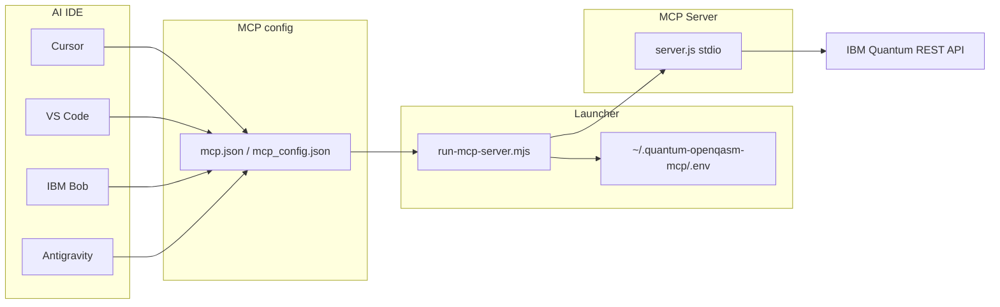

# Local MCP Setup for AI IDEs

<!--
SEO: Quantum MCP setup | Cursor MCP | VS Code MCP | IBM Bob | Antigravity | OpenQASM
local mcp server, quantum-openqasm-mcp, stdio mcp, ibm quantum credentials, mcp.json setup
-->

> Configure the **Quantum OpenQASM MCP server** (`quantum-openqasm-mcp`) so AI assistants in **Cursor**, **VS Code**, **IBM Bob**, and **Google Antigravity** can **list backends**, **submit OpenQASM 2.0 circuits**, and **fetch job results** on **IBM Quantum** hardware.

**Supported IDEs:** Cursor · VS Code · IBM Bob · Google Antigravity

📖 **[Main README](../../README.md)** · **[Remote MCP (Code Engine)](./REMOTE-MCP-SETUP.md)** · **[Extension README](../../extension/README.md)** · **[Deployment scenarios](../deployments/DEPLOYMENT-SCENARIOS.md)** · **[Project structure](../PROJECT-STRUCTURE.md)**

---

## One-click setup (recommended)

Use the **Quantum OpenQASM Assistant** VS Code extension:

1. Open **Quantum → Settings & Diagnostics** (or `Quantum: Open Diagnostics Panel`).
2. Enter **IBM API Key**, **Service CRN**, and **Endpoint**.
3. Click **Save Configuration**.
4. Click **Setup MCP for Cursor / VS Code / Bob / Antigravity**.
5. Reload your IDE when prompted.

The setup button writes credentials to `~/.quantum-openqasm-mcp/.env` and registers `quantum-openqasm-mcp` in **all** IDE config locations below.

**Qiskit workflows:** use the **[Qiskit Developer Pack](./QISKIT-DEVELOPER-PACK.md)** to also install [Qiskit MCP Servers](https://github.com/Qiskit/mcp-servers) (docs + circuit building) alongside OpenQASM execution.

---

## Architecture



---

## What gets configured

| Step | Output | Purpose |
|------|--------|---------|
| 1 | `~/.quantum-openqasm-mcp/.env` | IBM credentials for the MCP server process |
| 2 | `~/.cursor/mcp.json` | Cursor (global) |
| 3 | `<workspace>/.cursor/mcp.json` | Cursor (project) |
| 4 | VS Code user `mcp.json` | VS Code native MCP (global) |
| 5 | `<workspace>/.vscode/mcp.json` | VS Code native MCP (project) |
| 6 | `~/.bob/mcp_settings.json` | IBM Bob (global) |
| 7 | `<workspace>/.bob/mcp.json` | IBM Bob (project) |
| 8 | `~/.gemini/config/mcp_config.json` | Antigravity (global) |
| 9 | `~/.gemini/antigravity/mcp_config.json` | Antigravity (alternate path) |

### Config file paths by platform

**VS Code user MCP (global):**

| OS | Path |
|----|------|
| macOS | `~/Library/Application Support/Code/User/mcp.json` |
| Linux | `~/.config/Code/User/mcp.json` |
| Windows | `%APPDATA%\Code\User\mcp.json` |

**Bob global (Windows):** `%APPDATA%\IBM Bob\User\globalStorage\ibm.bob-code\settings\mcp_settings.json`

### Config formats

| IDE | JSON key | Stdio entry shape |
|-----|----------|-------------------|
| Cursor, Bob, Antigravity | `mcpServers` | `{ "command": "node", "args": ["…/run-mcp-server.mjs"] }` |
| VS Code | `servers` | `{ "type": "stdio", "command": "node", "args": ["…/run-mcp-server.mjs"] }` |

### npm alternative

After installing `@markusvankempen/quantum-openqasm-mcp` from npm:

```bash
npx @markusvankempen/quantum-openqasm-mcp --setup
```

Or set `IBM_API_KEY`, `IBM_SERVICE_CRN`, and related vars in `~/.quantum-openqasm-mcp/.env`.

**VS Code (native MCP)** — use `inputs` so VS Code prompts securely on first use:

```json
{
  "servers": {
    "quantum-openqasm-mcp": {
      "type": "stdio",
      "command": "npx",
      "args": ["-y", "@markusvankempen/quantum-openqasm-mcp"],
      "env": {
        "IBM_API_KEY": "${input:ibmApiKey}",
        "IBM_SERVICE_CRN": "${input:ibmServiceCrn}"
      }
    }
  },
  "inputs": [
    {
      "id": "ibmApiKey",
      "type": "promptString",
      "description": "IBM Cloud API Key",
      "password": true
    },
    {
      "id": "ibmServiceCrn",
      "type": "promptString",
      "description": "IBM Quantum Service CRN"
    }
  ]
}
```

The server fails fast at startup if required credentials are missing (stderr shows setup guidance).

---

## Launcher script

The bundled launcher (`scripts/run-mcp-server.mjs` in the dev repo, or `extension/scripts/run-mcp-server.mjs` when installed from VSIX):

1. Loads `~/.quantum-openqasm-mcp/.env`, repo-root `.env`, or legacy `~/.quantum-mcp/.env`
2. Starts `extension/out/server.js` over **stdio MCP**

---

## Manual setup

### 1. Build the MCP server

```bash
cd extension
npm install
node esbuild.js
```

Verify `extension/out/server.js` exists.

### 2. Credentials

Create `~/.quantum-openqasm-mcp/.env` (recommended) or repo-root `.env`:

```env
IBM_API_KEY=your_ibm_cloud_api_key
IBM_SERVICE_CRN=crn:v1:bluemix:public:quantum-computing:us-east:a/...
IBM_QUANTUM_ENDPOINT=https://us-east.quantum-computing.cloud.ibm.com
IBM_QUANTUM_BACKEND=ibm_fez
```

Get your API key from [IBM Cloud IAM](https://cloud.ibm.com/iam/apikeys).

### 3. Cursor (`~/.cursor/mcp.json`)

```json
{
  "mcpServers": {
    "quantum-openqasm-mcp": {
      "command": "node",
      "args": ["/absolute/path/to/quantum-openqasm-assistant/scripts/run-mcp-server.mjs"]
    }
  }
}
```

### 4. VS Code (user `mcp.json`)

```json
{
  "servers": {
    "quantum-openqasm-mcp": {
      "type": "stdio",
      "command": "node",
      "args": ["/absolute/path/to/quantum-openqasm-assistant/scripts/run-mcp-server.mjs"]
    }
  }
}
```

### 5. IBM Bob

```json
{
  "mcpServers": {
    "quantum-openqasm-mcp": {
      "command": "node",
      "args": ["/absolute/path/to/quantum-openqasm-assistant/scripts/run-mcp-server.mjs"],
      "disabled": false
    }
  }
}
```

### 6. Antigravity (`~/.gemini/config/mcp_config.json`)

```json
{
  "mcpServers": {
    "quantum-openqasm-mcp": {
      "command": "node",
      "args": ["/absolute/path/to/quantum-openqasm-assistant/scripts/run-mcp-server.mjs"]
    }
  }
}
```

---

## Reload per IDE

| IDE | How to activate |
|-----|-----------------|
| **Cursor** | Developer → Reload Window, or MCP: List Servers → restart `quantum-openqasm-mcp` |
| **VS Code** | Developer → Reload Window, or MCP panel → refresh servers |
| **Bob** | MCP settings → **Refresh all servers**, or reload window |
| **Antigravity** | Manage MCP Servers → refresh, or reload window |

---

## Available MCP tools

| Tool | Description |
|------|-------------|
| `list_backends` | List IBM Quantum backends with status and queue |
| `get_backend` | Backend details |
| `get_backend_configuration` | Native gate set / coupling map |
| `list_jobs` | Recent jobs |
| `submit_qasm_job` | Submit OpenQASM 2.0 ISA circuit |
| `get_job_status` | Poll job status |
| `get_job_results` | Fetch measurement counts |
| `cancel_job` | Cancel a running job |

### Example AI prompts

- *"Use quantum-openqasm-mcp to list available IBM Quantum backends and recommend one for a 2-qubit Bell state."*
- *"Submit this OpenQASM circuit to ibm_fez with 4096 shots using submit_qasm_job."*
- *"Poll job status and show the histogram when complete."*

---

## Troubleshooting

| Problem | Fix |
|---------|-----|
| Server not listed | Re-run **Setup MCP** from Diagnostics; verify IDE config path above |
| VS Code uses `servers` not `mcpServers` | Setup writes the correct format automatically |
| Bob not picking up config | Check both `~/.bob/mcp_settings.json` and `.bob/mcp.json`; refresh MCP servers |
| Antigravity not loading | Try both `~/.gemini/config/mcp_config.json` and `~/.gemini/antigravity/mcp_config.json` |
| Auth errors | Re-save API key + Service CRN in Diagnostics, then re-run setup |
| `server.js` missing | `cd extension && node esbuild.js` |
| Wrong server name | Use `quantum-openqasm-mcp` (not `quantum-mcp`) |

---

## Security

- Never commit `.env`, API keys, or Service CRNs to git
- Credentials are stored in `~/.quantum-openqasm-mcp/.env` (user home)
- IDE `mcp.json` files contain absolute paths only — no secrets in JSON

---

## References

- [IBM Quantum Platform](https://quantum.ibm.com/)
- [IBM Quantum REST API](https://quantum.cloud.ibm.com/endpoints-docs-learning/api/quantum-system-rest/openapi/latest)
- [Model Context Protocol](https://modelcontextprotocol.io/)
- [Bob MCP docs](https://bob.ibm.com/docs/ide/configuration/mcp/mcp-in-bob)
- [Deployment scenarios (local vs remote SSE)](../deployments/DEPLOYMENT-SCENARIOS.md)

---

## Topics & keywords

`mcp-setup` · `local-mcp` · `cursor` · `vscode` · `ibm-bob` · `antigravity` · `quantum-openqasm-mcp` · `stdio` · `ibm-quantum` · `openqasm` · `ai-assistant`

---

**Author:** Markus van Kempen  
**Email:** [markus.van.kempen@gmail.com](mailto:markus.van.kempen@gmail.com) · [mvk@ca.ibm.com](mailto:mvk@ca.ibm.com)  
**Website:** [markusvankempen.github.io](https://markusvankempen.github.io/)  
*No bug too small, no syntax too weird.*
