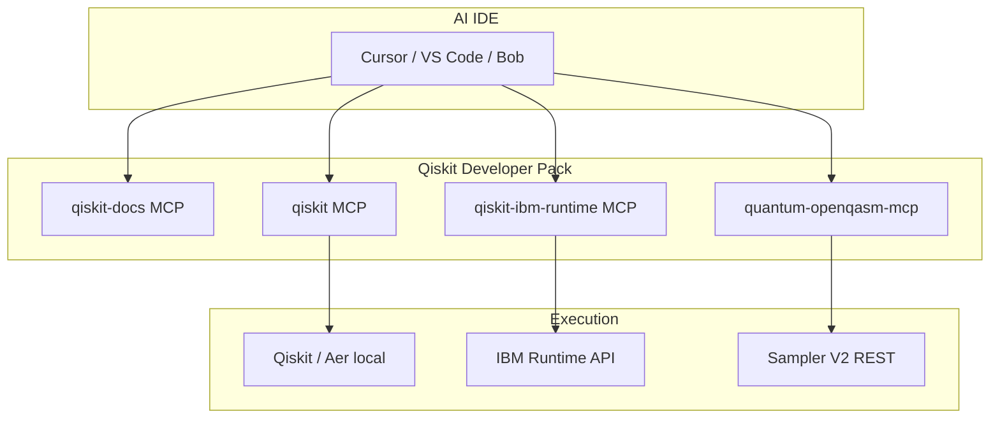

# Qiskit Developer Pack — MCP setup

<!--
SEO: Qiskit MCP Cursor | Qiskit VS Code MCP | quantum-openqasm-mcp bundle | IBM Quantum agent
-->

> **Phase 1** of the Qiskit + OpenQASM workflow: install **[Qiskit MCP Servers](https://github.com/Qiskit/mcp-servers)** alongside **Quantum OpenQASM Assistant** in one step — search docs, build Qiskit circuits, and run **OpenQASM 2.0** on IBM Quantum from Cursor, VS Code, IBM Bob, or Antigravity.

📖 **[Local MCP (OpenQASM only)](./LOCAL-MCP-SETUP.md)** · **[Qiskit integration](../QISKIT-INTEGRATION.md)** · **[Deployment pack README](../../deployments/qiskit-developer-pack/README.md)**

---

## Why this pack exists

IBM’s [Qiskit MCP Servers](https://github.com/Qiskit/mcp-servers) give agents access to Qiskit SDK, documentation, and (optionally) IBM Runtime — but setup is **five separate servers** and Python-focused.

**Quantum OpenQASM Assistant** gives agents **OpenQASM 2.0 → IBM Sampler V2** with a TypeScript MCP and VS Code **Quantum Lab**.

The **Developer Pack** merges both into your IDE `mcp.json` so agents can:

1. **Search** Qiskit docs (`qiskit-docs`)
2. **Build** circuits in Qiskit (`qiskit`)
3. **Export & run** on IBM hardware via OpenQASM (`quantum-openqasm-mcp`)
4. *(Optional full tier)* **Run** Qiskit Runtime primitives (`qiskit-ibm-runtime`)

---

## Architecture



---

## One-command setup

```bash
# From repo root
./deployments/qiskit-developer-pack/setup-qiskit-developer-pack.sh --ide cursor
```

| Flag | Description |
|------|-------------|
| `--tier core` | Default — docs + qiskit + openqasm |
| `--tier full` | Adds `qiskit-ibm-runtime` |
| `--ide cursor,vscode,bob,antigravity,claude,all` | Target IDEs |
| `--workspace` | Also merge `.vscode/mcp.json` in current repo |
| `--dry-run` | Preview merged JSON |

**Full tier with token:**

```bash
export QISKIT_IBM_TOKEN="your_ibm_quantum_token"
./deployments/qiskit-developer-pack/setup-qiskit-developer-pack.sh --tier full --ide all
```

---

## Prerequisites

| Requirement | Purpose |
|-------------|---------|
| [uv](https://docs.astral.sh/uv/) / **uvx** | Launch Qiskit MCP servers (`uvx qiskit-mcp-server`, etc.) |
| **Node.js 18+** / npx | `quantum-openqasm-mcp` |
| `~/.quantum-openqasm-mcp/.env` | `IBM_API_KEY`, `IBM_SERVICE_CRN` for OpenQASM submit |
| `QISKIT_IBM_TOKEN` *(full tier)* | [IBM Quantum](https://quantum.ibm.com) token for Runtime MCP |

Create OpenQASM credentials:

```bash
npx @markusvankempen/quantum-openqasm-mcp --setup
# or use Quantum → Setup MCP in the VS Code extension
```

---

## What gets merged (core tier)

**Cursor / Bob / Antigravity** (`mcpServers`):

```json
{
  "mcpServers": {
    "qiskit-docs": {
      "command": "uvx",
      "args": ["qiskit-docs-mcp-server"]
    },
    "qiskit": {
      "command": "uvx",
      "args": ["qiskit-mcp-server"]
    },
    "quantum-openqasm-mcp": {
      "command": "npx",
      "args": ["-y", "@markusvankempen/quantum-openqasm-mcp"]
    }
  }
}
```

**VS Code** uses `servers` with `"type": "stdio"` — see templates in `deployments/qiskit-developer-pack/mcp-configs/`.

Existing MCP entries are **merged**, not replaced. Backups: `mcp.json.bak.<timestamp>`.

---

## Suggested agent workflow

After reload, try in chat:

> Search Qiskit docs for qasm2.dumps OpenQASM 2 export. Build a 2-qubit Bell circuit in Qiskit, **transpile it for ibm_marrakesh**, export OpenQASM 2.0, then use quantum-openqasm-mcp to list_backends and submit_qasm_job.

End-to-end Qiskit → hardware path: [QISKIT-INTEGRATION.md](../QISKIT-INTEGRATION.md)

---

## Worked example: Bell state on IBM hardware

This is the expected outcome when you run the agent workflow above (verified 2026-06-25 on **ibm_marrakesh**).

### 1. Search Qiskit docs

IBM guide: [OpenQASM 2 and the Qiskit SDK](https://docs.quantum.ibm.com/guides/interoperate-qiskit-qasm2) — use **`qiskit.qasm2.dumps()`** to export a `QuantumCircuit` to OpenQASM 2.0.

### 2. Build Bell circuit

```python
from qiskit import QuantumCircuit, qasm2

qc = QuantumCircuit(2, 2)
qc.h(0)
qc.cx(0, 1)
qc.measure([0, 1], [0, 1])
```

### 3. Transpile before export (required for real QPUs)

Raw `qasm2.dumps(qc)` uses logical gates (`h`, `cx`). IBM hardware needs **native gates** (`rz`, `sx`, `cz`, …).

**First submit without transpile → fails:**

```text
Error: The instruction h on qubits (0,) is not supported by the target system.
Transpile your circuits for the target before submitting a primitive query.
```

**Fix:** transpile for the target backend, then export:

```bash
# After Developer Pack setup (installs qiskit + qiskit-ibm-runtime on prompt)
~/.quantum-openqasm-mcp/qiskit-venv/bin/python examples/qiskit-bell-transpile-export.py
```

Or use script: [`examples/qiskit-bell-transpile-export.py`](../../examples/qiskit-bell-transpile-export.py)

Example transpiled OpenQASM 2.0 (excerpt):

```qasm
OPENQASM 2.0;
include "qelib1.inc";
qreg q[156];
creg c[2];
rz(pi/2) q[0];
sx q[0];
rz(pi/2) q[0];
...
cz q[0],q[1];
...
measure q[0] -> c[0];
measure q[1] -> c[1];
```

### 4. Submit via quantum-openqasm-mcp

Agent calls (or use MCP tools directly):

1. `list_backends` → pick **ibm_marrakesh** (queue: 0)
2. `submit_qasm_job` with transpiled QASM, `provider: ibm_quantum`
3. `get_job_status` until **Completed**
4. `get_job_results` → histogram

**Example job:** `d8uk065posuc738qa6kg` on **ibm_marrakesh** — **Completed**, 4096 shots.

**Measurement counts:**

| State | Count | ~% |
|-------|------:|---:|
| `\|11⟩` | 1943 | 47% |
| `\|00⟩` | 1867 | 46% |
| `\|10⟩` | 203 | 5% |
| `\|01⟩` | 83 | 2% |

Most probability on `|00⟩` and `|11⟩` — expected Bell-state behavior (noise on `|01⟩` / `|10⟩`).

```json
{"counts":{"10":203,"11":1943,"00":1867,"01":83},"register":"c","shots":4096}
```

---

## Python stack (transpile scripts)

The setup script checks for **`qiskit`** and **`qiskit-ibm-runtime`**. If missing, it offers to install into:

```text
~/.quantum-openqasm-mcp/qiskit-venv/
```

```bash
# Interactive install prompt during setup
./deployments/qiskit-developer-pack/setup-qiskit-developer-pack.sh --ide cursor

# Non-interactive
./deployments/qiskit-developer-pack/setup-qiskit-developer-pack.sh --install-python-deps --yes --ide cursor
```

| Check | Command |
|-------|---------|
| Verify imports | `~/.quantum-openqasm-mcp/qiskit-venv/bin/python -c "import qiskit, qiskit_ibm_runtime"` |
| Export Bell QASM | `~/.quantum-openqasm-mcp/qiskit-venv/bin/python examples/qiskit-bell-transpile-export.py` |

---

## When to use which server

| Task | Use |
|------|-----|
| Learn Qiskit APIs | `qiskit-docs` |
| Build / transpile Qiskit circuits | `qiskit` |
| Qiskit Runtime primitives (Sampler, Estimator, etc.) | `qiskit-ibm-runtime` *(full tier)* |
| Submit **OpenQASM 2.0** file/string to IBM | `quantum-openqasm-mcp` |
| Visual lab + histograms in VS Code | [Quantum OpenQASM extension](../../extension/README.md) |

---

## VS Code extension

**Today:** run this script or use **Quantum → Setup MCP** for OpenQASM only.

**Planned:** **Quantum → Setup Qiskit Developer Pack** — same bundle from the Diagnostics panel.

**Phase 2 (roadmap):** Unified **Qiskit Lab** — edit `.py`, run Aer locally, export QASM, submit to hardware in one extension UI.

---

## Troubleshooting

| Issue | Fix |
|-------|-----|
| `uvx: command not found` | Install [uv](https://docs.astral.sh/uv/getting-started/installation/) |
| `No module named 'qiskit_ibm_runtime'` | Re-run setup with `--install-python-deps --yes` or `pip install qiskit-ibm-runtime` |
| Submit fails: `h` not supported | Transpile for target backend before export — see [worked example](#worked-example-bell-state-on-ibm-hardware) |
| Qiskit MCP fails to start | `uvx qiskit-mcp-server` in terminal; check Python 3.10+ |
| OpenQASM MCP setup banner | Run `--setup` or create `~/.quantum-openqasm-mcp/.env` |
| Runtime MCP auth error | Set `QISKIT_IBM_TOKEN`; get token at [quantum.ibm.com](https://quantum.ibm.com) |
| Too many MCP servers slow IDE | Use `--tier core` or disable unused servers in IDE MCP settings |

---

## Related

- [Qiskit MCP Servers (GitHub)](https://github.com/Qiskit/mcp-servers)
- [Qiskit Ecosystem profile](https://qiskit.github.io/ecosystem/p/bd91d04b/)
- [Local MCP setup](./LOCAL-MCP-SETUP.md)
- [Remote MCP (Code Engine)](./REMOTE-MCP-SETUP.md)

---

**Author:** Markus van Kempen  
**Email:** [markus.van.kempen@gmail.com](mailto:markus.van.kempen@gmail.com) · [mvk@ca.ibm.com](mailto:mvk@ca.ibm.com)  
**Website:** [markusvankempen.github.io](https://markusvankempen.github.io/)
