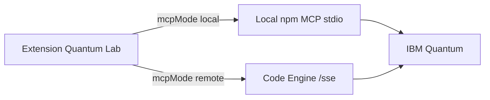

# Quantum OpenQASM Assistant — VS Code Extension

<!--
SEO: VS Code Extension | Quantum OpenQASM | IBM Quantum | MCP | OpenQASM 2.0 | QASM
quantum computing, quantum lab, quantum circuit, submit qasm, job polling, histogram,
ibm quantum, ibm fez, bell state, cursor, vscode, bob, antigravity, mcp server,
model context protocol, ai assistant, quantum hardware, qiskit, quantum programming
-->

[](https://marketplace.visualstudio.com/items?itemName=markusvankempen.quantum-openqasm-assistant)
[](https://www.npmjs.com/package/@markusvankempen/quantum-openqasm-mcp)
[](https://github.com/markusvankempen/quantum-openqasm-assistant/releases)
[](https://openqasm.com/)
[](https://modelcontextprotocol.io/)
[](https://quantum.ibm.com/)

> **VS Code / Cursor extension** for **IBM Quantum** — run **OpenQASM 2.0** `.qasm` circuits on real **quantum hardware** via the **Model Context Protocol (MCP)**. **Quantum Lab** panel, **job polling**, **histogram** results, **Diagnostics** UI, and one-click **MCP registration** for Cursor, VS Code, Bob & Antigravity.

**Publisher:** `markusvankempen` · **Extension ID:** `quantum-openqasm-assistant` · **Version:** **1.9.2** · **NPM MCP:** `@markusvankempen/quantum-openqasm-mcp@1.9.2`

**Search terms:** `vscode quantum extension` · `openqasm vscode` · `ibm quantum vscode` · `quantum lab` · `submit qasm` · `mcp quantum` · `cursor quantum` · `qiskit developer pack` · `claude desktop mcp` · `bell state hardware`

---

## Features

| Feature | Description |
|---------|-------------|
| **Quantum Lab** | OpenQASM 2.0 editor — run circuits on IBM hardware |
| **Qiskit Lab** | Dedicated Qiskit Python panel · Aer sim · transpile → OpenQASM → hardware |
| **Setup Lab Qiskit** | MCP bundle: qiskit-ibm-transpiler, code assistant, **quantum-assistant** alias |
| **Load / Save circuits** | Open and save OpenQASM 2.0 `.qasm` files from Quantum Lab |
| **Live job polling** | Auto-polls job status every 15s with elapsed time |
| **Histogram results** | Measurement counts as bar chart with Bell-state fidelity |
| **Ask AI prompts** | MCP workflow prompts (transpiler vs quantum-assistant split) |
| **MCP local/remote** | Local stdio npm MCP or **remote Code Engine SSE** |
| **Diagnostics panel** | Test auth, backends, Python Qiskit stack, and save all settings |

---

## Quick Start

### 1. Install

```bash
code --install-extension quantum-openqasm-assistant-1.9.2.vsix
```

Or install from the Extensions Marketplace by searching **Quantum OpenQASM Assistant** (publisher: **markusvankempen**).

### 2. Configure

Open **Settings** (`Cmd+,`) and search `quantumAssistant`, or use **Quantum: Open Diagnostics Panel** from the sidebar.

| Setting | Description |
|---------|-------------|
| `ibmApiKey` | IBM Cloud API Key — [cloud.ibm.com/iam/apikeys](https://cloud.ibm.com/iam/apikeys) |
| `ibmServiceCrn` | Service CRN from your IBM Quantum instance |
| `ibmEndpoint` | Default: `https://us-east.quantum-computing.cloud.ibm.com` |
| `defaultBackend` | `ibm_fez` / `ibm_marrakesh` / `ibm_kingston` |
| `mcpMode` | `local` (spawn npm MCP) or `remote` (Code Engine SSE) |
| `remoteMcpUrl` | Remote SSE URL when `mcpMode = remote` (e.g. `https://…codeengine…/sse`) |

**Remote mode (Code Engine):** open **Diagnostics** → MCP Mode **remote** → paste SSE URL → **Test Remote Gateway** → **Save**. No IBM API key needed on your machine for Quantum Lab.

📖 **[Extension remote MCP guide](../docs/ide/EXTENSION-REMOTE-MCP.md)** · **[Code Engine deploy](../deployments/code-engine/README.md)**

### 3. Use

- Click the **⚛** atom icon in the Activity Bar → **Open Quantum Lab**
- Select an example circuit (Bell State, GHZ, etc.) or paste your own
- Click **▶ Run on Hardware**
- Results appear as a histogram once the job completes

---

## Commands

| Command | Description |
|---------|-------------|
| `Quantum: Open Quantum Lab` | Open the main Quantum Lab panel |
| `Quantum: Submit Current OpenQASM File` | Submit the active `.qasm` editor file |
| `Quantum: Check Job Status` | Fetch results for a known job ID |
| `Quantum: Open Diagnostics Panel` | Configure credentials and test connection |
| `Quantum: Setup Local MCP (Cursor / VS Code / Bob / Antigravity)` | Register local stdio MCP with your credentials |
| `Quantum: Setup Remote MCP (Code Engine SSE)` | Register `quantum-openqasm-mcp-remote` SSE URL for AI IDEs |
| `Quantum: Update MCP npm Package` | Install latest `@markusvankempen/quantum-openqasm-mcp` from npm |
| `Quantum: Load OpenQASM 2.0 Circuit` | Open a `.qasm` file into the editor and Quantum Lab |
| `Quantum: Save OpenQASM 2.0 Circuit` | Save the active `.qasm` file or circuit from Quantum Lab |

---

## MCP Server

**Local mode:** uses **`@markusvankempen/quantum-openqasm-mcp` from npm** (global install or `npx`) for Quantum Lab and submit. Set `quantumAssistant.useNpmMcp = false` to use bundled `out/server.js` instead.

**Remote mode:** set `mcpMode = remote` and `remoteMcpUrl` to your Code Engine `/sse` endpoint. The extension uses `SSEClientTransport` — credentials stay on the gateway. Use **Diagnostics → Test Remote Gateway** before running circuits.



Standalone npm package (stdio MCP, no UI):

```bash
npx @markusvankempen/quantum-openqasm-mcp
```

Docs: [npm package README](https://www.npmjs.com/package/@markusvankempen/quantum-openqasm-mcp) · [GitHub](https://github.com/markusvankempen/quantum-openqasm-assistant/tree/master/packages/quantum-openqasm-mcp)

### AI IDE MCP integration (Cursor, VS Code, Bob, Antigravity)

Use **Quantum: Setup MCP** (sidebar or Diagnostics panel) to register `quantum-openqasm-mcp` in all supported IDEs.

| Document | Description |
|----------|-------------|
| [Main README](../README.md) | Project overview, architecture, quick start |
| [Local MCP setup](../docs/ide/LOCAL-MCP-SETUP.md) | Cursor, VS Code, Bob, Antigravity stdio config |
| [Extension remote MCP](../docs/ide/EXTENSION-REMOTE-MCP.md) | Quantum Lab on Code Engine SSE |
| [Remote MCP setup](../docs/ide/REMOTE-MCP-SETUP.md) | IDE `mcp.json` for Code Engine |
| [Deployment scenarios](../docs/deployments/DEPLOYMENT-SCENARIOS.md) | Local, Code Engine, Docker, hybrid |
| [Project structure](../docs/PROJECT-STRUCTURE.md) | Full repo layout |

---

## Development

```bash
cd extension
npm install
node esbuild.js              # dev bundle → out/
node esbuild.js --production   # minified, no sourcemaps (for publish)
npm run package              # → quantum-openqasm-assistant-<version>.vsix
```

## Publish (Marketplace & Open VSX)

From the `extension/` directory after a production build:

```bash
# 1. Bump version in package.json, then:
npm run bundle:production

# 2. Package VSIX
npm run package

# 3a. VS Code Marketplace (publisher: markusvankempen)
npx @vscode/vsce login markusvankempen
npm run publish:vsce

# 3b. Open VSX (Cursor / VSCodium)
npx ovsx login
npm run publish:ovsx
# or: npx ovsx publish quantum-openqasm-assistant-<version>.vsix --no-dependencies
```

**VSIX must include:** `out/extension.js`, `out/server.js`, `scripts/run-mcp-server.mjs`, `media/`, `docs/`, `resources/`, `LICENSE`, `README.md`.

Repository: [github.com/markusvankempen/quantum-openqasm-assistant](https://github.com/markusvankempen/quantum-openqasm-assistant)

---

## Topics & keywords

`vscode-extension` · `quantum-computing` · `openqasm` · `qasm` · `ibm-quantum` · `quantum-lab` · `quantum-circuit` · `mcp` · `model-context-protocol` · `cursor` · `ibm-bob` · `antigravity` · `job-polling` · `histogram` · `bell-state` · `qiskit` · `quantum-hardware` · `ai-assistant`

---

**Author:** Markus van Kempen  
**Email:** [markus.van.kempen@gmail.com](mailto:markus.van.kempen@gmail.com) · [mvk@ca.ibm.com](mailto:mvk@ca.ibm.com)  
**Website:** [markusvankempen.github.io](https://markusvankempen.github.io/)  
*No bug too small, no syntax too weird.*
